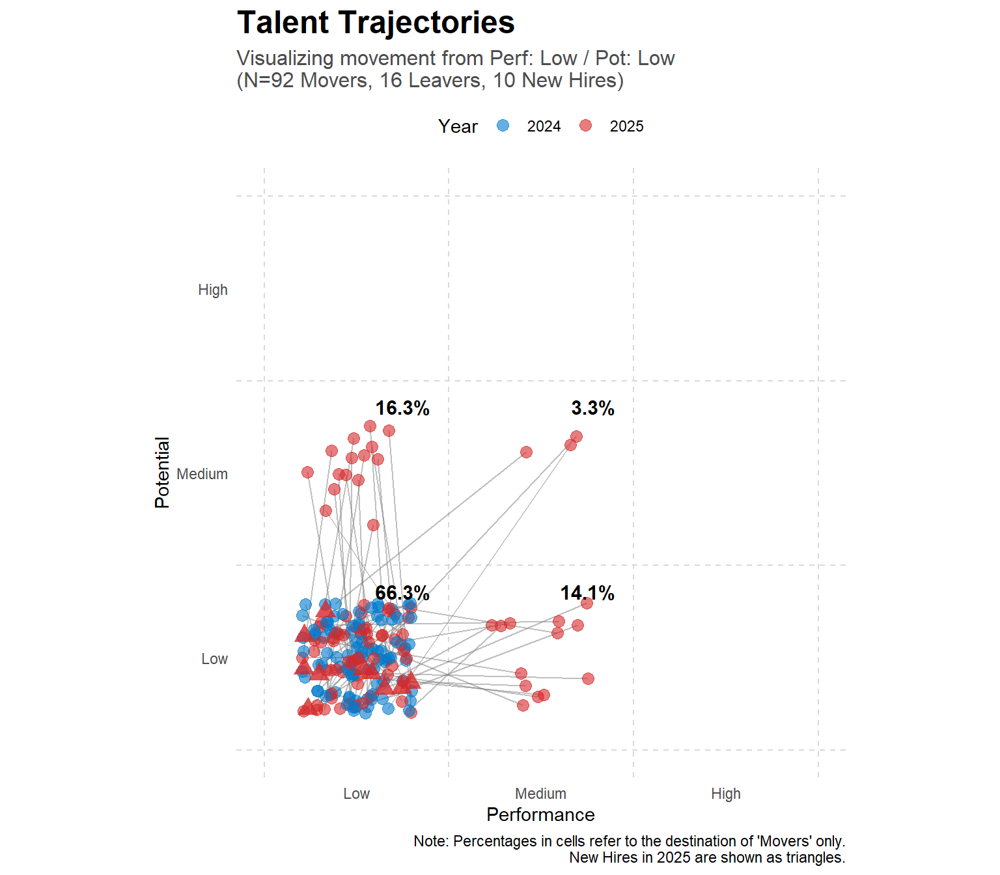

In one of my projects, I’m really struggling to find an effective and intuitive way to visualize YoY movements of people within the [9-box grid](https://www.aihr.com/blog/9-box-grid/) - a well-known talent management tool combining information about people’s performance and potential.

Putting aside all the conceptual and philosophical objections to the 9-box - has anyone come across a good way to visualize this? Or had a good experience with something that worked?

I tried a Sankey chart, which usually does a great job at showing transitions, but in this case it didn’t preserve the “2D logic” behind the grid - or at least I couldn’t figure out how to make it work. 

The best idea I’ve got so far is shown below, including the R code behind it. It sort of does the job, but only if I visualize it cell by cell, which isn’t ideal, especially outside the dashboard environment 🫤

```r
# --- 1. SETUP ---
# Load libraries
library(tidyverse)

# --- SET PARAMETERS FOR STARTING CELL ---
# Change these values (from 1 to 3) to filter for a different starting cell.
# 1 = Low, 2 = Medium, 3 = High
start_perf_filter <- 1
start_pot_filter <- 1


# --- 2. SAMPLE DATA GENERATION ---
# Set a seed for reproducibility of the random data
set.seed(42)

n_employees <- 1000 

# Helper function to generate scores
generate_scores <- function(n) {
  score1 <- sample(1:3, n, replace = TRUE)
  score2 <- sapply(score1, function(s) {
    change <- runif(1)
    if (change < 0.6) s # 60% chance to stay
    else if (change < 0.8) min(3, s + 1) # 20% chance to increase
    else max(1, s - 1) # 20% chance to decrease
  })
  list(score1 = score1, score2 = score2)
}

# Create the initial wide-format data frame
perf <- generate_scores(n_employees)
pot <- generate_scores(n_employees)

talent_data_wide <- data.frame(
  id = 1:n_employees, # Using numeric IDs instead of names
  year1_perf = perf$score1,
  year1_pot = pot$score1,
  year2_perf = perf$score2,
  year2_pot = pot$score2
)

# --- 3. DATA PROCESSING, SIMULATING LEAVERS & NEW HIRES ---

# Identify employees who started in the specified cell
source_employee_ids <- talent_data_wide %>%
  filter(year1_perf == start_perf_filter & year1_pot == start_pot_filter) %>%
  pull(id)

# Simulate leavers: randomly select 15% of source employees to have NA in year 2
leaver_ids <- sample(source_employee_ids, size = floor(0.15 * length(source_employee_ids)))
talent_data_wide <- talent_data_wide %>%
  mutate(
    year2_perf = ifelse(id %in% leaver_ids, NA, year2_perf),
    year2_pot = ifelse(id %in% leaver_ids, NA, year2_pot)
  )
n_leavers <- length(leaver_ids)

# Simulate new hires: add 10 new people assigned to the source cell in year 2
n_new_hires <- 10
new_hires_data <- tibble(
  id = (n_employees + 1):(n_employees + n_new_hires),
  year1_perf = NA,
  year1_pot = NA,
  year2_perf = start_perf_filter,
  year2_pot = start_pot_filter
)

# Combine original data with new hires
talent_data_wide <- bind_rows(talent_data_wide, new_hires_data)

# Filter for employees who started in the source cell and have data for both years ("Movers")
movers_data <- talent_data_wide %>%
  filter(id %in% source_employee_ids, !is.na(year2_perf))

# Calculate transition percentages for labels based only on "Movers"
total_movers <- nrow(movers_data)

label_data <- movers_data %>%
  group_by(year2_perf, year2_pot) %>%
  summarise(count = n(), .groups = 'drop') %>%
  mutate(
    percentage = count / total_movers * 100,
    label_text = sprintf("%.1f%%", percentage),
    x_pos = year2_perf - 0.1,
    y_pos = year2_pot - 0.1
  )

# Prepare data for plotting trajectories (only for "Movers")
jitter_amount <- 0.3
movers_long <- movers_data %>%
  pivot_longer(cols = -id, names_to = c("year", ".value"), names_pattern = "year(.)_(.*)") %>%
  mutate(
    perf_jitter = perf - 0.5 + runif(n(), -jitter_amount, jitter_amount),
    pot_jitter = pot - 0.5 + runif(n(), -jitter_amount, jitter_amount),
    year = factor(year, levels = c("1", "2"), labels = c("2024", "2025"))
  )

# Prepare data for plotting new hires in 2025
new_hires_long <- new_hires_data %>%
  pivot_longer(cols = -id, names_to = c("year", ".value"), names_pattern = "year(.)_(.*)") %>%
  filter(!is.na(perf)) %>%
  mutate(
    perf_jitter = perf - 0.5 + runif(n(), -jitter_amount, jitter_amount),
    pot_jitter = pot - 0.5 + runif(n(), -jitter_amount, jitter_amount),
    year = "2025"
  )

# --- 4. CHART GENERATION ---
axis_labels <- c("Low", "Medium", "High")
axis_breaks <- c(0.5, 1.5, 2.5)

ggplot() +
  geom_vline(xintercept = c(0, 1, 2, 3), color = "grey85", linetype = "dashed") +
  geom_hline(yintercept = c(0, 1, 2, 3), color = "grey85", linetype = "dashed") +
  
  # Add connector lines and points for "Movers"
  geom_line(data = movers_long, aes(x = perf_jitter, y = pot_jitter, group = id), color = "grey50", alpha = 0.5) +
  geom_point(data = movers_long, aes(x = perf_jitter, y = pot_jitter, color = year), size = 3, alpha = 0.6) +
  
  # Add points for "New Hires" in 2025 (using a different shape)
  geom_point(data = new_hires_long, aes(x = perf_jitter, y = pot_jitter), color = "#d62728", shape = 17, size = 4, alpha = 0.8) +
  
  # Add percentage labels
  geom_text(
    data = label_data, aes(x = x_pos, y = y_pos, label = label_text),
    fontface = "bold", color = "black", size = 4, hjust = 1, vjust = 1
  ) +
  
  scale_color_manual(values = c("2024" = "#007acc", "2025" = "#d62728")) +
  scale_x_continuous(name = "Performance", limits = c(0, 3), breaks = axis_breaks, labels = axis_labels) +
  scale_y_continuous(name = "Potential", limits = c(0, 3), breaks = axis_breaks, labels = axis_labels) +
  
  labs(
    title = "Talent Trajectories",
    subtitle = sprintf("Visualizing movement from Perf: %s / Pot: %s \n(N=%d Movers, %d Leavers, %d New Hires)", 
                       axis_labels[start_perf_filter], axis_labels[start_pot_filter],
                       total_movers, n_leavers, n_new_hires),
    caption = "Note: Percentages in cells refer to the destination of 'Movers' only.\nNew Hires in 2025 are shown as triangles.",
    color = "Year"
  ) +
  theme_minimal() +
  theme(
    plot.title = element_text(size = 18, face = "bold"),
    plot.subtitle = element_text(size = 12, color = "grey30"),
    legend.position = "top",
    panel.grid.major = element_blank(),
    panel.grid.minor = element_blank(),
    aspect.ratio = 1,
    plot.background = element_rect(fill="white", color = "white")
  )

```



Would be super grateful for any tips or suggestions on dataviz tools or approaches worth exploring 🙏

<!-- RELATED:BEGIN -->
## Related notes
- [[xmr-charts-in-people-analytics|Do you use XmR charts for People Analytics use cases?]]
- [[org-chart-and-collaboration|Org chart and collaboration]]
- [[change-detection|How to quickly navigate dashboard users to what they need to know?]]
- [[doppelganger-for-career-pathing|Using Doppelgänger for career pathing?]]
- [[tenure-vs-satisfaction|Simulating the "survivorship" effect in employee satisfaction data over time]]
<!-- RELATED:END -->

---
> 📄 Read the [original post with full outputs](https://blog-about-people-analytics.netlify.app/posts/2025-08-20-9-box-grid-dataviz-over-time/) on my blog.
