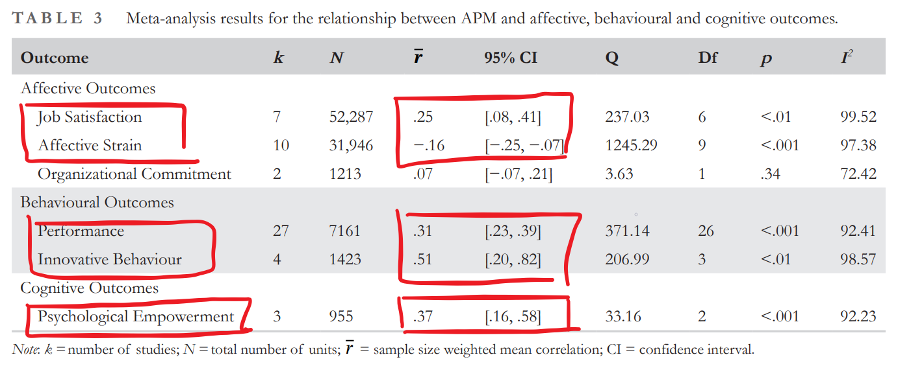

I must admit with some shame that it was only when I came across the meta-analysis by [Koch et al. (2023)](https://bpspsychub.onlinelibrary.wiley.com/doi/pdf/10.1111/joop.12429) that I wondered whether there was any systematic evidence to support the benefits of an Agile Project Management (APM).

The authors of this pre-registered meta-analysis (with *k* = 41 independent studies, *N* = 73,825) focused specifically on the affective, behavioral and cognitive outcomes of APM.  

What did they find? Beneficial effects of APM across all three outcomes:

* For the affective outcomes of job satisfaction, affective strain and organizational commitment, the effect sizes were, on average, small.
* For the behavioral outcomes of performance and innovative behavior, the effect sizes were medium to large.
* For the cognitive outcome of psychological empowerment, the results of the meta‐analysis suggest a medium effect.

Interesting were also the results of the analysis of moderating effects of contextual factors, specifically team size (no significant moderating effect), and occupational groups (compared to studies conducted with software developers, the effect sizes were stronger in other occupations, such as manufacturing, health care and logistics).

So pretty good news for APM proponents, however, it's good to keep in mind that this is "only" a preliminary meta-analysis, that there aren't that many studies, especially regarding affective and cognitive outcomes, that the relationships found cannot be interpreted as causal as 90% of the studies only report cross-sectional correlations, and that there is also some evidence of publication bias that may overestimate the effects.

<!-- RELATED:BEGIN -->
## Related notes
- [[time-management|Consequences of time management in the workplace]]
- [[self-leadership|Self-Leadership: A New Superpower?]]
- [[timeboxing|Timeboxing. Does it really work?]]
- [[engagement-interventions|Effectiveness of interventions for encreasing employee engagement]]
- [[job-insecurity-and-behavioral-outcomes|Does a stick work?]]
<!-- RELATED:END -->

---
> 📄 Read the [original post with full outputs](https://blog-about-people-analytics.netlify.app/posts/2024-03-06-agile-project-management/) on my blog.
