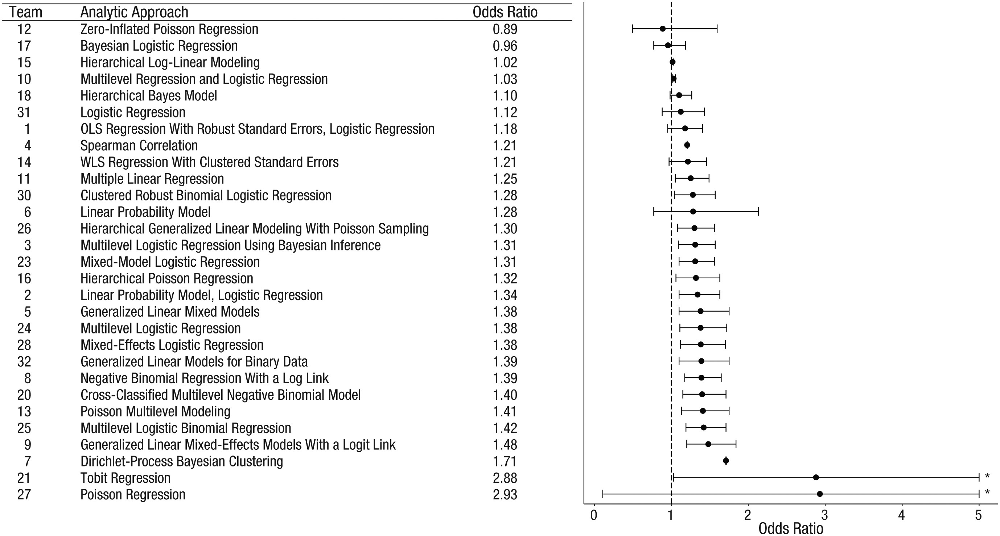

Unfortunately, the same bias can also creep into data analysis. Along the way, we make numerous decisions—some small, some significant—that impact our results. Yet, we often act as if none of these choices happened, believing we've arrived at the one true, objective finding.

A great example of this comes from [Silberzahn et al. (2018)](https://journals.sagepub.com/doi/10.1177/2515245917747646), who set out to expose these subjective analytical choices and their influence on results. They asked 29 teams, comprising 61 analysts, to analyze the same dataset and answer the same question: Are soccer referees more likely to give red cards to players with darker skin tones than to those with lighter skin tones?

They found that analytical approaches varied widely, leading to effect size estimates ranging from 0.89 to 2.93 (Mdn = 1.31) in odds-ratio units. Twenty teams (69%) found a statistically significant positive effect, while nine teams (31%) did not. Interestingly, neither the analysts’ prior beliefs nor their level of expertise explained the variation. Even peer ratings of analysis quality failed to account for the differences.

This study highlights an important reality: even defensible, well-intentioned analytical choices can lead to vastly different results. What should we take from this? Should sensitivity analysis be a standard practice? Should we crowdsource high-profile analyses? What do you think?

P.S. If you want to see how your own approach would shape the results, you can download the [original dataset from OSF](https://osf.io/47tnc/?view_only=) and give it a try!

<!-- RELATED:BEGIN -->
## Related notes
- [[scientific-divides-and-cognitive-traits|Why do psychologists disagree—even when they use the same data and methods?]]
- [[visual-diff-in-diff|Causal insights with no code?]]
- [[regression-to-the-mean|Employee commitment over time & regression to the mean]]
- [[self-awareness-and-personality|Does your personality interfere with your self-awareness?]]
- [[multilevel-modeling|Multilevel modeling in people analytics]]
<!-- RELATED:END -->

---
> 📄 Read the [original post with full outputs](https://blog-about-people-analytics.netlify.app/posts/2025-02-02-analytical-choices-and-variability/) on my blog.
