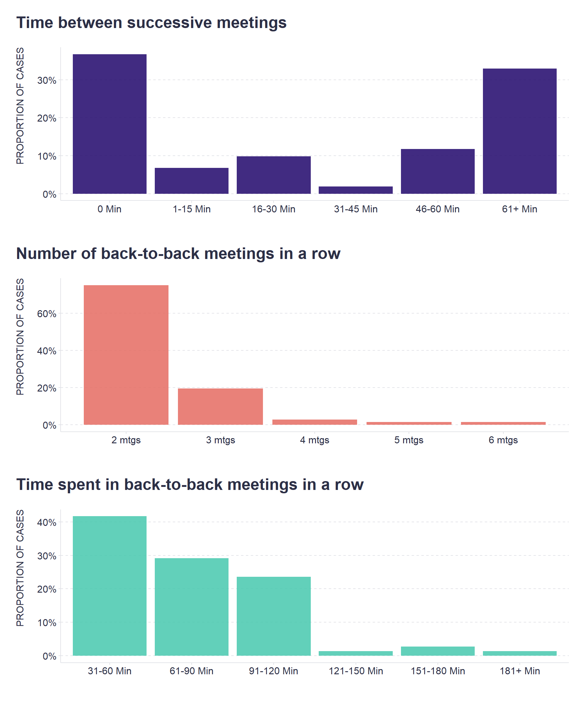

"Context, Context, Context" could be the headline of this post.

When we address the issue of good meeting habits with [our](https://www.timeisltd.com/) clients, the length of breaks between successive meetings is one of the first metrics we focus on. 

As many of you probably know from your firsthand experience, consecutive meetings with no breaks, a.k.a. **back-to-back meetings**, have many detrimental effects, from [overload and exhaustion](https://www.microsoft.com/en-us/worklab/work-trend-index/brain-research) to not being adequately prepared for subsequent meetings and [arriving late](https://bpspsychub.onlinelibrary.wiley.com/doi/abs/10.1111/joop.12183) to them.

As useful as the above metric is, it does not tell the whole story and can lead to invalid conclusions and see a problem where there is none. Data from one of our teams illustrates this well. 

```r
# uploading libraries
library(tidyverse)
library(patchwork)
library(scales)

# uploading datasets from the platform
data1 <- readr::read_delim("./timeisltd-chart1.csv",delim = ";") %>%
  rename(cat = `...1`)
data2 <- readr::read_delim("./timeisltd-chart2.csv",delim = ";") %>%
  rename(cat = `...1`)
data3 <- readr::read_delim("./timeisltd-chart3.csv",delim = ";") %>%
  rename(cat = `...1`)

# Time between successive meetings
g1 <- data1 %>%
  dplyr::mutate(
    all = sum(data),
    prop = data/all
  ) %>%
  ggplot2::ggplot(aes(x = cat, y = prop)) +
  ggplot2::geom_bar(stat = "identity", fill = "#20066b", alpha = 0.85) +
  ggplot2::scale_y_continuous(labels = scales::percent_format()) +
  ggplot2::labs(
    x = "",
    title = "Time between successive meetings",
    y = "PROPORTION OF CASES"
  ) +
  ggplot2::theme(plot.title = element_text(color = '#2C2F46', face = "bold", size = 20, margin=margin(0,0,20,0)),
        plot.subtitle = element_text(color = '#2C2F46', face = "plain", size = 16, margin=margin(0,0,20,0)),
        plot.caption = element_text(color = '#2C2F46', face = "plain", size = 11, hjust = 0),
        axis.title.x.bottom = element_text(margin = margin(t = 0, r = 0, b = 0, l = 0), color = '#2C2F46', face = "plain", size = 13, lineheight = 16, hjust = 0),
        axis.title.y.left = element_text(margin = margin(t = 0, r = 15, b = 0, l = 0), color = '#2C2F46', face = "plain", size = 12, lineheight = 16, hjust = 1),
        axis.title.y.right = element_text(margin = margin(t = 0, r = 0, b = 0, l = 15), color = '#2C2F46', face = "plain", size = 13, lineheight = 16, hjust = 0),
        axis.text = element_text(color = '#2C2F46', face = "plain", size = 12, lineheight = 16),
        axis.line.x = element_line(colour = "#E0E1E6"),
        axis.line.y = element_line(colour = "#E0E1E6"),
        legend.position=c(.15,.5),
        legend.key = element_rect(fill = "white"),
        legend.key.width = unit(1.6, "line"),
        legend.margin = margin(-0.8,0,0,0, unit="cm"),
        legend.text = element_text(color = '#2C2F46', face = "plain", size = 10, lineheight = 16),
        panel.background = element_blank(),
        panel.grid.major.y = element_line(color = "#E0E1E6", linetype = "dashed"),
        panel.grid.major.x = element_blank(),
        panel.grid.minor = element_blank(),
        axis.ticks.x = element_line(color = "#E0E1E6"),
        axis.ticks.y = element_line(color = "#E0E1E6"),
        plot.margin=unit(c(5,5,5,5),"mm"), 
        plot.title.position = "plot",
        plot.caption.position =  "plot"
  )

# Number of back-to-back meetings in a row
g2 <- data2 %>%
  dplyr::mutate(
    all = sum(data),
    prop = data/all,
    cat = as.numeric(cat)
  ) %>%
  ggplot2::ggplot(aes(x = cat, y = prop)) +
  ggplot2::geom_bar(stat = "identity", fill = "#e56b61", alpha = 0.85) +
  ggplot2::scale_y_continuous(labels = scales::percent_format()) +
  ggplot2::scale_x_continuous(labels = scales::number_format(suffix = " mtgs", accuracy = 1)) +
  ggplot2::labs(
    x = "",
    title = "Number of back-to-back meetings in a row",
    y = "PROPORTION OF CASES"
  ) +
  ggplot2::theme(plot.title = element_text(color = '#2C2F46', face = "bold", size = 20, margin=margin(0,0,20,0)),
        plot.subtitle = element_text(color = '#2C2F46', face = "plain", size = 16, margin=margin(0,0,20,0)),
        plot.caption = element_text(color = '#2C2F46', face = "plain", size = 11, hjust = 0),
        axis.title.x.bottom = element_text(margin = margin(t = 0, r = 0, b = 0, l = 0), color = '#2C2F46', face = "plain", size = 13, lineheight = 16, hjust = 0),
        axis.title.y.left = element_text(margin = margin(t = 0, r = 15, b = 0, l = 0), color = '#2C2F46', face = "plain", size = 12, lineheight = 16, hjust = 1),
        axis.title.y.right = element_text(margin = margin(t = 0, r = 0, b = 0, l = 15), color = '#2C2F46', face = "plain", size = 13, lineheight = 16, hjust = 0),
        axis.text = element_text(color = '#2C2F46', face = "plain", size = 12, lineheight = 16),
        axis.line.x = element_line(colour = "#E0E1E6"),
        axis.line.y = element_line(colour = "#E0E1E6"),
        legend.position=c(.15,.5),
        legend.key = element_rect(fill = "white"),
        legend.key.width = unit(1.6, "line"),
        legend.margin = margin(-0.8,0,0,0, unit="cm"),
        legend.text = element_text(color = '#2C2F46', face = "plain", size = 10, lineheight = 16),
        panel.background = element_blank(),
        panel.grid.major.y = element_line(color = "#E0E1E6", linetype = "dashed"),
        panel.grid.major.x = element_blank(),
        panel.grid.minor = element_blank(),
        axis.ticks.x = element_line(color = "#E0E1E6"),
        axis.ticks.y = element_line(color = "#E0E1E6"),
        plot.margin=unit(c(5,5,5,5),"mm"), 
        plot.title.position = "plot",
        plot.caption.position =  "plot"
  )

# Time spent in back-to-back meetings in a row
g3 <- data3 %>%
  dplyr::mutate(
    all = sum(data),
    prop = data/all,
    cat = factor(cat, levels = c("31-60 Min", "61-90 Min", "91-120 Min", "121-150 Min", "151-180 Min", "181+ Min"), ordered = TRUE)
  ) %>%
  ggplot2::ggplot(aes(x = cat, y = prop)) +
  ggplot2::geom_bar(stat = "identity", fill = "#46c8ae", alpha = 0.85) +
  ggplot2::scale_y_continuous(labels = scales::percent_format(accuracy = 1)) +
  ggplot2::labs(
    x = "",
    title = "Time spent in back-to-back meetings in a row",
    y = "PROPORTION OF CASES"
  ) +
  ggplot2::theme(plot.title = element_text(color = '#2C2F46', face = "bold", size = 20, margin=margin(0,0,20,0)),
        plot.subtitle = element_text(color = '#2C2F46', face = "plain", size = 16, margin=margin(0,0,20,0)),
        plot.caption = element_text(color = '#2C2F46', face = "plain", size = 11, hjust = 0),
        axis.title.x.bottom = element_text(margin = margin(t = 0, r = 0, b = 0, l = 0), color = '#2C2F46', face = "plain", size = 13, lineheight = 16, hjust = 0),
        axis.title.y.left = element_text(margin = margin(t = 0, r = 15, b = 0, l = 0), color = '#2C2F46', face = "plain", size = 12, lineheight = 16, hjust = 1),
        axis.title.y.right = element_text(margin = margin(t = 0, r = 0, b = 0, l = 15), color = '#2C2F46', face = "plain", size = 13, lineheight = 16, hjust = 0),
        axis.text = element_text(color = '#2C2F46', face = "plain", size = 12, lineheight = 16),
        axis.line.x = element_line(colour = "#E0E1E6"),
        axis.line.y = element_line(colour = "#E0E1E6"),
        legend.position=c(.15,.5),
        legend.key = element_rect(fill = "white"),
        legend.key.width = unit(1.6, "line"),
        legend.margin = margin(-0.8,0,0,0, unit="cm"),
        legend.text = element_text(color = '#2C2F46', face = "plain", size = 10, lineheight = 16),
        panel.background = element_blank(),
        panel.grid.major.y = element_line(color = "#E0E1E6", linetype = "dashed"),
        panel.grid.major.x = element_blank(),
        panel.grid.minor = element_blank(),
        axis.ticks.x = element_line(color = "#E0E1E6"),
        axis.ticks.y = element_line(color = "#E0E1E6"),
        plot.margin=unit(c(5,5,5,5),"mm"), 
        plot.title.position = "plot",
        plot.caption.position =  "plot"
  )

# putting graphs together
g <- g1/g2/g3

print(g)

```



Based purely on the time between successive meetings, we could conclude that a given team suffers from an unhealthy frequency of back-to-back meetings, as in more than a third of cases, there is no break between meetings. However, if we look at how long the series of back-to-back meetings tend to be (in 75% of cases it's only 2 meetings in a row) and how much time people spend in them (in 42% of cases it’s between 31-60 minutes and in 30% of cases it’s between 61-90 minutes), then the resulting picture is less pessimistic and more indicative of a rather healthy level of effort to protect time for **focused work** by **batching** meetings into short blocks that do not come at the cost of exhausting people and making meetings less effective.

What is your approach to back-to-back meetings? Do you try to always have at least a 5-minute buffer between two consecutive meetings? And how successful are you at this? Are you aware of situations where it is appropriate to batch meetings into tight blocks without breaks? And do you have a limit on how many meetings to put in a row? Feel free to share your thoughts and experiences in the comments.

<!-- RELATED:BEGIN -->
## Related notes
- [[meeting-planning|Fighting meeting overload]]
- [[large-and-recurring-meetings|Where to look first when considering meeting reset?]]
- [[meeting-matrix|Eisenhower matrix for meetings]]
- [[timeboxing|Timeboxing. Does it really work?]]
- [[slack-batching|Always messaging]]
<!-- RELATED:END -->

---
> 📄 Read the [original post with full outputs](https://blog-about-people-analytics.netlify.app/posts/2022-09-17-back-to-back-meetings/) on my blog.
