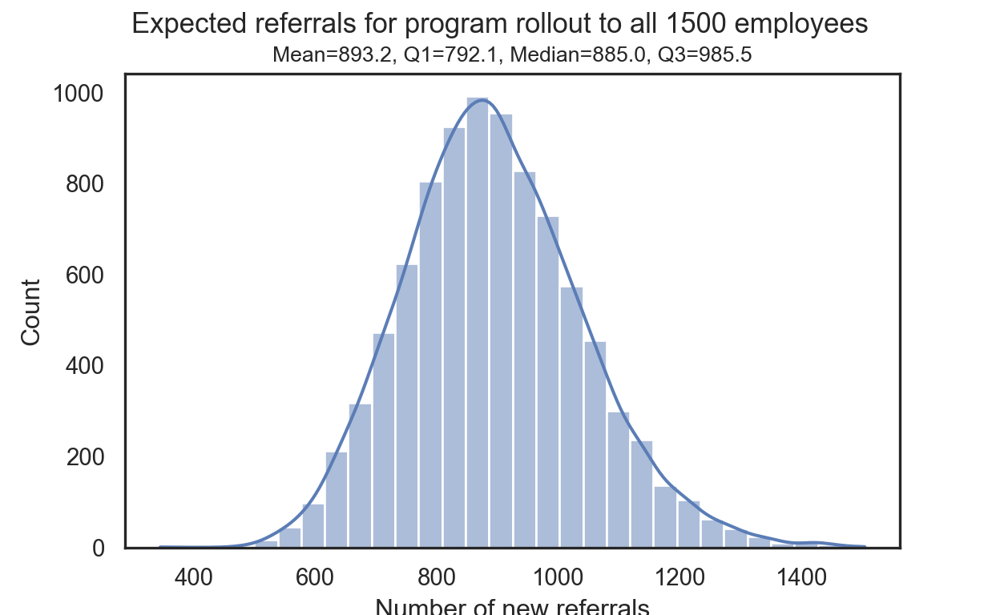
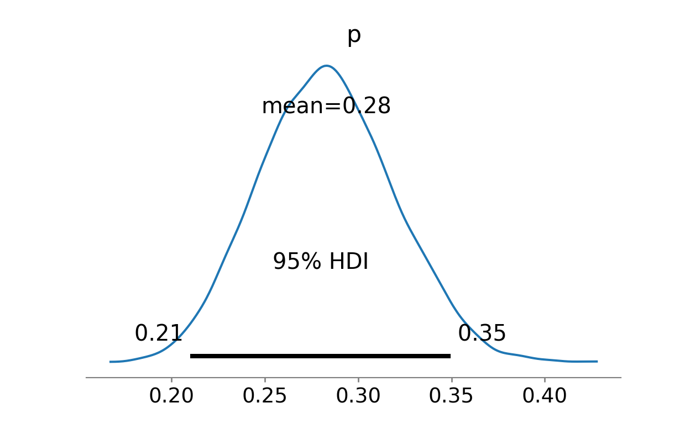
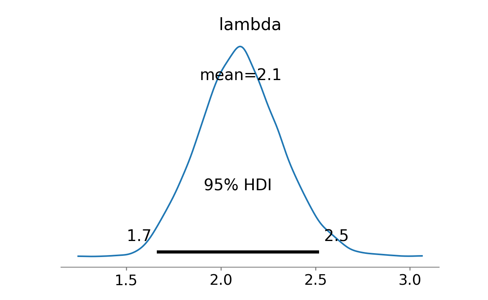

One of the advantages of doing statistical analysis in a Bayesian framework is that its generative part makes it a natural fit for business process simulation, which incorporates all the uncertainties inherent in the statistical models we use to capture the patterns of interest.

Once the parameters of the models have been estimated, their corresponding posterior distributions can be easily sampled and used in combination with a range of input values to simulate the expected outcomes, including the associated uncertainty that needs to be taken into account when making decisions.

To illustrate, imagine, for example, that as a CHRO you want to estimate the number of potential new employees brought in by employees who choose to participate in a new referral program. Fortunately, you have data from a small, three-month pilot of this program in which you offered participation to a small random sample of employees. Using a combination of simple Binomial and Poisson models, you can easily arrive at a reasonable estimate of the outcome of interest when you introduce the program to a larger portion of the company.

Lets' implement this simple illustrative example with [PyMC](https://www.pymc.io/welcome.html), a probabilistic programming library for Python that allows users to build Bayesian models with a simple Python API and fit them using Markov chain Monte Carlo (MCMC) methods.

First, let's upload the data from the pilot program. The first table includes 150 employees who were randomly selected and offered participation in the pilot program. The second table then shows 42 employees who chose to participate in the program and the number of potential new employees they brought in.


```python
import pandas as pd

# table with all pilot nominees
nominees=pd.read_excel("./dataBayesSim.xlsx", sheet_name="nominees")

# table with all pilot participants
participants=pd.read_excel("./dataBayesSim.xlsx", sheet_name="participants")

# showing first few rows of the tables
nominees.head(5)
participants.head(5)

```

In order to estimate the expected number of new potential employees after the introduction of a new referral program to a larger part of the company, we want to model the probability that nominees actually participate in the program and the expected number of potential candidates that a participant brings in. To do this, we can fit Binomial and Poisson models to the data, respectively. As mentioned above, we will do this in a Bayesian framework that will make it easier to deal with uncertainty later in our simulation. A side note: for the sake of brevity, I omit the usual sanity checks that should be performed before drawing any conclusions from fitted models - e.g., checking for convergence of Markov chains or posterior predictive checks for how well the fitted models predict observed data. 

Let's start with the first model. From the summary below, we see that the estimated probability of participating in the programme is between 0.21 and 0.35.

```python
import pymc as pm


# estimating the participation rate
nominated = nominees.shape[0]
participated = nominees['participation'].sum()

# setting up the model
with pm.Model() as participationModel:
  # assigning a flat Beta prior for p
  p = pm.Beta("p", alpha=1, beta=1)
  
  # defining likelihood
  obs = pm.Binomial("obs", p=p, n=nominated, observed=participated)
  
  # running mcmc
  idata = pm.sample(3000, tune=500, chains=3, cores=1)
  
  # generating posterior predictive sample
  participationModelPosterior = pm.sample_posterior_predictive(idata, extend_inferencedata=True)

```


```python
import arviz as az

# trace plot showing the evolution of parameter vector over the iterations of Markov chain(s)
#az.plot_trace(idata, kind="trace", divergences="bottom", show=True)

# posterior predictive check
#az.plot_ppc(participationModelPosterior, num_pp_samples=500, random_seed=7, alpha=0.3, textsize=14, kind='kde', show=True)

# tabular and visual summary of the posterior probability distribution of the p parameter value
az.summary(idata).round(2)
az.plot_posterior(idata, hdi_prob=.95, show=True)

```

The second model then suggests that program participants brought in an average of 1.7 to 2.5 referrals.

```python
# setting up the Poisson model
with pm.Model() as referralModel:
  # weakly informative exponential prior for lambda parameter with mean 3
  lambda_ = pm.Exponential('lambda', 1/3)
  # alternative flat prior for lambda parameter
  #lambda_ = pm.Uniform('lambda', lower=0, upper=25)
  
  # Poisson likelihood
  y_obs = pm.Poisson('y_obs', mu=lambda_, observed=participants['referrals'])
  
  # running mcmc
  trace = pm.sample(3000, tune=500, chains=3, cores=1)
  
  # generating posterior predictive sample
  referralModelPosterior = pm.sample_posterior_predictive(trace, extend_inferencedata=True)

```


```python
# trace plot showing the evolution of parameter vector over the iterations of Markov chain(s)
#az.plot_trace(trace, kind="trace", divergences="bottom", show=True)

# posterior predictive check
#az.plot_ppc(referralModelPosterior, num_pp_samples=500, random_seed=7, alpha=0.3, textsize=14, kind='kde', show=True)

# tabular and visual summary of the posterior probability distribution of the p parameter value
az.summary(trace).round(2)
az.plot_posterior(trace, hdi_prob=.95, show=True)

```

We can now sample the posterior distributions of the parameters `p` and `lambda`, insert them into the dataframe, and for each row/combination calculate the expected number of referrals brought in by participating employees when the program is rolled out to the entire population of 1500 employees. As you can see below, using the IQR, our CHRO can expect recruiters to reach 790 to 990 potential candidates once the new company-wide referral program is in place.      


```python
import numpy as np
import matplotlib.pyplot as plt
import seaborn as sns
sns.set_theme(style="white")

# sampling from the posterior distribution the parameters p and lambda
posterior = pd.DataFrame({
    'p': idata['posterior']['p'].values.flatten(),
    'lambda': trace['posterior']['lambda'].values.flatten()
})

# computing expected number of referrals with 1500 nominees
posterior['expectedReferrals'] = 1500*posterior['p']*posterior['lambda']

# computing summary statistics
m = posterior['expectedReferrals'].mean().round(1)
Q1 = np.percentile(posterior['expectedReferrals'], 25).round(1)
Q2 = np.percentile(posterior['expectedReferrals'], 50).round(1)
Q3 = np.percentile(posterior['expectedReferrals'], 75).round(1)

# visualizing results
sns.histplot(posterior['expectedReferrals'], bins=30, kde=True, color='#5b7db6').set(xlabel ="Number of new referrals", ylabel = "Count")
plt.gcf().suptitle('Expected referrals for program rollout to all 1500 employees', fontsize=13)
plt.gca().set_title(f'Mean={m}, Q1={Q1}, Median={Q2}, Q3={Q3}', fontsize=10)
plt.show()

```



And it doesn't have to end there. For example, this estimate can be combined with other inputs, e.g. the cost of a new referral program, the cost of an alternative solution, etc., to make a better informed decision, taking into account the existing uncertainty.

## Figures





<!-- RELATED:BEGIN -->
## Related notes
- [[bayesian-belief-updating|A visual introduction to Bayesian belief updating]]
- [[bayesian-networks-in-people-analytics|Use of Bayesian networks in people analytics?]]
- [[bayesian-shrinkage|Using Bayesian shrinkage in reporting employee turnover]]
- [[psw-and-selection-bias-in-employee-surveys|How to analyze employee survey results with less (selection) bias?]]
- [[people-analytics-popularity-after-covid|The impact of the COVID pandemic on the popularity of people analytics]]
<!-- RELATED:END -->

---
> 📄 Read the [original post with full outputs](https://blog-about-people-analytics.netlify.app/posts/2023-09-17-bayesian-simulation/) on my blog.
