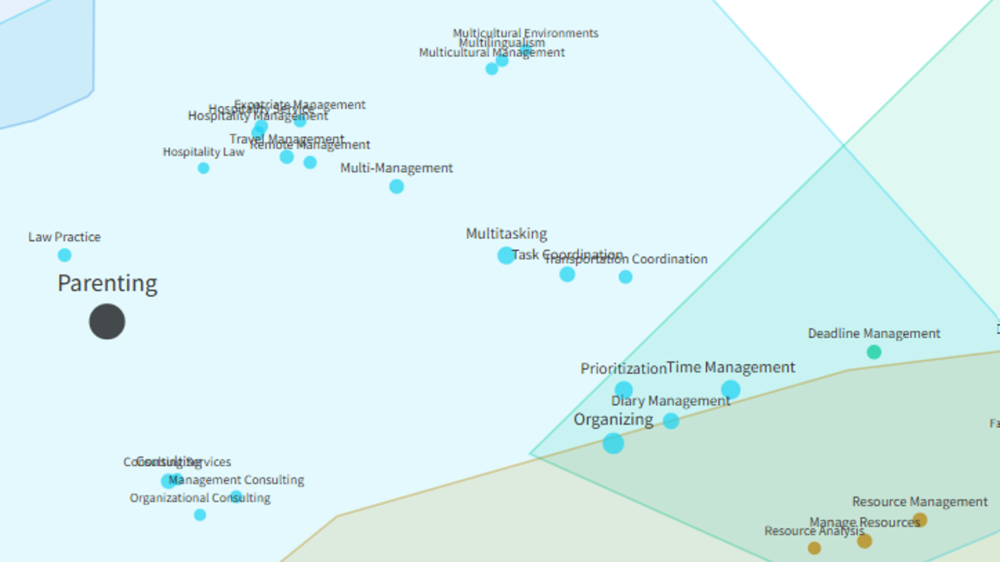
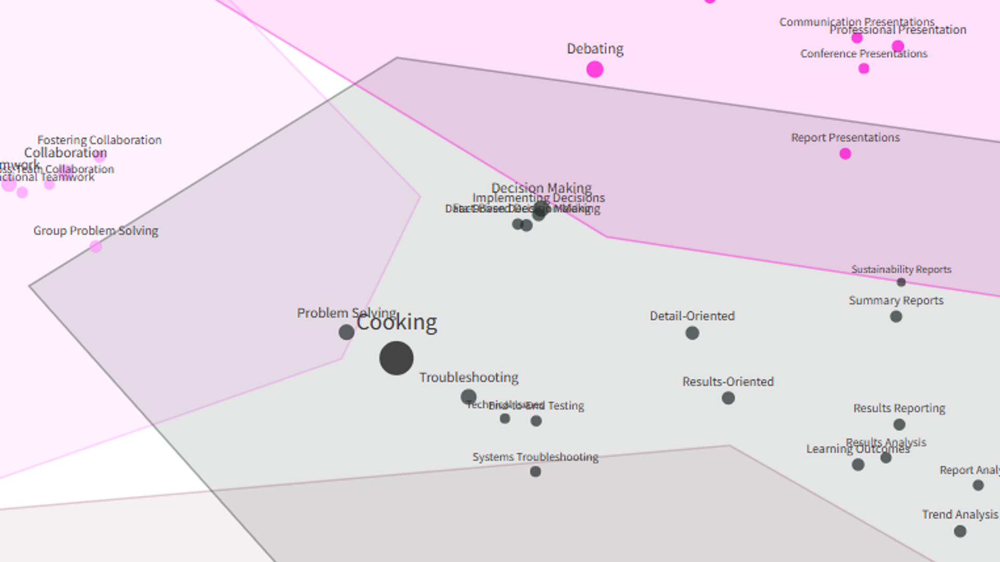

While stress-testing a team skills app, just for fun I tried searching in the semantic space of existing business skills for everyday activities like parenting and cooking.

Check out where these two landed in the attached pics. Does it resonate? 🙃 For me it’s pretty accurate 😅

<!-- RELATED:BEGIN -->
## Related notes
- [[big-consultancies-in-the-skills-semantic-space|Big consultancies in the skills semantic space]]
- [[ona-skills-exploration|ONA as a tool for exploring the skill space in your company?]]
- [[insights-discovery-and-skills|Do Insights Discovery ‘colors’ relate to self-reported skills?]]
- [[people-analytics-and-market-basket-analysis|I’ve finally lived to see the day…]]
- [[team-maps|Experiencing and seeing team similarities and differences]]
<!-- RELATED:END -->

---
> 📄 Read the [original post with full outputs](https://blog-about-people-analytics.netlify.app/posts/2026-03-18-daily-activities-among-business-skills/) on my blog.
