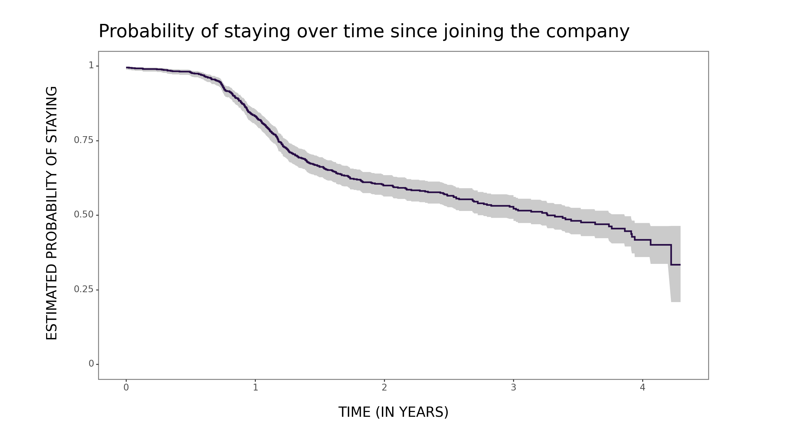
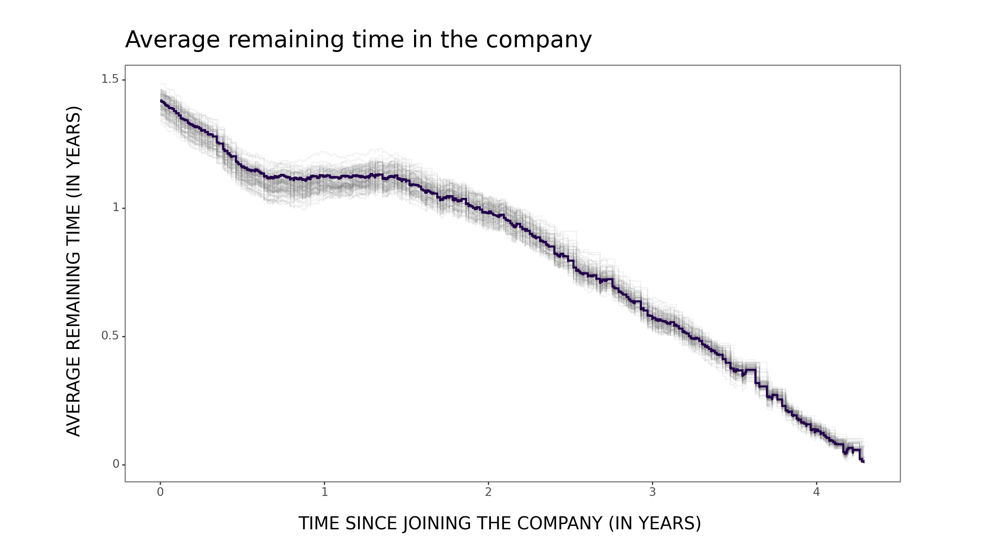
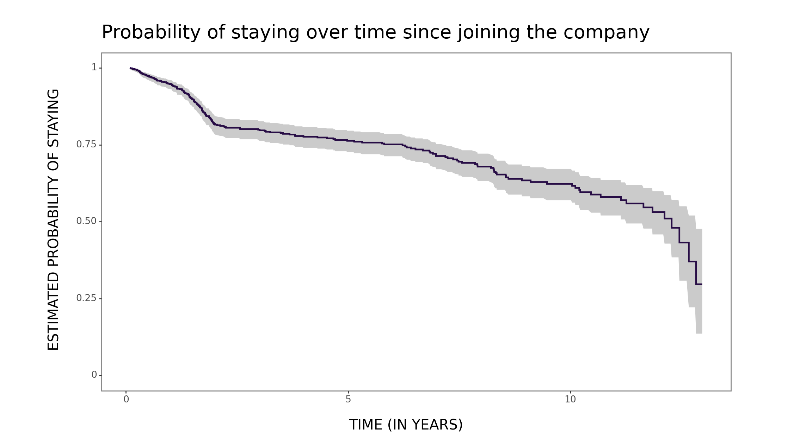
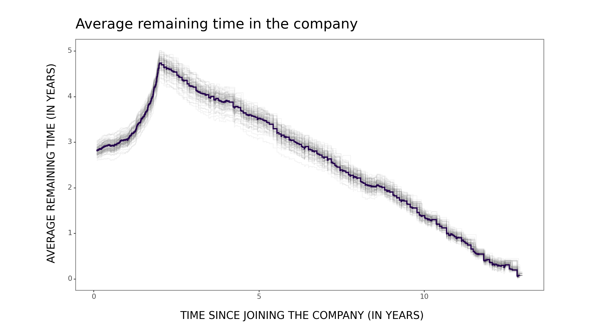

For those interested in data analytics, I highly recommend the book [Probably Overthinking It](https://www.allendowney.com/blog/) by [Allen B. Downey](https://www.linkedin.com/in/allendowney/). It offers insightful details on the various, more or less known data analytical situations that one might encounter while using data to understand the world better or to make more informed decisions.

Even if you are not a beginner in data analytics, there is a good chance that you will come across some new and valuable insights, as it happened to me.

For example, as a people analytics practitioner, I found it particularly enlightening to examine the survival function - commonly used in employee attrition modeling - from the perspective of average remaining time and related concepts of *new better than used in expectation* (NBUE) vs. *new worse than used in expectation* (NWUE). From now on, for me, org units exhibiting NBUE and NWUE characteristics are "light bulbs" and "wines", respectively 😉

If you’re curious about how to get from survival function to average remaining time, check out the short snippets of Python code below that do the trick. It's not a big deal, but it can still save you some time 👇

First, let's upload the dummy data and create functions that allow us to estimate and display the survival curve and the corresponding expected remaining time curve.

```python
# libraries used
import pandas as pd
from plotnine import *
from sksurv.nonparametric import kaplan_meier_estimator

# uploading the data
data_bulb = pd.read_csv('./attrition_data_bulb.csv')
data_wine = pd.read_csv('./attrition_data_wine.csv')

# function for estimating and plotting the survival function 
def survival_function_estimation_plotting(data, plot_name = 'chart'):    
    # estimating the survival function using the Kaplan-Meier estimator
    time, survival_prob, conf_int = kaplan_meier_estimator(data["event"], data["tenure_years"], conf_level=0.95, conf_type="log-log")
    
    # supp df for dataviz
    supp_df = pd.DataFrame({
        'time': time,
        'survival_prob': survival_prob,
        'lower_ci': conf_int[0],
        'upper_ci': conf_int[1]
    })
    
    # dataviz
    plot = (
        ggplot(supp_df, aes(x='time')) +
        geom_step(aes(y='survival_prob'), color='#23004C', size=1) +
        geom_ribbon(aes(ymin='lower_ci', ymax='upper_ci'), alpha=0.25) +
        scale_y_continuous(limits=[0,1]) +
        labs(
            title="Probability of staying over time since joining the company",
            x='TIME (IN YEARS)', 
            y='ESTIMATED PROBABILITY OF STAYING'
        ) +
        theme_bw() +
        theme(
            plot_title=element_text(size=20, margin={'b': 12}, ha='left'),
            axis_title_x=element_text(size=15, margin={'t': 15}),
            axis_title_y=element_text(size=15, margin={'r': 15}),
            axis_text_x=element_text(size=10),
            axis_text_y=element_text(size=10),
            strip_text_x=element_text(size=14, weight='bold'),
            panel_grid_major=element_blank(),
            panel_grid_minor=element_blank(),
            figure_size=(12, 6.5)
        ) 
    )
    
    # saving the plot
    # ggsave(plot=plot, filename=f'survival_curve_{plot_name}.png', width=12, height=6, dpi=500)
    
    # printing the plot
    print(plot)


# function for computing the average remaining time in the company
def remaining_time(data):    
    results = []
    # iterating over each time point in the data's index
    for t in data.index:
        if data.loc[t, "survival_prob"] > 0:
            # calculating the conditional survival probabilities from time t onwards
            # by dividing the survival probabilities by the survival probability at time t
            conditional_df = data.loc[t:, "survival_prob"] / data.loc[t, "survival_prob"]
            
            # removing the survival probability at time t from the calculations 
            # as it's not needed for the expected additional time calculation
            conditional_df = conditional_df.iloc[1:]
            
            # calculating the expected additional time by taking the weighted average 
            # of the time points, using the conditional survival probabilities as weights
            expected_additional_time = sum(conditional_df.values * (conditional_df.index - t)) / conditional_df.sum()
            result = {
                "time": t, 
                "expected_additional_time": expected_additional_time
            }
            
            # adding the result to the results list
            results.append(result)
        else:
            pass
    
    # converting the results list to a DataFrame
    return pd.DataFrame(results)


# function for estimating the uncertainty using the bootstrapping technique and for plotting the results
def remaining_time_bootstraping_plotting(data, n_bootstrap=100, plot_name='chart'):    
    # calculating the expected remaining time using all the data
    time, survival_prob = kaplan_meier_estimator(data["event"], data["tenure_years"])
    supp_df_all = pd.DataFrame({'time': time, 'survival_prob': survival_prob})
    supp_df_all = supp_df_all .set_index('time')
    all_results_df = remaining_time(supp_df_all) 

    # estimating the uncertainty using the bootstrapping technique
    all_curves = []
    
    for i in range(n_bootstrap):
        # resampling the data with replacement
        bootstrap_sample = data.sample(n=len(data), replace=True)
        # estimating the survival function using the Kaplan-Meier estimator
        time, survival_prob = kaplan_meier_estimator(bootstrap_sample["event"], bootstrap_sample["tenure_years"])
        # supp df for further calculations
        supp_df = pd.DataFrame({'time': time, 'survival_prob': survival_prob})
        supp_df  = supp_df.set_index('time')
        # calculating the expected remaining time
        remaining_time_bootstrap = remaining_time(supp_df)
        # adding a column to identify the bootstrap iteration
        remaining_time_bootstrap['bootstrap_id'] = i
        # adding the result to the all_curves list
        all_curves.append(remaining_time_bootstrap)
    
    # concatenating all bootstrap results into a single df
    bootstrap_results_df = pd.concat(all_curves)
    
    # dataviz
    plot = (
        ggplot() +
        geom_step(bootstrap_results_df, aes(x='time', y='expected_additional_time', group='bootstrap_id'), color='grey', alpha=0.1) +
        geom_step(all_results_df, aes(x='time', y='expected_additional_time'), color='#23004C', size=1) +
        labs(
            title="Average remaining time in the company",
            x='TIME SINCE JOINING THE COMPANY (IN YEARS)', 
            y='AVERAGE REMAINING TIME (IN YEARS)'
        ) +
        theme_bw() +
        theme(
            plot_title=element_text(size=20, margin={'b': 12}, ha='left'),
            axis_title_x=element_text(size=15, margin={'t': 15}),
            axis_title_y=element_text(size=15, margin={'r': 15}),
            axis_text_x=element_text(size=10),
            axis_text_y=element_text(size=10),
            strip_text_x=element_text(size=14, weight='bold'),
            panel_grid_major=element_blank(),
            panel_grid_minor=element_blank(),
            figure_size=(12, 6.5)
        ) 
    )
    
    # saving the plot
    # ggsave(plot=plot, filename=f'remaining_time_curve_{plot_name}.png', width=12, height=6, dpi=500)
    
    # printing the plot
    print(plot)


```


Now let's estimate and visualize these two curves for a "light bulb" team (i.e., a team exhibiting the NBUE characteristic)...

```python
survival_function_estimation_plotting(data=data_bulb)
remaining_time_bootstraping_plotting(data=data_bulb)

```

... and now for a "wine" team (i.e., a team exhibiting, at least partially, the NWUE characteristic).

```python
survival_function_estimation_plotting(data=data_wine)
remaining_time_bootstraping_plotting(data=data_wine)

```

## Figures









<!-- RELATED:BEGIN -->
## Related notes
- [[multilevel-modeling|Multilevel modeling in people analytics]]
- [[econml-and-employee-attriton|How to get causal interpretation for the Employee Attrition dataset?]]
- [[causal-inference-in-people-analytics|Beyond prediction: Exploiting organizational events for causal inference in people analytics]]
- [[tenure-vs-satisfaction|Simulating the "survivorship" effect in employee satisfaction data over time]]
- [[people-related-metrics-distribution|It's perfectly normal not to be normal]]
<!-- RELATED:END -->

---
> 📄 Read the [original post with full outputs](https://blog-about-people-analytics.netlify.app/posts/2024-02-26-expected-remaining-time/) on my blog.
