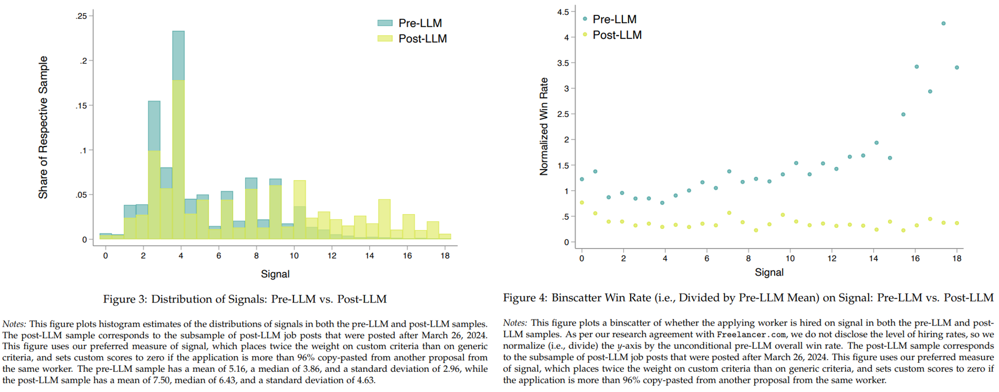

Historically, written communication served as a costly signal of competence. Producing a tailored proposal required effort, skill and relevance, and employers used this as a cue of ability. With LLMs, that cost has basically dropped to zero, which might weaken the signal it used to carry.

That this may already be happening - at least in some parts of the job market - is supported by the results of a super interesting [study  by Silbert & Galdin (2025)](https://jesse-silbert.github.io/website/silbert_jmp.pdf) - “*Making Talk Cheap: Generative AI and Labor Market Signaling*” -, which focuses on coding-related freelance jobs on a major digital labor platform ([*Freelancer.com*](https://www.freelancer.com/)). 

The authors observe that before widespread LLM adoption, employers paid a premium for more customised applications. After the rollout of AI-writing tools, that premium disappeared - writing quality generally increased and no longer differentiated good and bad candidates, as measured by actual job performance and completion outcomes.

To measure the quality of applications at scale, the authors developed a specialized large-scale scoring method: using Meta’s Llama 4 model, each job proposal was evaluated on nine criteria capturing both customisation (relevance to the specific task) and generic writing quality (clarity, tone). Proposals re-used across jobs were flagged and scored zero for customised relevance. This quantitative measure approximates what employers infer about candidate effort.

In their structural model the results are pretty stark: when writing becomes practically free due to GenAI, high-ability workers are hired 19 % less often, and low-ability workers 14 % more often - pointing to a decline in meritocratic sorting.

There are obvious limitations - the study focuses on one platform and one type of job signal (short, text-based applications in coding projects); it doesn’t capture richer selection stages or potential productivity gains from AI, etc. Still, it’s a good reminder that organisations should re-examine what candidates’ behaviour actually signals - and look for alternative, new (or perhaps old 😉) signals.

<!-- RELATED:BEGIN -->
## Related notes
- [[hr-tech-ai-shift|How AI is reshaping HR-tech]]
- [[ai-powered-data-exploration-assistant|Testing my GenAI skepticism]]
- [[causal-impact-of-leadership-skills|Novel way to measure leadership skills via causal inference (and AI)?]]
- [[genai-and-leadership-judgement|Can genAI help people managers lead better?]]
- [[ai-and-bullshit-asymmetry|Can AI help us fight the bullshit asymmetry?]]
<!-- RELATED:END -->

---
> 📄 Read the [original post with full outputs](https://blog-about-people-analytics.netlify.app/posts/2025-11-06-genai-and-disrupt-of-labor-market-signalling/) on my blog.
