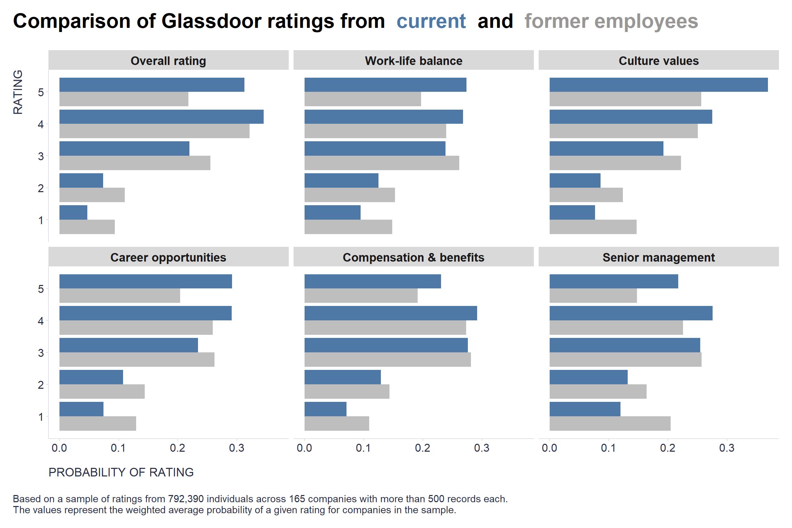

One simple lesson from the observation that former employees tend to rate their employers more harshly on Glassdoor compared to current employees: **Strive to retain your employees, and you'll likely have a more satisfied workforce and better Glassdoor ratings** 😁

```r
# uploading library
library(tidyverse)

# uploading data (link to the original dataset: https://www.kaggle.com/datasets/davidgauthier/glassdoor-job-reviews/code)
# data <- readr::read_csv("./glassdoor_reviews.csv")
# 
# # preparing data
# mydata <- data %>%
#   # selecting relevant vars
#   dplyr::select(firm, current, overall_rating, work_life_balance, culture_values, career_opp, comp_benefits, senior_mgmt) %>%
#   # keeping companies with at least 300 records
#   dplyr::group_by(firm) %>%
#   dplyr::mutate(n = n()) %>%
#   dplyr::ungroup() %>%
#   dplyr::filter(n >= 500) %>%
#   dplyr::select(-n) %>%
#   # renaming employee status and keeping only current and former employees
#   dplyr::mutate(
#     status = tolower(current),
#     status = case_when(
#       stringr::str_detect(status, "\\bcurrent\\b") ~ "Current employee",
#       stringr::str_detect(status, "\\bformer\\b") ~ "Former employee",
#       TRUE ~ "Unknown"
#     )
#     ) %>%
#   dplyr::filter(status != "Unknown") %>%
#   dplyr::select(-current) %>%
#   # changing wide format to long one
#   tidyr::pivot_longer(overall_rating:senior_mgmt, names_to = "rating_dimension", values_to = "value") %>%
#   # removing missing values
#   dplyr::filter(!is.na(value)) %>%
#   # renaming rating dimensions
#   dplyr::mutate(rating_dimension = case_when(
#     rating_dimension == "overall_rating" ~ "Overall rating",
#     rating_dimension == "work_life_balance" ~ "Work-life balance",
#     rating_dimension == "culture_values" ~ "Culture values",
#     rating_dimension == "career_opp" ~ "Career opportunities",
#     rating_dimension == "comp_benefits" ~ "Compensation & benefits",
#     rating_dimension == "senior_mgmt" ~ "Senior management",
#     TRUE ~ "Unknown"
#   )
#   ) %>%
#   # removing unknown rating dimensions
#   dplyr::filter(rating_dimension != "Unknown")

# to save space in my GitHub repo, I will upload already filtered dataset saved as .RDS file
mydata <- readRDS("./glassdoor_reviews_filtered.RDS")


# dataviz 
# computing weighted average probability of a given rating for companies in the sample
vizData <- mydata %>%
  dplyr::group_by(firm, status, rating_dimension, value) %>%
  dplyr::summarise(
    n = n()
  ) %>%
  dplyr::ungroup() %>%
  dplyr::group_by(firm, status, rating_dimension) %>%
  dplyr::mutate(nAll = sum(n)) %>%
  dplyr::ungroup() %>%
  dplyr::mutate(
    prop = n/nAll,
    wprop = prop*nAll
    ) %>%
  dplyr::group_by(status, rating_dimension, value) %>%
  dplyr::summarise(
    wpropsum = sum(wprop),
    w = sum(nAll)
    ) %>%
  dplyr::ungroup() %>%
  dplyr::mutate(fprop = wpropsum/w)

# chart
vizData %>%
  dplyr::mutate(rating_dimension = factor(rating_dimension, levels = c("Overall rating", "Work-life balance", "Culture values", "Career opportunities", "Compensation & benefits", "Senior management"))) %>%
  ggplot2::ggplot(aes(x = value, y = fprop, fill = forcats::fct_rev(status))) +
  ggplot2::geom_bar(stat = "identity", position="dodge") +
  ggplot2::coord_flip() +
  ggplot2::scale_fill_manual(values = c("Current employee" = "#4E79A7", "Former employee" = "gray")) +
  ggplot2::facet_wrap(~rating_dimension, ncol = 3, scales = "fixed") +
  ggplot2::labs(
    title = "<span style='font-size:22pt;font-weight:bold;'>**Comparison of Glassdoor ratings from** 
    <span style='color:#4E79A7;'>**current**</span> **and**
    <span style='color:#999696;'>**former employees**</span>
    </span>",
    caption = "\nBased on a sample of ratings from 792,390 individuals across 165 companies with more than 500 records each.\nThe values represent the weighted average probability of a given rating for companies in the sample.",
    x = "RATING",
    y = "PROBABILITY OF RATING"
  ) +
  ggplot2::theme(
    plot.title = ggtext::element_markdown(face = "bold", size = 18, margin=margin(0,0,20,0)),
    plot.subtitle = element_text(color = '#2C2F46', face = "plain", size = 16, margin=margin(0,0,20,0)),
    plot.caption = element_text(color = '#2C2F46', face = "plain", size = 11, hjust = 0),
    axis.title.x.bottom = element_text(margin = margin(t = 15, r = 0, b = 0, l = 0), color = '#2C2F46', face = "plain", size = 13, lineheight = 16, hjust = 0),
    axis.title.y.left = element_text(margin = margin(t = 0, r = 15, b = 0, l = 0), color = '#2C2F46', face = "plain", size = 13, lineheight = 16, hjust = 1),
    axis.text = element_text(color = '#2C2F46', face = "plain", size = 12, lineheight = 16),
    strip.text.x = element_text(size = 13, face = "bold"),
    axis.line = element_line(colour = "#E0E1E6"),
    legend.position="",
    panel.background = element_blank(),
    panel.grid.major.y = element_blank(),
    panel.grid.major.x = element_blank(),
    panel.grid.minor = element_blank(),
    axis.ticks = element_line(color = "#E0E1E6"),
    plot.margin=unit(c(5,5,5,5),"mm"), 
    plot.title.position = "plot",
    plot.caption.position =  "plot"
  )

```



On a more serious note, it may be quite interesting and potentially useful to examine the order of estimated differences in specific areas between current and former employees as it may provide some insights on which areas to focus on when trying to retain employees within the company. We can use a multilevel ordered regression analysis on a random sample of 300 ratings per company for this purpose.  

```r
# uploading libraries
library(ordinal)
library(broom.mixed)
library(parameters)

# modeling responses using multilevel ordered regression analysis
fits <- data.frame()
# looping over individual dimensions
for(scale in c("Overall rating", "Work-life balance", "Culture values", "Career opportunities", "Compensation & benefits", "Senior management")){
  #print(scale)
  set.seed(1234)
  model <- ordinal::clmm("value ~ status + (1 | firm)", data = mydata %>% dplyr::filter(rating_dimension == scale) %>% dplyr::mutate(value = factor(value,ordered = TRUE)) %>% dplyr::group_by(firm) %>% dplyr::sample_n(300) %>% dplyr::ungroup())
  #summary(model)
  
  # extracting information about fitted models
  supp <- broom.mixed::tidy(model) %>%
    dplyr::filter(term == "statusFormer employee") %>%
    dplyr::bind_cols(parameters::ci(model) %>% filter(Parameter == "statusFormer employee") %>% select(CI_low, CI_high)) %>%
    dplyr::select(-coef.type) %>%
    dplyr::mutate(scale = scale) %>%
    dplyr::select(scale, everything())
  
  fits <- dplyr::bind_rows(fits, supp)
  
}

fits %>%
  arrange(estimate)

```

Caveat: As the title of this post implies, readers should be aware that numerous biases can distort the portrayal of employee experiences reflected in Glassdoor ratings. Some of the most significant biases include survivorship bias, social desirability, non-response bias, self-selection, and motivated reasoning. 

[Dr. Paul De Young's](https://www.linkedin.com/in/pauldeyoungphd) personal experience in this regard is quite telling: *"There is often a high preponderance of phony ratings among so-called current employees on Glassdoor. Beware of bogus “part time” current employees giving high ratings, especially if the company does not employ a lot of part-time employees.Also, I learned from an HR executive that if you want to get ratings up on Glassdoor, encourage ALL your employees to rate the company. Most often it is the mistreated employees who post because this is an outlet for their misfortune. By getting more employees to rate, chances are your ratings will increase. Watch for actively monitored employers on Glassdoor. You can usually tell a bogus rating because there is a high rating with very few comments in jobs that do not exist. The first thing I do when looking at a company is to filter out the part time employees and look at the impact on the overall scores. If they jump down, you have to wonder about the validity of the ratings. Read the comments, they are more telling. There are all kinds of ways to game the system. Glassdoor is helpful, but doesn’t always give you a valid picture without looking at the details, which is where the devil lives."* 

However, it doesn't mean that there is no signal in Glassdoor ratings. For example, [behavioral scientists at Culture Amp](https://www.cultureamp.com/blog/improving-glassdoor-scores-engagement-data) investigated the relationship between Glassdoor ratings and employee engagement data collected by Culture Amp. The findings suggested a strong correlation between employee engagement and Glassdoor ratings, particularly as the number of reviews increases (r = 0.69 for 100+ reviews). Companies with higher engagement scores tended to have better Glassdoor ratings, including higher CEO approval percentages and a greater likelihood of being recommended as a workplace. The study also identified the five factors with the largest relationship to Glassdoor scores, which included Learning and Development, Service and Quality Focus, Decision-making, Leadership, and Collaboration.

<!-- RELATED:BEGIN -->
## Related notes
- [[tenure-vs-satisfaction|Simulating the "survivorship" effect in employee satisfaction data over time]]
- [[rwa|RWA – A go-to tool for key drivers analysis of employee survey data?]]
- [[psw-and-selection-bias-in-employee-surveys|How to analyze employee survey results with less (selection) bias?]]
- [[people-analytics-popularity-after-covid|The impact of the COVID pandemic on the popularity of people analytics]]
- [[multilevel-modeling|Multilevel modeling in people analytics]]
<!-- RELATED:END -->

---
> 📄 Read the [original post with full outputs](https://blog-about-people-analytics.netlify.app/posts/2023-04-24-glassdoor/) on my blog.
