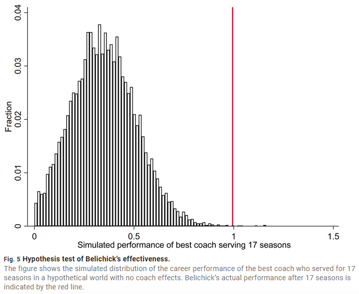

At least, that’s the somewhat unexpected takeaway from a [2021 study by Berry & Fowler](https://www.science.org/doi/10.1126/sciadv.abe3404) who found that…

* sports coaches in football, basketball, baseball, and hockey have the largest measurable effects on their teams’ outcomes (wins, points scored, defensive records, etc.);
* political leaders in autocracies and transitional regimes can significantly shape economic growth; at the subnational level, U.S. governors influence state finances and crime rates but not broader economic outcomes like income or employment; U.S. mayors, however, showed no detectable effect on their city's economy, public finances, or crime rates; and 
* CEOs show surprisingly little systematic influence on their organizations' performance, with the study finding no statistically significant effects for eight out of the nine firm outcomes it tested. 

The authors suggest these patterns may arise because the clarity of goals and direct impact of decisions in sports make coaching influence highly visible, while in politics the strength of institutions matters: in democracies, good institutions constrain leaders and reduce differences between them, but in autocracies or transitional regimes, individual leaders have more room to shape outcomes. In business, meanwhile, the lack of measurable CEO effects could be explained by institutional constraints, homogeneous selection of highly capable candidates, and strong external factors (like markets and industry cycles) that swamp individual leadership differences. 

Curious whether the findings for CEOs would hold if the analysis went beyond large, established firms with professional executives to also include start/scale-ups, where leadership might matter more given fewer institutional constraints, less mature organizational routines, and greater dependence on founders’ decisions.

Also super interesting is the new method the authors developed, called RIFLE (Randomization Inference for Leader Effects) - designed specifically to test whether leaders truly matter or whether outcomes are just the result of luck and timing. Its logic is relatively straightforward: first, measure how much variation in outcomes (GDP growth, firm profits, team wins) seems linked to leaders in the real data. Then create hundreds of “alternative worlds” by shuffling the order of leaders’ tenures while keeping tenure length, broader trends, environmental difficulty, and performance streaks exactly the same. In these reshuffled worlds, leaders are random - so any differences come only from chance and momentum. If the real-world pattern is stronger than in these simulated worlds, that’s evidence of genuine leadership impact. In this way, RIFLE improves on past methods: it avoids confusing streaks or trends with skill (a common flaw in standard regressions or variance decompositions) and makes use of all available data, unlike rare “natural experiments” such as leaders dying in office.

The chart below, from the paper, shows the method in action with famous NFL coach [Bill Belichick](https://en.wikipedia.org/wiki/Bill_Belichick). The histogram represents the distribution of the best records achievable over 17 seasons if outcomes were due to luck alone. The red line is Belichick's actual record - showing his success is an extreme statistical outlier, not just a lucky streak.

The key innovation is that RIFLE keeps the structure of the data intact while only randomizing who was in charge. That makes it possible to separate true leadership effects from the noise of luck and circumstance. While it's not a pure experiment, this method provides evidence that goes beyond simple correlation by ruling out some key alternative explanations, making a more confident, causal-like claim about a leader's actual impact.

I wonder if anyone in the people analytics space has tried applying this method to a PA-related use case.

<!-- RELATED:BEGIN -->
## Related notes
- [[causal-impact-of-leadership-skills|Novel way to measure leadership skills via causal inference (and AI)?]]
- [[self-leadership|Self-Leadership: A New Superpower?]]
- [[value-added-modeling|Goals saved above expected… for managers?]]
- [[managerial-quality|Unexpected protective effect of having a good manager?]]
- [[nice-leaders|If you are a leader, don't be afraid to be a nice one]]
<!-- RELATED:END -->

---
> 📄 Read the [original post with full outputs](https://blog-about-people-analytics.netlify.app/posts/2025-08-21-impact-of-leaders/) on my blog.
