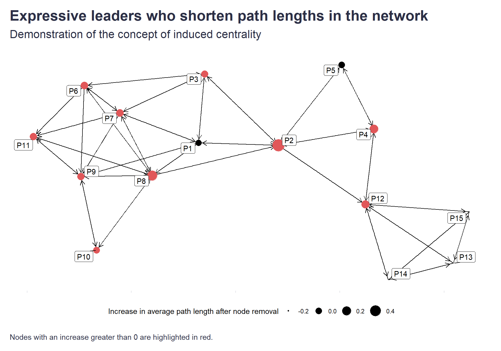

While reading the excellent publication [Social Networks at Work](https://www.amazon.com/Social-Networks-Work-Organizational-Frontiers/dp/1138572632) from SIOP's Organizational Frontiers series (btw, highly recommended to all PA professionals), I came across the interesting and useful concept of induced centrality. 

It sort of reverses the logic of the [common ONA centrality measures](https://cambridge-intelligence.com/keylines-faqs-social-network-analysis/), which focus primarily on what one gets from the surrounding network of connections, and instead shows how individual nodes contribute to some global network characteristic of interest, i.e. what one does for the network as a whole.

Its calculation is quite simple and straightforward - you just need to first calculate the global characteristic of the network that you are interested in as a reference point, e.g. its coherence, and then calculate how this measure changes when you remove individual nodes from the network. From this, you can deduce that the nodes that cause the most change in a specific direction contribute the most to a given measure. 

In addition to its versatility and the interesting angle it offers, it can also be very useful in making visible otherwise hidden and invisible "heroes" who contribute to the greater good under the radar of public recognition.

What follows is a small demonstration of using induced centrality to estimate which people play the role of expressive leaders who shorten the lengths of paths in the network. It’s an implementation of the idea briefly described in the aforementioned publication Social Networks at Work: 

*“For example, suppose one theorizes that there are certain individuals in groups (perhaps called expressive leaders) who provide a certain social glue such that they tend to shorten the lengths of paths in the network (see, for example, the Heidi Roizen case by McGinn and Tempest, 2010). This sounds like we should use closeness centrality, since it is concerned with path lengths. But there are two problems with this. First of all, closeness centrality only counts the shortest paths, and not the circuitous paths that things such as gossip often take. Second, closeness gets at how long it takes for information to reach a given node, who is then presumed to benefit from this information. But the concept we’ve just outlined is about individuals who enable others to have short paths so that the whole group benefits. Closeness was not designed to measure this, and doesn’t. However an induced centrality measure can be created to measure exactly this: to what degree paths lengthen when you remove each node from the network.”*

First, let’s upload the data used for the demonstration and create the network object. I will use a dataset that captures information-sharing links between 15 members of my friendship network.

```r
# uploading libraries
library(readxl)
library(igraph)
library(ggraph)

# uploading data
df <- readxl::read_excel("./friendshipNetwork.xlsx")

# creating network object
g <- igraph::graph_from_data_frame(df, directed=TRUE) 

```

We can now iterate over all directed pairs of nodes and compute the average length of paths between nodes we will use as a reference point. We won’t use all the paths but only the three shortest paths between each pair of nodes that would enable us to capture some of the circuitous paths mentioned in the problem description above.

```r
all_nodes <- V(g)
total_length <- 0
total_paths <- 0
# setting the number of 3 shortest paths between pair of nodes to capture also some of the circuitous paths 
top_shortest_paths <- 3

# loop for directed network
for (i in 1:length(all_nodes)) {
  for (j in 1:length(all_nodes)) {
    if (i != j) {
      lengths <- unlist(igraph::all_simple_paths(g, all_nodes[i], all_nodes[j], mode = "out"))
      lengths <- sort(lengths, decreasing = FALSE)[1:top_shortest_paths]
      total_length <- total_length + sum(lengths, na.rm = TRUE)
      total_paths <- total_paths + length(lengths)
    }
  }
}

# loop for undirected network 
# for (i in 1:(length(all_nodes) - 1)) {
#   for (j in (i + 1):length(all_nodes)) {
#     lengths <- all_simple_paths(g, all_nodes[i], all_nodes[j])
#     lengths <- sort(lengths, decreasing = FALSE)[1:top_shortest_paths]
#     total_length <- total_length + sum(lengths, na.rm = TRUE)
#     total_paths <- total_paths + length(lengths)
#   }
# }

# computing the average length of paths
average_length_ref <- total_length / total_paths

```

Now let’s remove each node one at a time from the network and calculate the average lengths of paths between pairs consisting of the remaining nodes. We also need to deal somehow with situations when node removal leads to the disconnection of previously connected nodes (in such situations, the distance between nodes is by default assumed to be infinite or undefined, which would bias our estimation). I have decided to take the three shortest paths from the complete network and add 1 (this is somewhat equivalent to the additional effort required to find a new bonding connection). After this step, we can subtract the reference point from the obtained values and get the information about the absence of which nodes lengthens the paths between other nodes and thus act as a kind of social glue that facilitates the spread of information between nodes. 

```r
# vector for saving average lengths of paths for individual nodes
average_lengths <- numeric(length(all_nodes))

for (k in 1:length(all_nodes)) {

  g_new <- g
  g_new <- igraph::delete_vertices(g_new, all_nodes[k])
  all_nodes_new <- V(g_new)
  
  total_length_new <- 0
  total_paths_new <- 0
  
  # for directed network
  for (i in 1:length(all_nodes_new)) {
    for (j in 1:length(all_nodes_new)) {
      if (i != j) {
        # lengths of paths in the network with removed node 
        lengths_new <- unlist(igraph::all_simple_paths(g_new, all_nodes_new[i], all_nodes_new[j], mode="out"))
        # lengths of paths in the complete network
        lengths <- unlist(igraph::all_simple_paths(g, all_nodes_new[i]$name, all_nodes_new[j]$name, mode="out"))
        # dealing with situations when node removal leads to disconnection of previously connected nodes by taking 3 shortest paths from the full network and adding 1
        if(is.null(lengths_new) & !is.null(lengths)){
          lengths_new <- sort(lengths, decreasing = FALSE)[1:top_shortest_paths]
          lengths_new <- lengths_new + 1
        } else{
          lengths_new <- sort(lengths_new, decreasing = FALSE)[1:top_shortest_paths]
        }
        total_length_new <- total_length_new + sum(lengths_new, na.rm = TRUE)
        total_paths_new <- total_paths_new + length(lengths_new)
      }
    }
  }
  
  # for undirected network 
  # for (i in 1:(length(all_nodes_new) - 1)) {
  #   for (j in (i + 1):length(all_nodes_new)) {
  #     lengths_new <- length_of_all_paths(g_new, all_nodes_new[i], all_nodes_new[j])
  #     lengths <- length_of_all_paths(g, all_nodes_new[i]$name, all_nodes_new[j]$name)
  #     if(is.null(lengths_new) & !is.null(lengths)){
  #      lengths_new <- sort(lengths, decreasing = FALSE)[1:top_shortest_paths]
  #      lengths_new <- lengths_new + 1
  #     } else{
  #      lengths_new <- sort(lengths_new, decreasing = FALSE)[1:top_shortest_paths]
  #     }
  #     total_length_new <- total_length_new + sum(lengths_new, na.rm = TRUE)
  #     total_paths_new <- total_paths_new + length(lengths_new)
  #   }
  # }
  
  average_lengths[k] <- total_length_new / total_paths_new
}

# computing the difference between average and reference point
average_length_diff <- average_lengths - average_length_ref

# assigning computed differences to individual nodes
V(g)$avg_length_diff <- average_length_diff

```

The graph below shows that nodes P2, P8, and P4 are the most critical in this respect. 

```r
ggraph::ggraph(g, layout = "kk") + # other available layouts: 'star', 'circle', 'gem', 'dh', 'graphopt', 'grid', 'mds', 'randomly', 'fr', 'kk', 'drl', 'lgl'
  ggraph::geom_edge_link(arrow = arrow(length = unit(2.5, 'mm')), end_cap = circle(2, 'mm')) +
  ggraph::geom_node_point(aes(size = avg_length_diff), alpha = 1, color = ifelse(V(g)$avg_length_diff>0, "#e15759", "black")) +
  ggplot2::scale_size_continuous(range = c(0.1,8)) +
  ggraph::geom_node_label(aes(label = name), repel = TRUE) +
  ggplot2::labs(
    title = "Expressive leaders who shorten path lengths in the network",
    subtitle = "Demonstration of the concept of induced centrality",
    size = "Increase in average path length after node removal",
    caption = "\nNodes with an increase greater than 0 are highlighted in red."
  ) +
  ggplot2::theme(
    plot.title = element_text(color = '#2C2F46', face = "bold", size = 21, margin=margin(0,0,9,0)),
    plot.subtitle = element_text(color = '#2C2F46', face = "plain", size = 16, margin=margin(0,0,20,0)),
    plot.caption = element_text(color = '#2C2F46', face = "plain", size = 11, hjust = 0),
    axis.title = element_blank(),
    axis.text = element_blank(),
    strip.text.x = element_text(size = 11, face = "plain"),
    axis.line = element_blank(),
    legend.position="bottom",
    legend.key = element_rect(fill = "white"),
    panel.background = element_blank(),
    panel.grid.major.y = element_blank(),
    panel.grid.major.x = element_blank(),
    panel.grid.minor = element_blank(),
    axis.ticks.x = element_line(color = "#E0E1E6"),
    axis.ticks.y = element_blank(),
    plot.margin=unit(c(5,5,5,5),"mm"), 
    plot.title.position = "plot",
    plot.caption.position =  "plot"
  )

```

## Figures



<!-- RELATED:BEGIN -->
## Related notes
- [[psychometric-network-analysis|Psychometric network analysis & employee survey data]]
- [[network-graph-employee-comments|Using network graph modeling to capture overarching thematic clusters in employee comments]]
- [[collaboration-overload-and-bottlenecks|Hot spots of collaboration overload and collaboration bottlenecks and how to find them]]
- [[conditional-inference-tree|Divide and... understand]]
- [[collaboration-and-personality|Collaboration and personality]]
<!-- RELATED:END -->

---
> 📄 Read the [original post with full outputs](https://blog-about-people-analytics.netlify.app/posts/2023-07-14-induced-centrality/) on my blog.
