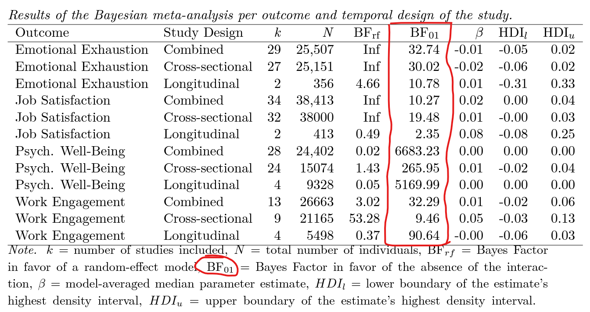

According to [Huth & Chung-Yan (2023)](https://psyarxiv.com/z5bdk/), contrary to the position of many theories in the field of occupational health and stress, job control does not reduce the negative impact of job demands on workers' well-being.

As you can see from the table below, the data provided strong evidence for the absence of the interaction between job demands and control.

At the same time, however, the authors themselves emphasize that “*[these] findings do not suggest that job demands and job control are not important work design features when considering the well-being of workers. Their direct effects on worker well-being are well-established in past research.*” 

“*The important conclusion of [the] study is that increased job control cannot offset the deleterious impact that high workloads have on workers. [This means that assuming] that employee well-being is a priority, workload should be restricted irrespective of the positive benefits of increasing employee control.*”

<!-- RELATED:BEGIN -->
## Related notes
- [[job-insecurity-and-behavioral-outcomes|Does a stick work?]]
- [[time-management|Consequences of time management in the workplace]]
- [[employee-satisfaction-and-company-bottom-line|Impact of employee satisfaction at work on a company's bottom line]]
- [[micro-breaks|Effectiveness of micro-breaks at work]]
- [[vocational-interests|Vocational interests don't seem so uninteresting after all]]
<!-- RELATED:END -->

---
> 📄 Read the [original post with full outputs](https://blog-about-people-analytics.netlify.app/posts/2023-11-18-job-demands-job-control-wellbeing/) on my blog.
