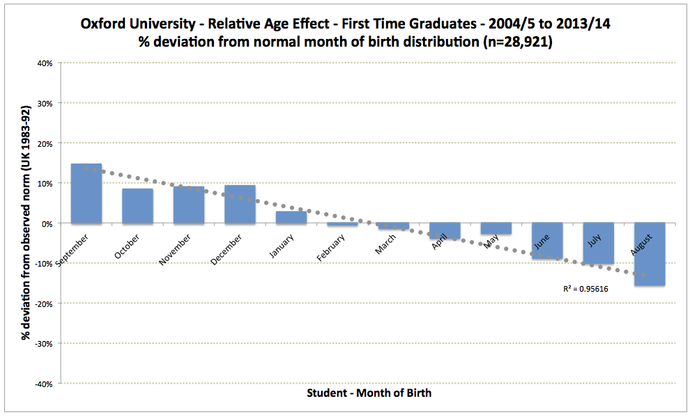

It’s easy to underestimate how much small, seemingly arbitrary factors shape long-term outcomes - especially when we’re used to telling clean stories about talent, effort, and merit.

I was reminded of this recently while reading [*Determined*](https://en.wikipedia.org/wiki/Determined:_A_Science_of_Life_Without_Free_Will) by [Robert Sapolsky](https://en.wikipedia.org/wiki/Robert_Sapolsky). One striking example he discusses is school entry cutoffs. Because these dates are administrative rather than developmental, children in the same classroom can differ in age by up to ~12 months. In early childhood, that gap often translates into real differences in cognitive, emotional, and self-regulatory maturity.

Teachers may understandably interpret those differences as indicators of ability or potential. That can lead to more encouragement, attention, and higher expectations for slightly older students - advantages that already start compounding by first grade, and can continue through tracking, confidence, and parental responses.

In the UK, where the cutoff date is August 31st, this [“relative age effect”](https://en.wikipedia.org/wiki/Relative_age_effect) shows up clearly in the data. While the effect size decreases over time, it remains detectable on average through secondary school and even into university. It’s a classic example of cumulative advantage (the so-called [*Matthew Effect*](https://en.wikipedia.org/wiki/Matthew_effect)). See the attached [chart](https://en.wikipedia.org/wiki/Relative_age_effect#/media/File:Oxford_10_years.png) for illustration - it shows a near-perfect linear decline in Oxford graduation rates, with the oldest students (September) being 15% overrepresented and the youngest (August) 15% underrepresented relative to the UK norm.

And of course, school entry dates are just one example. We could start with being born into a middle-class family, in a WEIRD country, at the end of the 20th century which already places you on a very particular starting point in life. And we could keep going. If you want a better sense of the background conditions we tend to leave out of our success (and failure) narratives, *Determined* is highly recommended - even if you don’t follow Sapolsky all the way on free will.

<!-- RELATED:BEGIN -->
## Related notes
- [[garden-of-forking-paths-redo|Refactoring the "Garden of Forking Paths]]
- [[conspiracy-theories-and-overfitting|Conspiracy theories as a specific example of overfitting?]]
- [[trust-errors-learning-reflection|When to forgive, when to close the book]]
- [[career-hurdles|And what are your career hurdles?]]
- [[strength-based-development-and-distributions|Strength-based development and power-law vs. normal distribution of performance]]
<!-- RELATED:END -->

---
> 📄 Read the [original post with full outputs](https://blog-about-people-analytics.netlify.app/posts/2026-01-23-matthew-effect-and-success-stories/) on my blog.
