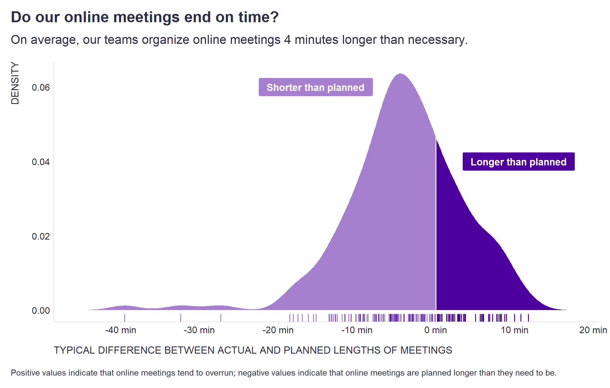

One of the recommended ways to save time in meetings is to plan them better in terms of the time we allocate for them. As in other activities, even here the well-known [Parkinson's rule](https://en.wikipedia.org/wiki/Parkinson%27s_law) applies that "work expands so as to fill the time available for its completion." When this is combined with the automatic use of default meeting lengths, it leads to spending more time in meetings than is necessary.

For this reason, [Steven Rogelberg](https://www.linkedin.com/in/rogelberg/) suggests in his book [The Surprising Science of Meetings](https://www.amazon.com/Surprising-Science-Meetings-Lead-Performance/dp/0190689218) that all meeting times should be reduced by 5-10 percent by default.

To assess whether you have room for improvement in this regard, it is useful to compare actual and planned meeting lengths. For illustration, the attached chart shows the distribution of the typical differences between actual and planned meeting lengths for each of our teams organizing online meetings over the course of a year. It clearly shows that a large proportion of teams are organizing meetings longer than necessary, by an average of 4 minutes. So in the case of our company [Time is Ltd.](https://www.timeisltd.com/), there definitely seems to be room for implementing Steven Rogelberg's suggestion. 

```r
# uploading package
library(tidyverse)

# uploading data
data <- readRDS("./tardiness.rds")

# preparing data for density plot
mydata <- with(density(data %>% pull(tardiness)), data.frame(x, y)) %>%
  mutate(col = ifelse(x >= 0, "A", "B"))

# visualizing data
mydata %>%
  ggplot() +
  geom_rug(data = filter(data, tardiness >=0), aes(x = tardiness), color = "#4d009d", size = 0.55, alpha = 1, position = "identity") +
  geom_rug(data = filter(data, tardiness <0), aes(x = tardiness), color = "#4d009d", size = 0.55, alpha = 0.5, position = "identity") +
  
  geom_area(data = filter(mydata, col == 'A'), aes(x = x, y = y), fill = '#4d009d', alpha = 1) + 
  geom_area(data = filter(mydata, col == 'B'), aes(x = x, y = y),  fill = '#4d009d', alpha = 0.5) +
  
  geom_label(aes( x=-15.25, y=0.06, label=" Shorter than planned "), fill = "#a67fce", color="white", size=4.5 , fontface="bold",  family = "Nunito Sans",  label.padding = unit(0.5, "lines")) +
  geom_label(aes( x=10.5, y=0.04, label=" Longer than planned "), fill = "#4d009d", color="white", size=4.5 , fontface="bold",  family = "Nunito Sans",  label.padding = unit(0.5, "lines")) +

  labs(
    x = "TYPICAL DIFFERENCE BETWEEN ACTUAL AND PLANNED LENGTHS OF MEETINGS",
    y = "DENSITY",
    title = "Do our online meetings end on time?",
    subtitle = str_glue("On average, our teams organize online meetings {round(abs(mean(data$tardiness)),1)} minutes longer than necessary."),
    caption = "\nPositive values indicate that online meetings tend to overrun; negative values indicate that online meetings are planned longer than they need to be."
  ) +
  scale_x_continuous(labels = scales::label_number(suffix = " min"), breaks =  seq(-40, 20, 10)) +
  theme(plot.title = element_text(color = '#2C2F46', face = "bold", family = "URW Geometric", size = 20, margin=margin(0,0,12,0)),
        plot.subtitle = element_text(color = '#2C2F46', face = "plain", family = "URW Geometric", size = 16, margin=margin(0,0,20,0)),
        plot.caption = element_text(color = '#2C2F46', face = "plain", family = "Nunito Sans", size = 11, hjust = 0),
        axis.title.x.bottom = element_text(margin = margin(t = 15, r = 0, b = 0, l = 0), color = '#2C2F46', face = "plain", family = "Nunito Sans", size = 13, lineheight = 16, hjust = 0),
        axis.title.y.left = element_text(margin = margin(t = 0, r = 15, b = 0, l = 0), color = '#2C2F46', face = "plain", family = "Nunito Sans", size = 13, lineheight = 16, hjust = 1),
        axis.title.y.right = element_text(margin = margin(t = 0, r = 0, b = 0, l = 15), color = '#2C2F46', face = "plain", family = "Nunito Sans", size = 13, lineheight = 16, hjust = 0),
        axis.text = element_text(color = '#2C2F46', face = "plain", family = "Nunito Sans", size = 12, lineheight = 16),
        axis.line.x = element_line(colour = "#E0E1E6"),
        axis.line.y = element_line(colour = "#E0E1E6"),
        legend.position=c(.2,.98),
        legend.key = element_rect(fill = "white"),
        legend.key.size = unit(0, "cm"),
        legend.margin = margin(-0.8,0,0,0, unit="cm"),
        legend.text = element_text(color = '#2C2F46', face = "plain", family = "Nunito Sans", size = 10, lineheight = 16),
        panel.background = element_blank(),
        panel.grid.major.y = element_blank(),
        panel.grid.major.x = element_blank(),
        panel.grid.minor = element_blank(),
        axis.ticks.x = element_line(color = "#E0E1E6"),
        axis.ticks.y = element_line(color = "#E0E1E6"),
        plot.margin=unit(c(5,5,5,5),"mm"), 
        plot.title.position = "plot",
        plot.caption.position =  "plot"
  )

```



It is also worth noting the reverse situation where meetings take longer than planned, as a late end to one meeting becomes a late start to the next meeting. 

How do you feel about finishing meetings too early or too late? Are both similarly unpleasant for you? And isn't actually having a shorter meeting than planned something positive?

<!-- RELATED:BEGIN -->
## Related notes
- [[back-to-back-meetings|Are back-to-back meetings for good or bad?]]
- [[meeting-matrix|Eisenhower matrix for meetings]]
- [[large-and-recurring-meetings|Where to look first when considering meeting reset?]]
- [[makers-and-managers-schedule|Makers' schedule and managers' schedule in collaboration data]]
- [[meetings-improvement|How to improve effectiveness of meetings?]]
<!-- RELATED:END -->

---
> 📄 Read the [original post with full outputs](https://blog-about-people-analytics.netlify.app/posts/2022-01-30-meeting-planning/) on my blog.
