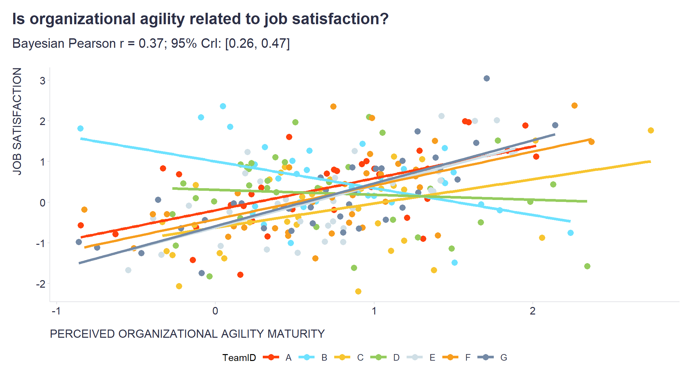

I am currently in the middle of a project where I am working with nested data and need to report multilevel correlations.

To my surprise, for quite a long time I couldn't find any libraries in the R or Python ecosystems that provided an easy-to-use implementation of this type of analysis. I thought I would have to code it from scratch using Stan or JAGS.

Fortunately, I discovered a fantastic correlation package (part of the easystats universe) that can compute various types of correlations, including multilevel correlations, partial correlations, Bayesian correlations, polychoric correlations, biweight correlations, distance correlations, and more.

Since nested data is (almost) everywhere, consider trying this package as it can make your life as an analyst a little bit easier 😉 Check out the code below to see it in action.

```r
# Uploading libraries and creating custom functions
library(tidyverse)
library(correlation)
library(ggsci)
library(MASS) 

# Creating simulated dataset with nested data

# Setting some basic parameters of the dataset
num_teams <- 7
team_ids <- LETTERS[1:num_teams]
min_rows <- 35

# Defining function to generate data for a team with specified correlation
generate_team_data <- function(team_id, correlation, job_sat_mean, agility_maturity_mean) {
  
  # Creating covariance matrix
  covariance <- correlation * (20 * 50)
  means <- c(job_sat_mean, agility_maturity_mean)
  cov_matrix <- matrix(c(100, covariance, covariance, 2500), nrow = 2)
  
  # Generating correlated data
  data <- MASS::mvrnorm(n = min_rows, mu = means, Sigma = cov_matrix)
  
  # Scaling the data
  data[, 1] <- scale(data[, 1],center = FALSE,scale = TRUE)
  data[, 2] <- scale(data[, 2],center = FALSE,scale = TRUE)
  
  # Putting data into dataframe
  df <- data.frame(
    TeamID = team_id,
    JobSatisfaction = data[, 1],
    AgilityMaturity = data[, 2])
  
  return(df)
  
}

# Generating random means for job satisfaction and agility maturity for each of the teams within some range
set.seed(42)
job_sat_means <- runif(num_teams, min = -5, max = 5)
agility_maturity_means <- runif(num_teams, min = 40, max = 60)

# Generating random correlations for each of the teams team within some range
set.seed(421)
correlations <- runif(num_teams, min = -0.3, max = 0.4)

# Generating data for each team and store in a list
set.seed(123)
team_data <- mapply(generate_team_data, team_id = team_ids, correlation = correlations, job_sat_mean = job_sat_means, agility_maturity_mean = agility_maturity_means, SIMPLIFY = FALSE)

# Combining team data into a single data frame
simulated_data <- do.call(rbind, team_data)

# Computing multilevel Bayesian Pearson  correlation analysis
c <- correlation::correlation(
  simulated_data,
  method = "pearson", 
  multilevel = TRUE, 
  bayesian = TRUE
)

# Extracting results of the analysis to be included in the chart defined below
Pearson_r = c[1,3]
CI95L = c[1,4]
CI95H = c[1,5]

# Plotting the chart
ggplot2::ggplot(simulated_data, aes(y = JobSatisfaction, x = AgilityMaturity, color = TeamID)) +
  ggplot2::geom_point(size = 3) +
  ggplot2::geom_smooth(method = "lm", se = FALSE, size = 1.5) + 
  ggsci::scale_color_tron() +
  ggplot2::labs(
    y = "JOB SATISFACTION",
    x = "PERCEIVED ORGANIZATIONAL AGILITY MATURITY",
    title = "Is organizational agility related to job satisfaction?",
    subtitle = stringr::str_glue("Bayesian Pearson r = {round(Pearson_r,2)}; 95% CrI: [{round(CI95L,2)}, {round(CI95H,2)}]")
  ) +
 
  ggplot2::theme(
    plot.title = element_text(color = '#2C2F46', face = "bold", size = 18, margin=margin(0,0,12,0)),
    plot.subtitle = element_text(color = '#2C2F46', face = "plain", size = 15, margin=margin(0,0,20,0)),
    plot.caption = element_text(color = '#2C2F46', face = "plain", size = 11, hjust = 0),
    axis.title.x.bottom = element_text(margin = margin(t = 15, r = 0, b = 0, l = 0), color = '#2C2F46', face = "plain", size = 13, lineheight = 16, hjust = 0),
    axis.title.y.left = element_text(margin = margin(t = 0, r = 15, b = 0, l = 0), color = '#2C2F46', face = "plain", size = 13, lineheight = 16, hjust = 1),
    axis.text = element_text(color = '#2C2F46', face = "plain", size = 12, lineheight = 16),
    axis.line = element_line(colour = "#E0E1E6"),
    axis.ticks = element_line(color = "#E0E1E6"),
    strip.text.x = element_text(size = 11, face = "plain"),
    legend.position= "bottom",
    legend.key = element_rect(fill = "white"),
    legend.key.width = unit(1.6, "line"),
    legend.margin = margin(0,0,0,0, unit="cm"),
    legend.text = element_text(color = '#2C2F46', face = "plain", size = 10, lineheight = 16),
    panel.background = element_blank(),
    panel.grid.major.y = element_blank(),
    panel.grid.major.x = element_blank(),
    panel.grid.minor = element_blank(),
    plot.margin=unit(c(5,5,5,5),"mm"), 
    plot.title.position = "plot",
    plot.caption.position =  "plot"
  ) +
  ggplot2::guides(color = guide_legend(nrow = 1))

```



<!-- RELATED:BEGIN -->
## Related notes
- [[multilevel-modeling|Multilevel modeling in people analytics]]
- [[psychometric-network-analysis|Psychometric network analysis & employee survey data]]
- [[personality-and-non-linearities|Nonlinear relationships between personality traits and business outcomes seem to be the norm rather than the exception]]
- [[rwa|RWA – A go-to tool for key drivers analysis of employee survey data?]]
- [[latent-class-analysis|Latent Class Analysis of responses from employee surveys]]
<!-- RELATED:END -->

---
> 📄 Read the [original post with full outputs](https://blog-about-people-analytics.netlify.app/posts/2023-04-18-multilevel-correlation/) on my blog.
