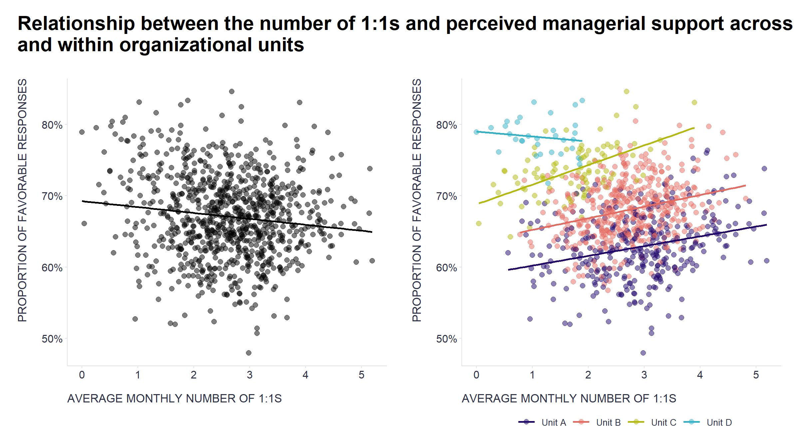
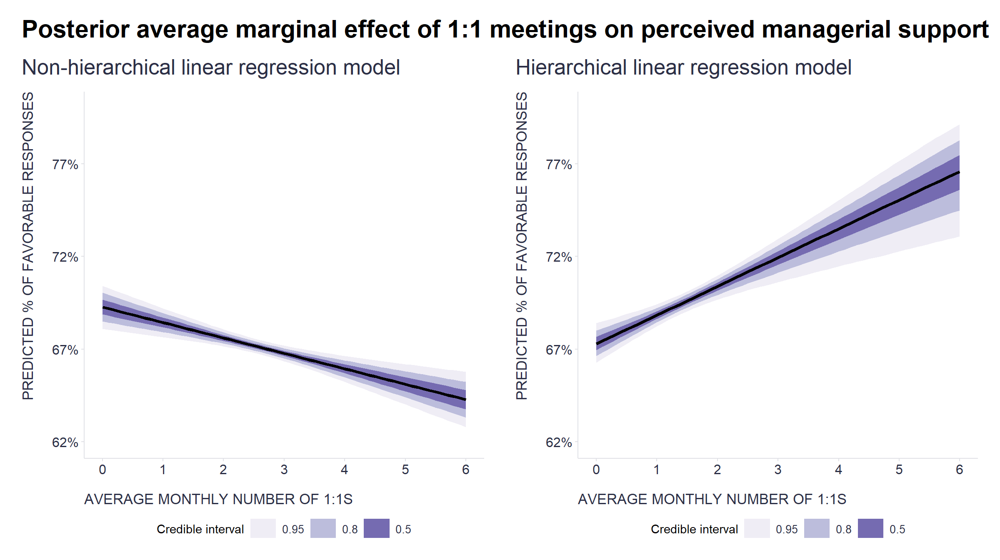

In one of [our](https://www.timeisltd.com/) projects, where we were trying to find out how collaborative behavior relates to employee engagement, we repeatedly came across patterns that reminded the client of internally well-known differences between the behavior of teams from different parts of the company. For example, we found that more frequent participation in short and small meetings was related to lower employee engagement. This pattern matched well the client's observation that one particular part of the company had regular daily stand-up meetings and also lower engagement scores compared to the rest of the company due to some other aspects of their work. As further analysis confirmed, this pattern was really just a statistical artifact caused by the coincidence of these two facts.  

One way analysts can protect themselves from this type of misleading conclusions is by using **multilevel or hierarchical models** that take into account the fact that the **data have a nested structure**, i.e. that some observations are not independent of each other because they belong to the same higher-order group, e.g. to an organizational unit (one of the basic assumptions of most statistical models in use).

This is well illustrated in the graphs below. They show that the relationship between the number of monthly 1:1s that employees have with their line manager and their subjectively perceived support from their line manager is slightly positive across most groups of teams (shown by colored dots and lines), but when all teams are analyzed together, the relationship is rather negative (shown by black dots and lines).

```r
# uploading libraries
library(tidyverse)
library(scales)
library(patchwork)
library(ggtext)

data <- readr::read_csv("./data.csv")

# chart showing a relationship between 1:1s and perceived managerial support while taking into account differences between organizational units 
g1 <- data %>% 
  ggplot2::ggplot(aes(oneonones, mngsupport)) +
  ggplot2::geom_point(aes(col = Unit), size = 2.5, alpha = 0.5) + 
  ggplot2::geom_smooth(aes(col = Unit), method = 'lm', alpha=0.2, se = F) +
  labs(
    x = "AVERAGE MONTHLY NUMBER OF 1:1S",
    y = "PROPORTION OF FAVORABLE RESPONSES",
    color = ""
  ) +
  ggplot2::scale_y_continuous(labels = scales::percent_format()) +
  ggplot2::scale_x_continuous(breaks = seq(0,5,1)) +
  ggplot2::scale_color_manual(values = c("Unit A" = "#20066b", "Unit B" = "#e56b61", "Unit C" = "#b4ba0d", "Unit D" = "#32b2c7")) +
  ggplot2::theme(plot.title = element_text(color = '#2C2F46', face = "bold", size = 21, margin=margin(0,0,0,0)),
        plot.subtitle = element_text(color = '#2C2F46', face = "plain", size = 16, margin=margin(0,0,0,0)),
        plot.caption = element_text(color = '#2C2F46', face = "plain", size = 11, hjust = 0),
        axis.title.x.bottom = element_text(margin = margin(t = 15, r = 0, b = 0, l = 0), color = '#2C2F46', face = "plain", family = "Nunito Sans", size = 13, lineheight = 16, hjust = 0),
        axis.title.y.left = element_text(margin = margin(t = 0, r = 15, b = 0, l = 0), color = '#2C2F46', face = "plain", family = "Nunito Sans", size = 13, lineheight = 16, hjust = 1),
        axis.title.y.right = element_text(margin = margin(t = 0, r = 0, b = 0, l = 15), color = '#2C2F46', face = "plain", family = "Nunito Sans", size = 13, lineheight = 16, hjust = 0),
        axis.text = element_text(color = '#2C2F46', face = "plain", size = 12, lineheight = 16),
        axis.line.x = element_line(colour = "#E0E1E6"),
        axis.line.y = element_line(colour = "#E0E1E6"),
        legend.position= "bottom",
        legend.key = element_rect(fill = "white"),
        legend.key.width = unit(1.6, "line"),
        legend.margin = margin(0,0,0,0, unit="cm"),
        legend.text = element_text(color = '#2C2F46', face = "plain", size = 10, lineheight = 16),
        legend.background = element_rect(fill = "transparent"),
        panel.background = element_blank(),
        panel.grid.major.y = element_blank(),
        panel.grid.major.x = element_blank(),
        panel.grid.minor = element_blank(),
        axis.ticks.x = element_line(color = "#E0E1E6"),
        axis.ticks.y = element_line(color = "#E0E1E6"),
        plot.margin=unit(c(5,5,5,5),"mm"), 
        plot.title.position = "plot",
        plot.caption.position =  "plot"
  )

# chart showing a relationship between 1:1s and perceived managerial support without taking into account differences between organizational units 
g2 <- data %>% 
  ggplot2::ggplot(aes(oneonones, mngsupport)) +
  ggplot2::geom_point(size = 2.5, alpha = 0.5) +
  ggplot2::geom_smooth(method = 'lm', alpha=0.2, linetype = "solid", color = "black", se = F) +
  ggplot2::labs(
    x = "AVERAGE MONTHLY NUMBER OF 1:1S",
    y = "PROPORTION OF FAVORABLE RESPONSES"
  ) +
  ggplot2::scale_y_continuous(labels = scales::percent_format()) +
  ggplot2::scale_x_continuous(breaks = seq(0,5,1)) +
  ggplot2::theme(plot.title = element_text(color = '#2C2F46', face = "bold", size = 21, margin=margin(0,0,0,0)),
        plot.subtitle = element_text(color = '#2C2F46', face = "plain", size = 16, margin=margin(0,0,0,0)),
        plot.caption = element_text(color = '#2C2F46', face = "plain", size = 11, hjust = 0),
        axis.title.x.bottom = element_text(margin = margin(t = 15, r = 0, b = 0, l = 0), color = '#2C2F46', face = "plain", size = 13, lineheight = 16, hjust = 0),
        axis.title.y.left = element_text(margin = margin(t = 0, r = 15, b = 0, l = 0), color = '#2C2F46', face = "plain", size = 13, lineheight = 16, hjust = 1),
        axis.title.y.right = element_text(margin = margin(t = 0, r = 0, b = 0, l = 15), color = '#2C2F46', face = "plain", size = 13, lineheight = 16, hjust = 0),
        axis.text = element_text(color = '#2C2F46', face = "plain", size = 12, lineheight = 16),
        axis.line.x = element_line(colour = "#E0E1E6"),
        axis.line.y = element_line(colour = "#E0E1E6"),
        legend.position= "bottom",
        legend.key = element_rect(fill = "white"),
        legend.key.width = unit(1.6, "line"),
        legend.margin = margin(0,0,0,0, unit="cm"),
        legend.text = element_text(color = '#2C2F46', face = "plain", size = 10, lineheight = 16),
        legend.background = element_rect(fill = "transparent"),
        panel.background = element_blank(),
        panel.grid.major.y = element_blank(),
        panel.grid.major.x = element_blank(),
        panel.grid.minor = element_blank(),
        axis.ticks.x = element_line(color = "#E0E1E6"),
        axis.ticks.y = element_line(color = "#E0E1E6"),
        plot.margin=unit(c(5,5,5,5),"mm"), 
        plot.title.position = "plot",
        plot.caption.position =  "plot"
  )

# combining the charts
g <- g2 + g1
g <- g + patchwork::plot_annotation(
  title = "<span style='font-size:22pt;font-weight:bold;'>**Relationship between the number of 1:1s and perceived managerial support across**
  <br>
  **and within organizational units**
    </span>",
  theme = theme(
    plot.title = ggtext::element_markdown(lineheight = 1.1, margin=margin(12,0,12,0), size = 22, face="bold")
  )
)

print(g)

```




```r
# uploading libraries
library(brms)
library(cmdstanr)

# fitting Bayesian hierarchical linear regression model
model <- brms::brm(
  brms::bf(mngsupport | trunc(lb = 0, ub = 1) ~ 1 + oneonones + (1 + oneonones | Unit)),
  data = data,
  family = gaussian(),
  chains = 3, 
  iter = 3000, 
  warmup = 1000,
  cores = 6, 
  seed = 1234, 
  backend = "cmdstanr",
  refresh = 0,
  silent = 2
)

# checking the fitted model
# summary(model)
# plot(model)
# brms::pp_check(model, ndraws = 100)


# fitting Bayesian non-hierarchical linear regression model
modelNonHierarchical <- brms::brm(
  brms::bf(mngsupport | trunc(lb = 0, ub = 1) ~ 1 + oneonones),
  data = data,
  family = gaussian(),
  chains = 3, 
  iter = 3000, 
  warmup = 1000,
  cores = 6, 
  seed = 1234, 
  backend = "cmdstanr",
  refresh = 0,
  silent = 2
)

# checking the fitted model
# summary(modelNonHierarchical)
# plot(modelNonHierarchical)
# brms::pp_check(modelNonHierarchical, ndraws = 100)

```

```r
# uploading libraries
library(emmeans)
library(tidybayes)

# marginal effect of 1:1s in the Bayesian hierarchical linear regression model
avg_marginal_effect <- model %>% 
  emmeans::emmeans(~ oneonones,
                   at = list(oneonones = seq(0, 6, by = 0.1)),
                   epred = TRUE,
                   re_formula = NULL) %>% 
  tidybayes::gather_emmeans_draws()

gf1 <- ggplot2::ggplot(avg_marginal_effect, aes(x = oneonones, y = .value)) +
  tidybayes::stat_lineribbon() +
  ggplot2::scale_y_continuous(labels = scales::percent_format(accuracy = 1), breaks = seq(0.62, 0.8, 0.05), limits = c(0.62, 0.8)) +
  ggplot2::scale_x_continuous(breaks = seq(0,6,1)) +
  ggplot2::scale_fill_brewer(palette = "Purples") +
  ggplot2::labs(
    x = "AVERAGE MONTHLY NUMBER OF 1:1S",
    y = "PREDICTED % OF FAVORABLE RESPONSES",
    fill = "Credible interval",
    title = "Hierarchical linear regression model"
  ) +
  ggplot2::theme(plot.title = element_text(color = '#2C2F46', face = "plain", size = 19, margin=margin(0,0,12,0)),
        plot.subtitle = element_text(color = '#2C2F46', face = "plain", size = 16, margin=margin(0,0,0,0)),
        plot.caption = element_text(color = '#2C2F46', face = "plain", size = 11, hjust = 0),
        axis.title.x.bottom = element_text(margin = margin(t = 15, r = 0, b = 0, l = 0), color = '#2C2F46', face = "plain", size = 13, lineheight = 16, hjust = 0),
        axis.title.y.left = element_text(margin = margin(t = 0, r = 15, b = 0, l = 0), color = '#2C2F46', face = "plain", size = 13, lineheight = 16, hjust = 1),
        axis.title.y.right = element_text(margin = margin(t = 0, r = 0, b = 0, l = 15), color = '#2C2F46', face = "plain", size = 13, lineheight = 16, hjust = 0),
        axis.text = element_text(color = '#2C2F46', face = "plain", size = 12, lineheight = 16),
        axis.line.x = element_line(colour = "#E0E1E6"),
        axis.line.y = element_line(colour = "#E0E1E6"),
        legend.position= "bottom",
        legend.key = element_rect(fill = "white"),
        legend.key.width = unit(1.6, "line"),
        legend.margin = margin(0,0,0,0, unit="cm"),
        legend.text = element_text(color = '#2C2F46', face = "plain", size = 10, lineheight = 16),
        legend.background = element_rect(fill = "transparent"),
        panel.background = element_blank(),
        panel.grid.major.y = element_blank(),
        panel.grid.major.x = element_blank(),
        panel.grid.minor = element_blank(),
        axis.ticks.x = element_line(color = "#E0E1E6"),
        axis.ticks.y = element_line(color = "#E0E1E6"),
        plot.margin=unit(c(5,5,5,5),"mm"), 
        plot.title.position = "plot",
        plot.caption.position =  "plot"
  )


# marginal effect of 1:1s in the Bayesian non-hierarchical linear regression model
avg_marginal_effect_nonHierarchical <- modelNonHierarchical %>% 
  emmeans::emmeans(
    ~ oneonones,
    at = list(oneonones = seq(0, 6, by = 0.1)),
    epred = TRUE,
    re_formula = NULL) %>% 
  tidybayes::gather_emmeans_draws()

gf2 <- ggplot2::ggplot(avg_marginal_effect_nonHierarchical, aes(x = oneonones, y = .value)) +
  tidybayes::stat_lineribbon() +
  ggplot2::scale_y_continuous(labels = scales::percent_format(accuracy = 1), breaks = seq(0.62, 0.8, 0.05), limits = c(0.62, 0.8)) +
  ggplot2::scale_x_continuous(breaks = seq(0,6,1)) +
  ggplot2::scale_fill_brewer(palette = "Purples") +
  ggplot2::labs(
    x = "AVERAGE MONTHLY NUMBER OF 1:1S",
    y = "PREDICTED % OF FAVORABLE RESPONSES",
    fill = "Credible interval",
    title = "Non-hierarchical linear regression model"
  ) +
    ggplot2::theme(plot.title = element_text(color = '#2C2F46', face = "plain", size = 19, margin=margin(0,0,12,0)),
        plot.subtitle = element_text(color = '#2C2F46', face = "plain", size = 16, margin=margin(0,0,0,0)),
        plot.caption = element_text(color = '#2C2F46', face = "plain", size = 11, hjust = 0),
        axis.title.x.bottom = element_text(margin = margin(t = 15, r = 0, b = 0, l = 0), color = '#2C2F46', face = "plain", size = 13, lineheight = 16, hjust = 0),
        axis.title.y.left = element_text(margin = margin(t = 0, r = 15, b = 0, l = 0), color = '#2C2F46', face = "plain", size = 13, lineheight = 16, hjust = 1),
        axis.title.y.right = element_text(margin = margin(t = 0, r = 0, b = 0, l = 15), color = '#2C2F46', face = "plain", size = 13, lineheight = 16, hjust = 0),
        axis.text = element_text(color = '#2C2F46', face = "plain", size = 12, lineheight = 16),
        axis.line.x = element_line(colour = "#E0E1E6"),
        axis.line.y = element_line(colour = "#E0E1E6"),
        legend.position= "bottom",
        legend.key = element_rect(fill = "white"),
        legend.key.width = unit(1.6, "line"),
        legend.margin = margin(0,0,0,0, unit="cm"),
        legend.text = element_text(color = '#2C2F46', face = "plain", size = 10, lineheight = 16),
        legend.background = element_rect(fill = "transparent"),
        panel.background = element_blank(),
        panel.grid.major.y = element_blank(),
        panel.grid.major.x = element_blank(),
        panel.grid.minor = element_blank(),
        axis.ticks.x = element_line(color = "#E0E1E6"),
        axis.ticks.y = element_line(color = "#E0E1E6"),
        plot.margin=unit(c(5,5,5,5),"mm"), 
        plot.title.position = "plot",
        plot.caption.position =  "plot"
  )

# combining the charts
gf <- gf2 + gf1
gf <- gf + patchwork::plot_annotation(
  title = "<span style='font-size:22pt;font-weight:bold;'>**Posterior average marginal effect of 1:1 meetings on perceived managerial support**
    </span>",
  theme = theme(
    plot.title = ggtext::element_markdown(lineheight = 1.1, margin=margin(12,0,0,0), size = 22, face="bold")
  )
)

print(gf)

```



Without the use of the hierarchical model (and/or a careful post-hoc visual check of alternative explanations), we would reach a completely opposite (and incorrect) conclusion about the relationship between the number of 1:1s and perceived support from the line manager (a phenomenon known as [Simpson’s paradox](https://en.wikipedia.org/wiki/Simpson%27s_paradox)). In this particular case, it is relatively easy to recognize that something may be wrong, but the situation is not always so obvious and intuitive. In these other cases, it is advantageous to have some tool at hand to compensate for our imperfect intuition and limited knowledge and imagination. Hierarchical models are one such tool.  

If you don't already have it in your analytics toolbox, be sure to give it a try. If you work with [R](https://www.r-project.org/), you can use the [lme4](https://cran.r-project.org/web/packages/lme4/index.html) or [brms](https://cran.r-project.org/web/packages/brms/index.html) packages to implement it. In a [Python environment](https://www.python.org/), you can use the [statsmodels](https://www.statsmodels.org/stable/index.html) or [PyMC3](https://docs.pymc.io/en/v3/index.html) libraries to do this. And if you're more used to drag-and-drop tools, then [JASP](https://jasp-stats.org/) or [jamovi](https://www.jamovi.org/) (both open-source alternatives to [SPSS](https://www.ibm.com/analytics/spss-statistics-software)) will give you access to various mixed models through an easy-to-use graphical interface.

For an accessible discussion of this topic in the context of people analytics, including other useful tools for working with hierarchical data, see also the excellent articles by [Paul van der Laken](https://www.linkedin.com/in/paulvanderlaken/), [John Lipinski](https://www.linkedin.com/in/john-lipinski-ph-d-99723814/), and [Max Blumberg](https://www.linkedin.com/in/maxblumberg/): 

* [Simpson’s Paradox: Two HR examples with R code.](https://paulvanderlaken.com/2017/09/27/simpsons-paradox-two-hr-examples-with-r-code/)
* [How to Avoid Aggregation Errors and Simpson’s Paradox in HR Analytics: Part 1](https://hranalytics101.com/how-to-avoid-aggregation-errors-and-simpsons-paradox-in-hr-analytics-part-1/)
* [How to Avoid Aggregation Errors and Simpson’s Paradox in HR Analytics: Part 2](https://hranalytics101.com/how-to-avoid-aggregation-errors-and-simpsons-paradox-in-hr-analytics-part-2/)
* [Why People Analytics should NOT be using regression to predict team outcomes](https://www.linkedin.com/pulse/why-peopleanalytics-should-using-regression-predict-team-max-blumberg/)

<!-- RELATED:BEGIN -->
## Related notes
- [[mixed-level-ml|Beyond the “flat Earth”]]
- [[causal-inference-in-people-analytics|Beyond prediction: Exploiting organizational events for causal inference in people analytics]]
- [[cross-lagged-panel-modeling|Getting (more) causal insights from employee survey data (without an RCT)]]
- [[latent-class-analysis|Latent Class Analysis of responses from employee surveys]]
- [[value-added-modeling|Goals saved above expected… for managers?]]
<!-- RELATED:END -->

---
> 📄 Read the [original post with full outputs](https://blog-about-people-analytics.netlify.app/posts/2022-09-17-multilevel-modeling/) on my blog.
