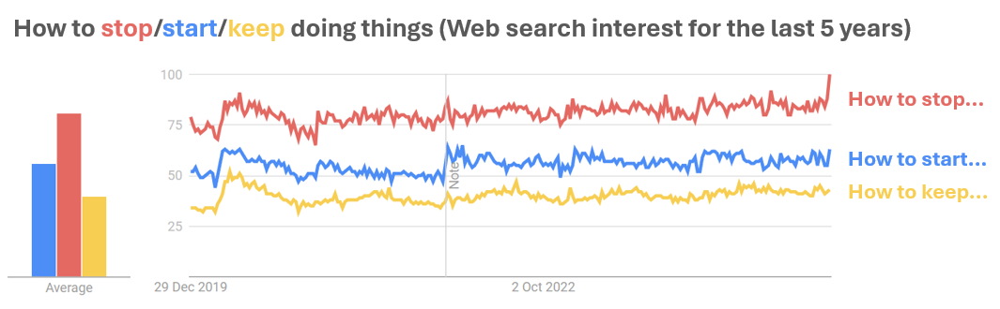

As we enter this part of the year when the 'fresh start' effect can kick in and help us make some desirable changes in our lives, I began to wonder what types of changes people are most inclined to pursue. One way to approach this question is through the well-known [Stop, Start, Continue framework](https://clickup.com/blog/start-stop-continue/), commonly used in employee feedback and development.

Looking at [Google Trends](https://trends.google.com/trends/) data and examining the frequency of search terms related to these three actions, it seems that people most often search for ways to stop doing things, followed by how to start doing things, and least often, how to continue doing things.

Any hypotheses as to why this might be the case? Here are my 'three cents', based on my personal experience:

1. The things we want to stop doing may feel more urgent because we are already experiencing their negative impact in our lives.
2. Stopping certain behaviors can be perceived as more challenging, as it often requires overcoming deeply ingrained habits formed through repeated actions – habits we tend to revert to, especially under stress or cognitive load. Or, as Mark Twain put it, "*It is easier to stay out than to get out.*"
3. The availability heuristic might play a role, as behaviors we already engage in are more easily brought to mind for reflection.

More importantly, whatever stops, starts, and continues make it onto your New Year’s resolution list – and for whatever reason – I wish you success in achieving them! 🖖🙂

<!-- RELATED:BEGIN -->
## Related notes
- [[start-stop-continue-feedback|Do we give more "Try This", "Knock It Off", or "Keep It Up" recommendations in 360-degree feedback?]]
- [[goal-setting|Do high-low range goals aid in maintaining motivation over time?]]
- [[managers-and-performance-evaluations|A new broom sweeps clean]]
- [[self-leadership|Self-Leadership: A New Superpower?]]
- [[predictors-of-stay-intentions-vs-actual-resignations|Talk vs. Walk: Predictors of staying intentions vs. actual quitting behavior]]
<!-- RELATED:END -->

---
> 📄 Read the [original post with full outputs](https://blog-about-people-analytics.netlify.app/posts/2024-12-30-new-years-resolution/) on my blog.
