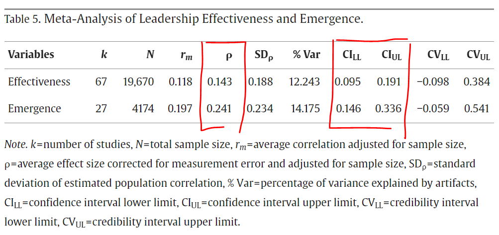

Contrary to the old adage that "nice guys finish last", a [meta-analysis by Blake et al. (2022)](https://www.sciencedirect.com/science/article/pii/S1048984321000989) that examined the relationship between leader agreeableness and leadership outcomes found that leader agreeableness was positively related to both leadership effectiveness and leadership emergence, though more strongly to the latter.

In the authors' own words, “*It seems that leaders no longer need to choose to be “effective” or “nice,” but rather both can be achieved simultaneously.*”

Interestingly, this applies, though perhaps to varying degrees, to leaders regardless of whether they work in collectivist or individualist cultures, whether they are executive or non-executive leaders, or whether they are male or female.

Considering that a large part of a manager's job is interacting with other people, be it individual employees, entire teams or larger groups, we probably shouldn't be so surprised. Still, it's good to see some support for this claim in the data.

The article also contains other interesting results of various moderation and post-hoc analyses, so I recommend you check out the original (open-access) article linked above.

<!-- RELATED:BEGIN -->
## Related notes
- [[impact-of-leaders|Want to maximize your impact as a leader?]]
- [[causal-impact-of-leadership-skills|Novel way to measure leadership skills via causal inference (and AI)?]]
- [[personality-and-work-engagement|Putting the "ideal" personality for high work engagement in a broader context]]
- [[big-five-personality-and-earnings|Link between the Big Five personality traits and earnings]]
- [[collaboration-and-personality|Collaboration and personality]]
<!-- RELATED:END -->

---
> 📄 Read the [original post with full outputs](https://blog-about-people-analytics.netlify.app/posts/2024-03-21-nice-leaders/) on my blog.
