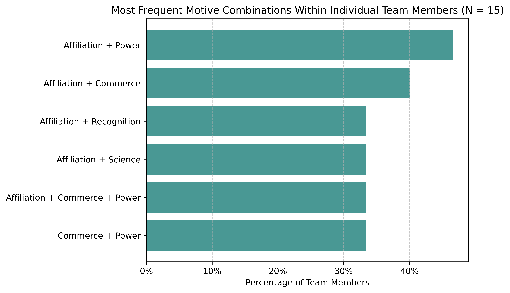

Early in my data science journey, one method that kept popping up in courses and study materials was market basket analysis—a simple technique designed to identify items that commonly occur together, typically in retail scenarios. In this context, many of you probably remember the famous “beer and diapers” example from the ’90s—the finding that young dads were often picking up a six-pack and diapers in the same trip to the store.

Despite its popularity, up until recently, I never really found a practical use for this method in my day-to-day work. But now, after many years, I finally came across a situation in a PA project where it actually came in handy. The task was to identify, within a team profile analysis, which pairs or trios of motives—as measured by the MVPI method—tend to show up together in a team within individual team members. This was meant to support interpretation for those running a series of team workshops (see the illustrative chart below).

The long wait was probably simply because the PA problems I’d worked on hadn’t really called for it before. But maybe it was also partly down to a lack of imagination on my part 🤔 What about you? Curious if you've found this method useful in any of the common PA tasks.

<!-- RELATED:BEGIN -->
## Related notes
- [[personality-and-non-linearities|Nonlinear relationships between personality traits and business outcomes seem to be the norm rather than the exception]]
- [[bayesian-networks-in-people-analytics|Use of Bayesian networks in people analytics?]]
- [[latent-class-analysis|Latent Class Analysis of responses from employee surveys]]
- [[self-selection-and-proxy-measures|When self-selected behavior is a blessing, not a headache]]
- [[expected-remaining-time|Does your team belong among “light bulbs” or “wines”?]]
<!-- RELATED:END -->

---
> 📄 Read the [original post with full outputs](https://blog-about-people-analytics.netlify.app/posts/2025-04-30-people-analytics-and-market-basket-analysis/) on my blog.
