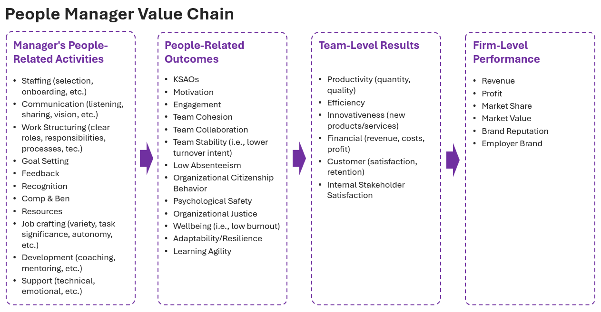

One of the projects I’m currently working on involves generating specific people-related insights to help managers be more successful at what they do—delivering results through others.

As you can imagine, it would be extremely useful to have a well-established and thoroughly researched model of a people manager value chain that clearly describes how individual managers contribute to organizational effectiveness. Unfortunately, my search for such a model wasn’t very fruitful—I mostly found isolated pieces of information and evidence.

The notable exception was a [2010 article, “The Leadership Value Chain,” by Kaiser & Overfield](https://www.researchgate.net/publication/238318590_The_Leadership_Value_Chain). They provided a comprehensive framework showing how leadership creates value, moving from individual leader characteristics through leadership style, team processes, unit results, and ultimately organizational effectiveness. However, their framework wasn’t detailed enough and lacked specific day-to-day managerial activities, which we needed to inspire practical ideas for our specific use case.

So, using the sources I found, I decided to put together my own model—a draft of which is attached. It starts with specific activities or processes that people managers more or less control or influence, driving people-related outcomes, which in turn fuel team-level results and ultimately contribute to firm performance.

Re methodology, I started with existing HRM value chain models (e.g., [Paauwe & Richardson, 1997](https://www.tandfonline.com/doi/abs/10.1080/095851997341621?journalCode=rijh20); [Hunt, 2014](https://www.amazon.com/Common-Sense-Talent-Management-Performance/dp/0470442417)) and research on the impact of HRM practices on business outcomes (e.g., [Huselid, 1995](https://www.researchgate.net/publication/228215412_The_Impact_of_Human_Resource_Management_Practices_on_Turnover_and_Productivity); [Combs et al., 2006](https://onlinelibrary.wiley.com/doi/10.1111/j.1744-6570.2006.00045.x?msockid=0007c754846062a23e99d26b850b6305); [Subramony, 2009](https://onlinelibrary.wiley.com/doi/10.1002/hrm.20315?msockid=0007c754846062a23e99d26b850b6305); [Jiang et al., 2012](https://journals.aom.org/doi/abs/10.5465/amj.2011.0088)), then distilled from specific HRM activities and processes the kinds of managerial actions that naturally overlap with or are part of them—things like coaching, mentoring, job design, feedback, goal setting, etc., and added a few extra elements based on other studies (e.g., [Jo & Hong’s 2022](https://www.frontiersin.org/journals/psychology/articles/10.3389/fpsyg.2022.900830/full) study on learning agility and innovative behavior) and plain common sense (e.g., people need functioning tools to do their job). For selected elements, I also checked existing evidence of their relationships—for instance, job crafting as a predictor of employee retention, using [Rubenstein et al.’s (2017)](https://onlinelibrary.wiley.com/doi/full/10.1111/peps.12226) meta-analysis on voluntary turnover.

Like any model, it’s a simplification of reality. It undoubtedly misses some key factors due to the chosen level of granularity or simply my ignorance. It’s static and linear, it doesn’t capture external moderators, and the relationships among many elements are in reality multi-directional and reciprocal. Nevertheless, I believe the model can serve as a useful starting point for discussions and decision-making regarding manager selection, development, performance appraisals, or broader organizational interventions.

Would love to hear if you’ve come across any solid sources on this topic—or if you’ve tried building something similar in your own organization and are up for sharing. Also, feel free to suggest any key factors you think are missing from this draft—or maybe don’t belong there at all.

<!-- RELATED:BEGIN -->
## Related notes
- [[hrm-value-chain-and-sem|HRM value chain and structural equation modeling - Moneyball case]]
- [[span-of-control-and-managerial-behavior|Can flatter orgs undermine people management?]]
- [[good-manager|Signals of a good manager]]
- [[the-triple-filter-test|The Triple-Filter Test: How to prioritize HR interventions with panel data]]
- [[causal-impact-of-leadership-skills|Novel way to measure leadership skills via causal inference (and AI)?]]
<!-- RELATED:END -->

---
> 📄 Read the [original post with full outputs](https://blog-about-people-analytics.netlify.app/posts/2025-07-09-people-manager-value-chain/) on my blog.
