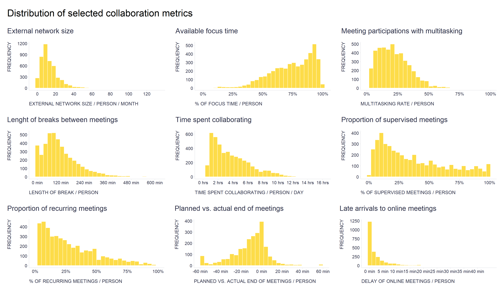

The fact is that many HR practitioners overestimate the frequency with which the phenomena they commonly encounter in their practice have a normal, bell-shaped, symmetrical distribution.

This is very much the case, for example, in the area of communication and collaboration that we deal with at [Time is Ltd.](https://www.timeisltd.com/), as illustrated in the attached chart with some of our collaboration metrics, which show a wide range of distributions from log-normal and power law to exponential, gamma, Weibull and beta. 

```r
# uploading libraries
library(tidyverse)
library(patchwork)

# uploading data
mydata <- readRDS("./collaborationMetrics.rds")

# External network size metric
externalNetworkSizeG <- mydata %>%
    dplyr::filter(metric == "externalNetworkSize") %>%
    ggplot2::ggplot(aes(x = metricValue)) +
    ggplot2::geom_histogram(fill = "#fdd835", alpha = 0.9, color = "white") +
    ggplot2::scale_x_continuous(breaks = seq(0,120,20)) +
    ggplot2::labs(
      x = "EXTERNAL NETWORK SIZE / PERSON / MONTH",
      y = "FREQUENCY",
      title = "External network size"
    ) +
    ggplot2::theme(
      plot.title = element_text(color = '#2C2F46', face = "plain", size = 19, margin=margin(0,0,20,0)),
      plot.subtitle = element_text(color = '#2C2F46', face = "plain", size = 13, margin=margin(0,0,15,0)),
      plot.caption = element_text(color = '#2C2F46', face = "plain", size = 11, hjust = 0),
      axis.title.x.bottom = element_text(margin = margin(t = 15, r = 0, b = 0, l = 0), color = '#2C2F46', face = "plain", size = 13, lineheight = 16, hjust = 0),
      axis.title.y.left = element_text(margin = margin(t = 0, r = 15, b = 0, l = 0), color = '#2C2F46', face = "plain", size = 13, lineheight = 16, hjust = 1),
      axis.title.y.right = element_text(margin = margin(t = 0, r = 0, b = 0, l = 15), color = '#2C2F46', face = "plain", size = 13, lineheight = 16, hjust = 0),
      axis.text = element_text(color = '#2C2F46', face = "plain", size = 12, lineheight = 16),
      axis.line.x = element_line(colour = "#E0E1E6"),
      axis.line.y = element_line(colour = "#E0E1E6"),
      legend.position= "bottom",
      legend.key = element_rect(fill = "white"),
      legend.key.width = unit(1.6, "line"),
      legend.margin = margin(0,0,0,0, unit="cm"),
      legend.text = element_text(color = '#2C2F46', face = "plain", size = 10, lineheight = 16),
      legend.background = element_rect(fill = "transparent"),
      panel.background = element_blank(),
      panel.grid.major.y = element_blank(),
      panel.grid.major.x = element_blank(),
      panel.grid.minor = element_blank(),
      axis.ticks.x = element_line(color = "#E0E1E6"),
      axis.ticks.y = element_line(color = "#E0E1E6"),
      plot.margin=unit(c(5,5,5,5),"mm"),
      plot.title.position = "plot",
      plot.caption.position =  "plot"
  )
  

# Focus rate metric
focusRatePrctG <- mydata %>%
    dplyr::filter(metric == "focusRatePrct") %>%
    ggplot2::ggplot(aes(x = metricValue)) +
    ggplot2::geom_histogram(fill = "#fdd835", alpha = 0.9, color = "white") +
    ggplot2::scale_x_continuous(labels = scales::percent_format()) +
    ggplot2::labs(
      x = "% OF FOCUS TIME / PERSON",
      y = "FREQUENCY",
      title = "Available focus time"
    ) +
    ggplot2::theme(
      plot.title = element_text(color = '#2C2F46', face = "plain", size = 19, margin=margin(0,0,20,0)),
      plot.subtitle = element_text(color = '#2C2F46', face = "plain", size = 13, margin=margin(0,0,15,0)),
      plot.caption = element_text(color = '#2C2F46', face = "plain", size = 11, hjust = 0),
      axis.title.x.bottom = element_text(margin = margin(t = 15, r = 0, b = 0, l = 0), color = '#2C2F46', face = "plain", size = 13, lineheight = 16, hjust = 0),
      axis.title.y.left = element_text(margin = margin(t = 0, r = 15, b = 0, l = 0), color = '#2C2F46', face = "plain", size = 13, lineheight = 16, hjust = 1),
      axis.title.y.right = element_text(margin = margin(t = 0, r = 0, b = 0, l = 15), color = '#2C2F46', face = "plain", size = 13, lineheight = 16, hjust = 0),
      axis.text = element_text(color = '#2C2F46', face = "plain", size = 12, lineheight = 16),
      axis.line.x = element_line(colour = "#E0E1E6"),
      axis.line.y = element_line(colour = "#E0E1E6"),
      legend.position= "bottom",
      legend.key = element_rect(fill = "white"),
      legend.key.width = unit(1.6, "line"),
      legend.margin = margin(0,0,0,0, unit="cm"),
      legend.text = element_text(color = '#2C2F46', face = "plain", size = 10, lineheight = 16),
      legend.background = element_rect(fill = "transparent"),
      panel.background = element_blank(),
      panel.grid.major.y = element_blank(),
      panel.grid.major.x = element_blank(),
      panel.grid.minor = element_blank(),
      axis.ticks.x = element_line(color = "#E0E1E6"),
      axis.ticks.y = element_line(color = "#E0E1E6"),
      plot.margin=unit(c(5,5,5,5),"mm"),
      plot.title.position = "plot",
      plot.caption.position =  "plot"
    )


# Multitasking in meetings metric
multitaskingInMeetingsPrctG <- mydata %>%
    dplyr::filter(metric == "multitaskingInMeetingsPrct") %>%
    ggplot2::ggplot(aes(x = metricValue)) +
    ggplot2::geom_histogram(fill = "#fdd835", alpha = 0.9, color = "white") +
    ggplot2::scale_x_continuous(labels = scales::percent_format(), limits = c(0,1)) +
    ggplot2::labs(
      x = "MULTITASKING RATE / PERSON",
      y = "FREQUENCY",
      title = "Meeting participations with multitasking"
    ) +
    ggplot2::theme(
      plot.title = element_text(color = '#2C2F46', face = "plain", size = 19, margin=margin(0,0,20,0)),
      plot.subtitle = element_text(color = '#2C2F46', face = "plain", size = 13, margin=margin(0,0,15,0)),
      plot.caption = element_text(color = '#2C2F46', face = "plain", size = 11, hjust = 0),
      axis.title.x.bottom = element_text(margin = margin(t = 15, r = 0, b = 0, l = 0), color = '#2C2F46', face = "plain", size = 13, lineheight = 16, hjust = 0),
      axis.title.y.left = element_text(margin = margin(t = 0, r = 15, b = 0, l = 0), color = '#2C2F46', face = "plain", size = 13, lineheight = 16, hjust = 1),
      axis.title.y.right = element_text(margin = margin(t = 0, r = 0, b = 0, l = 15), color = '#2C2F46', face = "plain", size = 13, lineheight = 16, hjust = 0),
      axis.text = element_text(color = '#2C2F46', face = "plain", size = 12, lineheight = 16),
      axis.line.x = element_line(colour = "#E0E1E6"),
      axis.line.y = element_line(colour = "#E0E1E6"),
      legend.position= "bottom",
      legend.key = element_rect(fill = "white"),
      legend.key.width = unit(1.6, "line"),
      legend.margin = margin(0,0,0,0, unit="cm"),
      legend.text = element_text(color = '#2C2F46', face = "plain", size = 10, lineheight = 16),
      legend.background = element_rect(fill = "transparent"),
      panel.background = element_blank(),
      panel.grid.major.y = element_blank(),
      panel.grid.major.x = element_blank(),
      panel.grid.minor = element_blank(),
      axis.ticks.x = element_line(color = "#E0E1E6"),
      axis.ticks.y = element_line(color = "#E0E1E6"),
      plot.margin=unit(c(5,5,5,5),"mm"),
      plot.title.position = "plot",
      plot.caption.position =  "plot"
    )


# Breaks between meetings metric
breaksBetweenMeetingsMinutesG <- mydata %>%
    dplyr::filter(metric == "breaksBetweenMeetingsMinutes") %>%
    ggplot2::ggplot(aes(x = metricValue)) +
    ggplot2::geom_histogram(fill = "#fdd835", alpha = 0.9, color = "white") +
    ggplot2::scale_x_continuous(labels = scales::number_format(suffix = " min"), breaks = seq(0,600,120)) +
    ggplot2::labs(
      x = "LENGTH OF BREAK / PERSON",
      y = "FREQUENCY",
      title = "Lenght of breaks between meetings"
    ) +
    ggplot2::theme(
      plot.title = element_text(color = '#2C2F46', face = "plain", size = 19, margin=margin(0,0,20,0)),
      plot.subtitle = element_text(color = '#2C2F46', face = "plain", size = 13, margin=margin(0,0,15,0)),
      plot.caption = element_text(color = '#2C2F46', face = "plain", size = 11, hjust = 0),
      axis.title.x.bottom = element_text(margin = margin(t = 15, r = 0, b = 0, l = 0), color = '#2C2F46', face = "plain", size = 13, lineheight = 16, hjust = 0),
      axis.title.y.left = element_text(margin = margin(t = 0, r = 15, b = 0, l = 0), color = '#2C2F46', face = "plain", size = 13, lineheight = 16, hjust = 1),
      axis.title.y.right = element_text(margin = margin(t = 0, r = 0, b = 0, l = 15), color = '#2C2F46', face = "plain", size = 13, lineheight = 16, hjust = 0),
      axis.text = element_text(color = '#2C2F46', face = "plain", size = 12, lineheight = 16),
      axis.line.x = element_line(colour = "#E0E1E6"),
      axis.line.y = element_line(colour = "#E0E1E6"),
      legend.position= "bottom",
      legend.key = element_rect(fill = "white"),
      legend.key.width = unit(1.6, "line"),
      legend.margin = margin(0,0,0,0, unit="cm"),
      legend.text = element_text(color = '#2C2F46', face = "plain", size = 10, lineheight = 16),
      legend.background = element_rect(fill = "transparent"),
      panel.background = element_blank(),
      panel.grid.major.y = element_blank(),
      panel.grid.major.x = element_blank(),
      panel.grid.minor = element_blank(),
      axis.ticks.x = element_line(color = "#E0E1E6"),
      axis.ticks.y = element_line(color = "#E0E1E6"),
      plot.margin=unit(c(5,5,5,5),"mm"),
      plot.title.position = "plot",
      plot.caption.position =  "plot"
    )

# Collaboration time metric
collaborationTimePersonHrsDayG <- mydata %>%
    dplyr::filter(metric == "collaborationTimePersonHrsDay") %>%
    ggplot2::ggplot(aes(x = metricValue)) +
    ggplot2::geom_histogram(fill = "#fdd835", alpha = 0.9, color = "white") +
    ggplot2::scale_x_continuous(labels = scales::number_format(suffix = " hrs"), breaks = seq(0,16,2)) +
    ggplot2::labs(
      x = "TIME SPENT COLLABORATING / PERSON / DAY",
      y = "FREQUENCY",
      title = "Time spent collaborating"
    ) +
    ggplot2::theme(
      plot.title = element_text(color = '#2C2F46', face = "plain", size = 19, margin=margin(0,0,20,0)),
      plot.subtitle = element_text(color = '#2C2F46', face = "plain", size = 13, margin=margin(0,0,15,0)),
      plot.caption = element_text(color = '#2C2F46', face = "plain", size = 11, hjust = 0),
      axis.title.x.bottom = element_text(margin = margin(t = 15, r = 0, b = 0, l = 0), color = '#2C2F46', face = "plain", size = 13, lineheight = 16, hjust = 0),
      axis.title.y.left = element_text(margin = margin(t = 0, r = 15, b = 0, l = 0), color = '#2C2F46', face = "plain", size = 13, lineheight = 16, hjust = 1),
      axis.title.y.right = element_text(margin = margin(t = 0, r = 0, b = 0, l = 15), color = '#2C2F46', face = "plain", size = 13, lineheight = 16, hjust = 0),
      axis.text = element_text(color = '#2C2F46', face = "plain", size = 12, lineheight = 16),
      axis.line.x = element_line(colour = "#E0E1E6"),
      axis.line.y = element_line(colour = "#E0E1E6"),
      legend.position= "bottom",
      legend.key = element_rect(fill = "white"),
      legend.key.width = unit(1.6, "line"),
      legend.margin = margin(0,0,0,0, unit="cm"),
      legend.text = element_text(color = '#2C2F46', face = "plain", size = 10, lineheight = 16),
      legend.background = element_rect(fill = "transparent"),
      panel.background = element_blank(),
      panel.grid.major.y = element_blank(),
      panel.grid.major.x = element_blank(),
      panel.grid.minor = element_blank(),
      axis.ticks.x = element_line(color = "#E0E1E6"),
      axis.ticks.y = element_line(color = "#E0E1E6"),
      plot.margin=unit(c(5,5,5,5),"mm"),
      plot.title.position = "plot",
      plot.caption.position =  "plot"
    )

# Supervised meetings metric
micromngMeetingsPrctG <- mydata %>%
    dplyr::filter(metric == "micromngMeetingsPrct") %>%
    ggplot2::ggplot(aes(x = metricValue)) +
    ggplot2::geom_histogram(fill = "#fdd835", alpha = 0.9, color = "white") +
    ggplot2::scale_x_continuous(labels = scales::percent_format()) +
    ggplot2::labs(
      x = "% OF SUPERVISED MEETINGS / PERSON",
      y = "FREQUENCY",
      title = "Proportion of supervised meetings"
    ) +
    ggplot2::theme(
      plot.title = element_text(color = '#2C2F46', face = "plain", size = 19, margin=margin(0,0,20,0)),
      plot.subtitle = element_text(color = '#2C2F46', face = "plain", size = 13, margin=margin(0,0,15,0)),
      plot.caption = element_text(color = '#2C2F46', face = "plain", size = 11, hjust = 0),
      axis.title.x.bottom = element_text(margin = margin(t = 15, r = 0, b = 0, l = 0), color = '#2C2F46', face = "plain", size = 13, lineheight = 16, hjust = 0),
      axis.title.y.left = element_text(margin = margin(t = 0, r = 15, b = 0, l = 0), color = '#2C2F46', face = "plain", size = 13, lineheight = 16, hjust = 1),
      axis.title.y.right = element_text(margin = margin(t = 0, r = 0, b = 0, l = 15), color = '#2C2F46', face = "plain", size = 13, lineheight = 16, hjust = 0),
      axis.text = element_text(color = '#2C2F46', face = "plain", size = 12, lineheight = 16),
      axis.line.x = element_line(colour = "#E0E1E6"),
      axis.line.y = element_line(colour = "#E0E1E6"),
      legend.position= "bottom",
      legend.key = element_rect(fill = "white"),
      legend.key.width = unit(1.6, "line"),
      legend.margin = margin(0,0,0,0, unit="cm"),
      legend.text = element_text(color = '#2C2F46', face = "plain", size = 10, lineheight = 16),
      legend.background = element_rect(fill = "transparent"),
      panel.background = element_blank(),
      panel.grid.major.y = element_blank(),
      panel.grid.major.x = element_blank(),
      panel.grid.minor = element_blank(),
      axis.ticks.x = element_line(color = "#E0E1E6"),
      axis.ticks.y = element_line(color = "#E0E1E6"),
      plot.margin=unit(c(5,5,5,5),"mm"),
      plot.title.position = "plot",
      plot.caption.position =  "plot"
    )


# Recurring meetings metric
recurringMeetingsPrctG <- mydata %>%
    dplyr::filter(metric == "recurringMeetingsPrct") %>%
    ggplot2::ggplot(aes(x = metricValue)) +
    ggplot2::geom_histogram(fill = "#fdd835", alpha = 0.9, color = "white") +
    ggplot2::scale_x_continuous(labels = scales::percent_format(), limits = c(0,1)) +
    ggplot2::labs(
      x = "% OF RECURRING MEETINGS / PERSON",
      y = "FREQUENCY",
      title = "Proportion of recurring meetings"
    ) +
    ggplot2::theme(
      plot.title = element_text(color = '#2C2F46', face = "plain", size = 19, margin=margin(0,0,20,0)),
      plot.subtitle = element_text(color = '#2C2F46', face = "plain", size = 13, margin=margin(0,0,15,0)),
      plot.caption = element_text(color = '#2C2F46', face = "plain", size = 11, hjust = 0),
      axis.title.x.bottom = element_text(margin = margin(t = 15, r = 0, b = 0, l = 0), color = '#2C2F46', face = "plain", size = 13, lineheight = 16, hjust = 0),
      axis.title.y.left = element_text(margin = margin(t = 0, r = 15, b = 0, l = 0), color = '#2C2F46', face = "plain", size = 13, lineheight = 16, hjust = 1),
      axis.title.y.right = element_text(margin = margin(t = 0, r = 0, b = 0, l = 15), color = '#2C2F46', face = "plain", size = 13, lineheight = 16, hjust = 0),
      axis.text = element_text(color = '#2C2F46', face = "plain", size = 12, lineheight = 16),
      axis.line.x = element_line(colour = "#E0E1E6"),
      axis.line.y = element_line(colour = "#E0E1E6"),
      legend.position= "bottom",
      legend.key = element_rect(fill = "white"),
      legend.key.width = unit(1.6, "line"),
      legend.margin = margin(0,0,0,0, unit="cm"),
      legend.text = element_text(color = '#2C2F46', face = "plain", size = 10, lineheight = 16),
      legend.background = element_rect(fill = "transparent"),
      panel.background = element_blank(),
      panel.grid.major.y = element_blank(),
      panel.grid.major.x = element_blank(),
      panel.grid.minor = element_blank(),
      axis.ticks.x = element_line(color = "#E0E1E6"),
      axis.ticks.y = element_line(color = "#E0E1E6"),
      plot.margin=unit(c(5,5,5,5),"mm"),
      plot.title.position = "plot",
      plot.caption.position =  "plot"
    )


# Call ending metric
callEndingMinutesG <- mydata %>%
    dplyr::filter(metric == "callEndingMinutes") %>%
    ggplot2::ggplot(aes(x = metricValue)) +
    ggplot2::geom_histogram(fill = "#fdd835", alpha = 0.9, color = "white") +
    ggplot2::scale_x_continuous(labels = scales::number_format(suffix = " min"), breaks = seq(-60,60,20)) +
    ggplot2::labs(
      x = "PLANNED VS. ACTUAL END OF MEETINGS / PERSON",
      y = "FREQUENCY",
      title = "Planned vs. actual end of meetings"
    ) +
    ggplot2::theme(
      plot.title = element_text(color = '#2C2F46', face = "plain", size = 19, margin=margin(0,0,20,0)),
      plot.subtitle = element_text(color = '#2C2F46', face = "plain", size = 13, margin=margin(0,0,15,0)),
      plot.caption = element_text(color = '#2C2F46', face = "plain", size = 11, hjust = 0),
      axis.title.x.bottom = element_text(margin = margin(t = 15, r = 0, b = 0, l = 0), color = '#2C2F46', face = "plain", size = 13, lineheight = 16, hjust = 0),
      axis.title.y.left = element_text(margin = margin(t = 0, r = 15, b = 0, l = 0), color = '#2C2F46', face = "plain", size = 13, lineheight = 16, hjust = 1),
      axis.title.y.right = element_text(margin = margin(t = 0, r = 0, b = 0, l = 15), color = '#2C2F46', face = "plain", size = 13, lineheight = 16, hjust = 0),
      axis.text = element_text(color = '#2C2F46', face = "plain", size = 12, lineheight = 16),
      axis.line.x = element_line(colour = "#E0E1E6"),
      axis.line.y = element_line(colour = "#E0E1E6"),
      legend.position= "bottom",
      legend.key = element_rect(fill = "white"),
      legend.key.width = unit(1.6, "line"),
      legend.margin = margin(0,0,0,0, unit="cm"),
      legend.text = element_text(color = '#2C2F46', face = "plain", size = 10, lineheight = 16),
      legend.background = element_rect(fill = "transparent"),
      panel.background = element_blank(),
      panel.grid.major.y = element_blank(),
      panel.grid.major.x = element_blank(),
      panel.grid.minor = element_blank(),
      axis.ticks.x = element_line(color = "#E0E1E6"),
      axis.ticks.y = element_line(color = "#E0E1E6"),
      plot.margin=unit(c(5,5,5,5),"mm"),
      plot.title.position = "plot",
      plot.caption.position =  "plot"
    )


# Call delay metric
callDelayMinutesG <- mydata %>%
    dplyr::filter(metric == "callDelayMinutes") %>%
    ggplot2::ggplot(aes(x = metricValue)) +
    ggplot2::geom_histogram(fill = "#fdd835", alpha = 0.9, color = "white") +
    ggplot2::scale_x_continuous(labels = scales::number_format(suffix = " min"), breaks = seq(0,40,5)) +
    ggplot2::labs(
      x = "DELAY OF ONLINE MEETINGS / PERSON",
      y = "FREQUENCY",
      title = "Late arrivals to online meetings"
    ) +
    ggplot2::theme(
      plot.title = element_text(color = '#2C2F46', face = "plain", size = 19, margin=margin(0,0,20,0)),
      plot.subtitle = element_text(color = '#2C2F46', face = "plain", size = 13, margin=margin(0,0,15,0)),
      plot.caption = element_text(color = '#2C2F46', face = "plain", size = 11, hjust = 0),
      axis.title.x.bottom = element_text(margin = margin(t = 15, r = 0, b = 0, l = 0), color = '#2C2F46', face = "plain", size = 13, lineheight = 16, hjust = 0),
      axis.title.y.left = element_text(margin = margin(t = 0, r = 15, b = 0, l = 0), color = '#2C2F46', face = "plain", size = 13, lineheight = 16, hjust = 1),
      axis.title.y.right = element_text(margin = margin(t = 0, r = 0, b = 0, l = 15), color = '#2C2F46', face = "plain", size = 13, lineheight = 16, hjust = 0),
      axis.text = element_text(color = '#2C2F46', face = "plain", size = 12, lineheight = 16),
      axis.line.x = element_line(colour = "#E0E1E6"),
      axis.line.y = element_line(colour = "#E0E1E6"),
      legend.position= "bottom",
      legend.key = element_rect(fill = "white"),
      legend.key.width = unit(1.6, "line"),
      legend.margin = margin(0,0,0,0, unit="cm"),
      legend.text = element_text(color = '#2C2F46', face = "plain", size = 10, lineheight = 16),
      legend.background = element_rect(fill = "transparent"),
      panel.background = element_blank(),
      panel.grid.major.y = element_blank(),
      panel.grid.major.x = element_blank(),
      panel.grid.minor = element_blank(),
      axis.ticks.x = element_line(color = "#E0E1E6"),
      axis.ticks.y = element_line(color = "#E0E1E6"),
      plot.margin=unit(c(5,5,5,5),"mm"),
      plot.title.position = "plot",
      plot.caption.position =  "plot"
    )

g <- (externalNetworkSizeG + focusRatePrctG + multitaskingInMeetingsPrctG) / 
  (breaksBetweenMeetingsMinutesG + collaborationTimePersonHrsDayG + micromngMeetingsPrctG) / 
  (recurringMeetingsPrctG + callEndingMinutesG + callDelayMinutesG) +
  patchwork::plot_annotation(
    title = 'Distribution of selected collaboration metrics',
    theme = theme(
      plot.title = element_text(size = 26, margin=margin(20,0,12,0))
    )
  )

print(g)

```



But it also applies to more traditional areas of HR concern such as individual or team performance. For many job roles, especially knowledge-based ones, job performance has a power-law distribution, i.e., only a few percent of individuals or teams have disproportionately high performance and most have performance below the statistical average (many of you have probably heard of Pareto's law, and the 80/20 rule in this context). More detailed information on this particular topic can be found, for example, in the following two articles - [The Best and the Rest: Revisiting the Norm of Normality of Individual Performance](https://onlinelibrary.wiley.com/doi/abs/10.1111/j.1744-6570.2011.01239.x) by O'Boyle Jr. & Aguinis (2012) and [Team Performance: Nature and Antecedents of Nonnormal Distributions](https://pubsonline.informs.org/doi/full/10.1287/orsc.2022.1619) by Bradley & Aguinis (2022). 

Why bother with that? Well, because, based on incorrect assumptions about the distribution of specific phenomena, companies may make decisions that ultimately harm them. For example, suppose a company applies the assumption of normal distribution in evaluating employees’ performance that actually has power law distribution. In that case, it will result in underestimating the contribution of the best performers and overestimating the contribution of the worst performers, which may be negatively reflected in various decisions regarding reward & compensation, learning & development, promotions, succession planning, etc. 

Lessons learned? For frequent decisions or decisions with a significant expected impact, it is worth checking that our underlying assumptions match reality.

Btw, this also applies to personal life. Here's an example from mine: I thought I was in control of watching movies and TV shows on streaming platforms, but I started getting signals from those around me that I was spending too much time there. So as a proper ['Quantified Selfer'](https://quantifiedself.com/), I decided to track my daily screen time for a month. To my surprise, I found that I was indeed spending a lot more time there than I thought and wished. I then put in place simple solutions to prevent me from watching more than I should - I have started to pay extra fees into the family budget for watching movies ([loss aversion](https://en.wikipedia.org/wiki/Loss_aversion)), I have pre-selected time slots for watching movies ([implementation intention](https://en.wikipedia.org/wiki/Implementation_intention)), I've removed streaming apps from my phone (lowering [salience](https://en.wikipedia.org/wiki/Salience_(neuroscience))), I've stopped watching movies alone (social control), and I'm also playing with the idea of asking my wife to change the PINs (preventing [impulsive](https://en.wikipedia.org/wiki/Impulsivity) watching). 

P.S. If you ever need to check the shape distribution of any of your metrics, you should definitely try the amazing [fitdistrplus R package](https://cran.r-project.org/web/packages/fitdistrplus/index.html).

<!-- RELATED:BEGIN -->
## Related notes
- [[strength-based-development-and-distributions|Strength-based development and power-law vs. normal distribution of performance]]
- [[psychometric-network-analysis|Psychometric network analysis & employee survey data]]
- [[multilevel-modeling|Multilevel modeling in people analytics]]
- [[personality-and-non-linearities|Nonlinear relationships between personality traits and business outcomes seem to be the norm rather than the exception]]
- [[expected-remaining-time|Does your team belong among “light bulbs” or “wines”?]]
<!-- RELATED:END -->

---
> 📄 Read the [original post with full outputs](https://blog-about-people-analytics.netlify.app/posts/2022-11-15-people-related-metrics-distribution/) on my blog.
