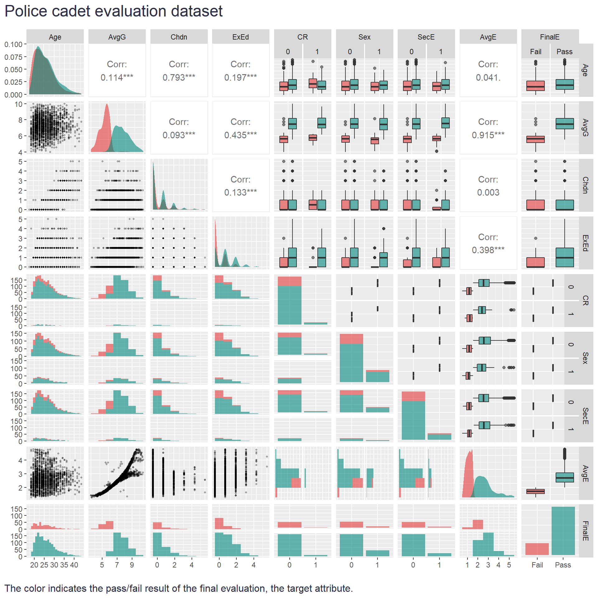

While cleaning out my (very) old computer, I came across a hidden gem: a dataset with real-world data about police cadet evaluation. It was part of a tutorial from [Peltarion](https://en.wikipedia.org/wiki/Peltarion), an AI software company providing specialized software ([Synapse](https://en.wikipedia.org/wiki/Peltarion_Synapse)) for creating, training, evaluating, and deploying artificial neural networks and other adaptive systems (recently acquired by [King](https://en.wikipedia.org/wiki/King_(company))). AFAIK, this dataset is not part of any publicly available database with training datasets, so it may add a bit to the portfolio of possibilities for those involved and interested in people analytics.  

The data were collected as part of an effort by the [National Police Services Agency](https://en.wikipedia.org/wiki/Korps_landelijke_politiediensten) and the [Dutch Ministry of Justice and Security](https://www.government.nl/ministries/ministry-of-justice-and-security) to objectively examine whether the data collected at the time of graduation of police cadets can be used to predict the requirements for passing the standard five-year evaluation. The main reason for the study was to find the key indicators for the then 20% failure rate, which was considered unacceptable (data were collected in the late 1990s), and to study the effects of lowering admission standards (accepting cadets with past criminal records and lowering the minimum grade from 5.5 to 4.0).

The dataset has the following characteristics:

* 2000 observations  
* 9 attributes:
  + **Age**: the age at which the cadet started studying to become a police officer.
  + **AvG**: average grade at the time of graduation (scale 1-10).
  + **Chdn**: number of children at the time of graduation.
  + **ExEd**: extra university-level or equivalent education (years).
  + **CR**: criminal record (0=No, 1=Yes).
  + **Sex**: sex of the cadet (0 = Male, 1 = Female).
  + **SecE**: other experience in the security sector (0 = No, 1 = Yes).
  + **AvgE**: average yearly evaluation score (The average of five years. The evaluation is performed by a committee of 10 senior police officers. Scale 1-5). This is a help attribute and not for use as input.
  + **FinalE**: final evaluation. Fail if average yearly evaluation score (Avg) < 2.0 otherwise pass. (1610 Pass / 390 Fail). This is the target attribute.

Here is a table you can use to check and download the data.

```r
# uploading libraries for data manipulation and making user-friendly data table
library(tidyverse)
library(DT)

# uploading data
data <- readr::read_csv("./policeCadetEvaluation.csv")

# adjusting the data type for some variables for tabulation and visualization purposes
data <- data %>%
  mutate(
    CR = as.factor(CR),
    Sex = as.factor(Sex),
    SecE = as.factor(SecE),
    FinalE = as.factor(FinalE)
  )

# defining the table
DT::datatable(
  data,
  class = 'cell-border stripe', 
  filter = 'top',
  extensions = 'Buttons',
  fillContainer = FALSE,
  rownames= FALSE,
  options = list(
    pageLength = 5, 
    autoWidth = TRUE,
    dom = 'Bfrtip',
    buttons = c('copy', 'csv', 'excel'), 
    scrollX = TRUE, 
    selection="multiple"
    )
  )

```


And here is a pairplot showing the distribution and relationships between variables in the dataset.
  
```r
# uploading library for the pairplot data visualization
library(GGally)

# defining custom function for diagonal continuous variable chart  
my_dens <- function(data, mapping) {
  ggplot(data = data, mapping = mapping) +
    geom_density(alpha = 0.6, color = NA) 
}

# pairplot
GGally::ggpairs(
  data = data,
  title = "Police cadet evaluation dataset",
  mapping=ggplot2::aes(fill = FinalE),
  lower=list(
    combo = wrap("facethist", binwidth=1, alpha = 0.6),
    continuous = wrap("points", alpha = 0.3, size = 0.7),
    discrete = wrap("facetbar", alpha = 0.6)
    ),
  upper=list(
    discrete = wrap("box", alpha = 0.6),
    combo = wrap("box", alpha = 0.6)
  ),
  diag = list(
    continuous = my_dens,
    discrete = wrap("barDiag", alpha = 0.6)
    )
  ) +
  ggplot2::scale_fill_manual(values=c("Fail" = "#e53935", "Pass" = "#00897b")) +
  labs(caption = "\nThe color indicates the pass/fail result of the final evaluation, the target attribute.") +
  ggplot2::theme(
    plot.title = element_text(color = '#2C2F46', face = "plain", size = 19, margin=margin(0,0,12,0)),
    plot.caption = element_text(color = '#2C2F46', face = "plain", size = 12, hjust = 0),
    plot.title.position = "plot",
    plot.caption.position =  "plot"
  )


```



If you want to download the dataset, you can do so here via the table above or via [my GitHub page](https://github.com/lstehlik2809/Police-Cadet-Evaluation-Dataset) where you can also find more information about the dataset. Happy analysis 😉

<!-- RELATED:BEGIN -->
## Related notes
- [[latent-class-analysis|Latent Class Analysis of responses from employee surveys]]
- [[selection-procedures-validity-update|Visualizing shifts in validity estimates for selection procedures]]
- [[conditional-inference-tree|Divide and... understand]]
- [[people-analytics-challenge-from-orgnostic|People Analytics Challenge from Orgnostic: Plan for high growth]]
- [[career-hurdles|And what are your career hurdles?]]
<!-- RELATED:END -->

---
> 📄 Read the [original post with full outputs](https://blog-about-people-analytics.netlify.app/posts/2022-10-24-police-cadet-evaluation-dataset/) on my blog.
