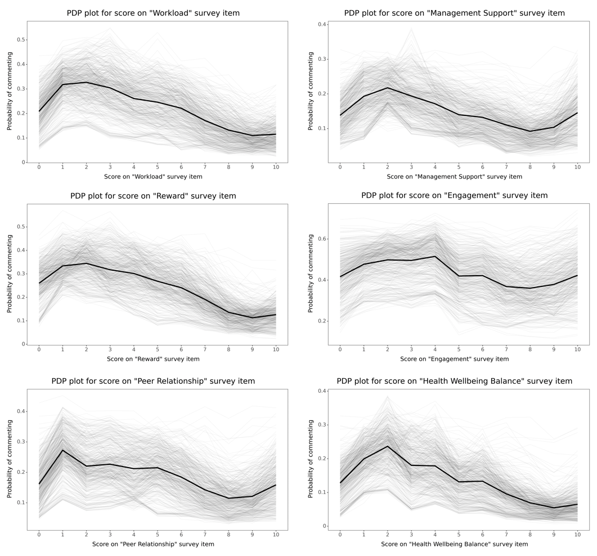

I've been curious about this for a while, but until recently, I only had my personal pet theories to rely on. Luckily, one of my recent projects gave me the chance to explore this question with real-world data and satisfy my curiosity a bit.

Why bother? Well, you can get a better feel for the representativeness of the comments, from which a lot of useful insights into the employee experience can be gleaned.  

Btw, what’s your guess? And try to make a prediction before reading on and/or checking the charts – with hindsight the results may seem too obvious 😉

To test my ideas, I used a classification RF model to be able to capture non-linear relationships, and used item score and some common controls as predictors of whether an employee would leave a comment on a given item. Then, I applied Partial Dependence Plot – a global ML interpretation tool – to the fitted model to examine the relationship between item scores and the likelihood of leaving a comment.

<div style="text-align:center">


</div>

What were the results? Well, as usual, it depends. However, across the sample of items shown, we can observe a common pattern of a non-linear, S-reversed-shaped relationship. Dissatisfied employees tend to comment more, except for those who are extremely dissatisfied. As satisfaction increases, the probability of commenting decreases, only to slightly rise again as we approach a satisfaction level of 10. Generally, it can be said that less satisfied employees comment more on average. Given that we collect feedback from employees to improve things, it makes kind of sense, right? 🤓

Does this match your expectations, or are you surprised? Would you expect different patterns for different items? Have you conducted a similar exercise with your own data? If so, what were the results? Perhaps you also know of some relevant research on this topic. Feel free to share.

P.S. If you would like to replicate this analysis using your own data, you can use the following Python script as inspiration. 


```python
# required libraries
# data manipulation
import pandas as pd
import numpy as np
import copy
# dataviz
from plotnine import *
# ML
from sklearn.model_selection import train_test_split, GridSearchCV
from sklearn.pipeline import Pipeline
from sklearn.compose import ColumnTransformer
from sklearn.preprocessing import OneHotEncoder, StandardScaler
from sklearn.ensemble import RandomForestClassifier
# ML explanation & interpretation
from sklearn.inspection import partial_dependence

# function for changing snake case names to titles (to beautify titles in generated charts)
def snake_to_title(snake_str):
    # Split the string by underscores
    words = snake_str.split('_')
    # Capitalize each word
    capitalized_words = [word.capitalize() for word in words]
    # Join the words with spaces
    title_case_string = ' '.join(capitalized_words)
    return title_case_string


# the analysis assumes wide-format data with individual-level records of employees' responses to employee survey questions on a scale 0-10 and their comments to these questions  
mydata = pd.read_csv('your_data.csv')

# list of survey items of interest
items = [
    'autonomy',
    'engagement',
    'workload',
    'recognition',
    'reward',
    'strategy',
    'growth',
    'management_support',
    'peer_relationship',
    'diversity_inclusion',
    'health_wellbeing_balance'
]

# looping over individual items
for item in items:
  
    print(item)
    
    # dataset to be used for ML task
    ml_data = copy.deepcopy(mydata)

    # name of the field with comments to a specific question
    item_comment = f'comment_{item}'

    # creating a flag indicating presence/absence of a comment
    ml_data[item_comment] = np.where(
        ml_data[item_comment].isna(), False, True
    )

    # keeping only those employees who replied to the question on a scale 0-10
    ml_data.dropna(subset=[item], inplace=True)


    # defining the predictors and target variable
    predictors = [item, 'age', 'gender', 'country', 'job_family_group', 'is_manager', 'management_level', 'org_unit', 'tenure']
    target = item_comment

    # stratified split of the data into training and testing sets
    X = ml_data[predictors]
    y = ml_data[target]
    X_train, X_test, y_train, y_test = train_test_split(X, y, test_size=0.2, random_state=1979, stratify=y)

    # defining the column transformer for data pre-processing
    preprocessor = ColumnTransformer(
        transformers=[
            ('num', StandardScaler(), ['age', 'tenure']),
            ('cat', OneHotEncoder(drop='first'), [item, 'gender', 'country', 'job_family_group', 'is_manager', 'management_level', 'org_unit'])
        ]
    )

    # Random Forest Classifier
    # skipping hyper-parameter fine-tuning for the sake of brevity
    rf = RandomForestClassifier(min_samples_leaf=5, min_samples_split=30, n_estimators=500,random_state=1979)
    

    # creating a pipeline
    pipeline = Pipeline(steps=[
        ('preprocessor', preprocessor),  
        ('classifier', rf)
    ])

    # fitting the pipeline
    pipeline.fit(X_train, y_train)
    
    # skipping assessment of the quality of the model for the sake of brevity

    # PDP (Partial Dependence) plots
    # size of the sample of individual conditional expectation (ICE) curves
    n = 500
    feature_names = X.columns
    fIndex = np.where(feature_names == item)[0][0]
    pdp_results = partial_dependence(pipeline, X_train, [fIndex], grid_resolution=50, kind="both")

    # extracting the data
    values = pdp_results['values'][0]
    average = pdp_results['average'][0]
    individual = pdp_results['individual'][0]

    # df for the average line
    pdp_data_avg = pd.DataFrame({
        'Score': values,
        'Partial Dependence': average
    })

    # df for the ICE curves
    pdp_data_ind = pd.DataFrame(individual, columns=values)
    pdp_data_ind['ID'] = pdp_data_ind.index
    pdp_data_ind = pdp_data_ind.melt(id_vars='ID', var_name='Score', value_name='Partial Dependence')

    # sampling 500 unique IDs
    sampled_ids = pdp_data_ind['ID'].unique()
    if len(sampled_ids) > n:
        np.random.seed(1979)
        sampled_ids = np.random.choice(sampled_ids, n, replace=False)

    pdp_data_ind = pdp_data_ind[pdp_data_ind['ID'].isin(sampled_ids)]
    pdp_data_ind['Score'] = pdp_data_ind['Score'].astype(float)


    # plotting the results
    item_title = snake_to_title(item)
    plot = (
        ggplot() +
        geom_line(aes(x='Score', y='Partial Dependence', group='ID'), size=0.1, alpha=0.2, data=pdp_data_ind) + 
        geom_line(aes(x='Score', y='Partial Dependence', group=1), size=1.5, data=pdp_data_avg) +  
        scale_x_continuous(breaks=range(0,11)) +
        labs(
            title=f'PDP plot for score on "{item_title}" survey item',
            x=f'Score on "{item_title}" survey item',
            y='Probability of commenting'
        ) +
        theme_bw() + 
        theme(    
            plot_title=element_text(size=18, margin={'t': 0, 'r': 0, 'b': 10, 'l': 0}), 
            axis_text=element_text(size=12), 
            axis_title=element_text(size=14), 
            axis_title_x=element_text(margin={'t': 10, 'r': 0, 'b': 0, 'l': 0}), 
            axis_title_y=element_text(margin={'t': 0, 'r': 10, 'b': 0, 'l': 0}), 
            strip_text_x=element_text(size=13),
            panel_grid_major=element_blank(),  
            panel_grid_minor=element_blank(),
            figure_size=(11, 6)
        ) 
    )

    #print(plot)
    
    # saving the plot
    plot.save(filename=f"{item}_item_pdp.png", width=11, height=6, dpi=500)

```

<!-- RELATED:BEGIN -->
## Related notes
- [[you-said-we-did|‘You Said, We Did’ matters - maybe just not as distinctly as we assume]]
- [[sentiment-analysis-validation|Sentiment analysis of employee survey comments using zero-shot classification]]
- [[predictors-of-stay-intentions-vs-actual-resignations|Talk vs. Walk: Predictors of staying intentions vs. actual quitting behavior]]
- [[honesty-in-engagement-vs-exit-surveys|Are people during exit surveys more honest in their responses than in engagement surveys?]]
- [[network-graph-employee-comments|Using network graph modeling to capture overarching thematic clusters in employee comments]]
<!-- RELATED:END -->

---
> 📄 Read the [original post with full outputs](https://blog-about-people-analytics.netlify.app/posts/2024-05-21-probability-of-comments-in-a-survey/) on my blog.
