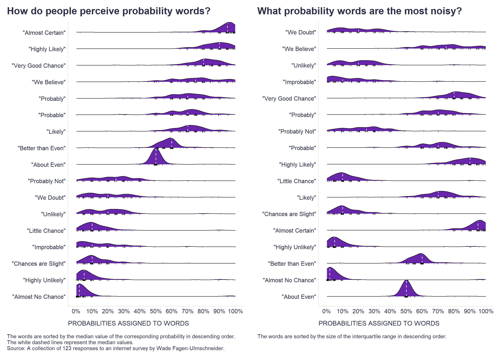

Nowadays - probably also due to the Covid pandemic and the associated predictions - we are more and more frequently encountering various probabilistic statements, but these are often expressed not in terms of precise numerical probabilities, but in terms of relatively vague probability words such as "probably", "maybe", "unlikely", etc.

Since people may imagine different probabilities under these words, it would be useful to have something like a glossary to help us decipher these words and indicate what people usually mean when they use them. 

Fortunately, there are some studies that examine what numerical probabilities people typically associate with probability words.

For this purpose, I used a collection of 123 responses to the [Wade Fagen-Ulmschneider's internet survey](https://github.com/wadefagen/datasets/tree/master/Perception-of-Probability-Words) and created two similar graphs based on them. The first shows the distribution of the numerical probabilities that people associate with each word, and these are sorted in the graph by the median value of the corresponding probability in descending order. The second graph then differs only in that the words are sorted by the size of the interquartile range in descending order.

```r
# uploading libraries
library(tidyverse)
library(ggridges)
library(ggpubr)

# uploading data
data <- readr::read_csv("./survey-results.csv")

# getting ordered list of words based on the median value of corresponding probabilities
wordsMedian <- data %>%
  select("\"Almost Certain\"":"\"Chances are Slight\"") %>%
  pivot_longer("\"Almost Certain\"":"\"Chances are Slight\"", names_to = "word", values_to = "probability") %>%
  group_by(word) %>%
  summarise(median = median(probability)) %>%
  mutate(
    word = factor(word),
    word = forcats::fct_reorder(word, median)
      )
  
levelsMedian <- levels(wordsMedian$word)

# getting ordered list of words based on the IQR of corresponding probabilities
wordsVariability <- data %>%
  select("\"Almost Certain\"":"\"Chances are Slight\"") %>%
  pivot_longer("\"Almost Certain\"":"\"Chances are Slight\"", names_to = "word", values_to = "probability") %>%
  group_by(word) %>%
  summarise(sd = IQR(probability)) %>%
  mutate(
    word = factor(word),
    word = forcats::fct_reorder(word, sd)
  )

levelsVariability <- levels(wordsVariability$word)

# graph 1
g1 <- data %>%
  select("\"Almost Certain\"":"\"Chances are Slight\"") %>%
  pivot_longer("\"Almost Certain\"":"\"Chances are Slight\"", names_to = "word", values_to = "probability") %>%
  mutate(word = factor(word, levels = levelsMedian, ordered = TRUE)) %>%
  ggplot(aes(x = probability, y = word)) + 
  geom_density_ridges(
    fill = "#4d009d",
    alpha = 0.85,
    scale = 1,
    jittered_points = TRUE,
    position = position_points_jitter(width = 1, height = 0),
    point_shape = '|', point_size = 1, point_alpha = 1, 
    quantile_lines =TRUE, vline_linetype = "dashed", vline_color = "white", vline_size = 0.55,
    quantile_fun=function(x,...)median(x)
  ) +
  scale_x_continuous(limits = c(0, 100), breaks = seq(0,100,10), labels = scales::number_format(suffix = "%",accuracy = 1)) +
  labs(
    fill = "Trend size",
    x = "PROBABILITIES ASSIGNED TO WORDS",
    y = "",
    title = "How do people perceive probability words?",
    caption = "\nThe words are sorted by the median value of the corresponding probability in descending order.\nThe white dashed lines represent the median values.\nSource: A collection of 123 responses to an internet survey by Wade Fagen-Ulmschneider."
  ) +
  scale_fill_gradient2(
    low = "red",
    mid = "white",
    high = "blue",
    midpoint = 0,
    space = "Lab"
  ) +
  theme(plot.title = element_text(color = '#2C2F46', face = "bold", family = "URW Geometric", size = 20, margin=margin(0,0,16,0)),
        plot.subtitle = element_text(color = '#2C2F46', face = "plain", family = "URW Geometric", size = 16, margin=margin(0,0,20,0)),
        plot.caption = element_text(color = '#2C2F46', face = "plain", family = "Nunito Sans", size = 11, hjust = 0),
        axis.title.x.bottom = element_text(margin = margin(t = 15, r = 0, b = 0, l = 0), color = '#2C2F46', face = "plain", family = "Nunito Sans", size = 13, lineheight = 16, hjust = 0),
        axis.title.y.left = element_text(margin = margin(t = 0, r = 0, b = 0, l = 0), color = '#2C2F46', face = "plain", family = "Nunito Sans", size = 13, lineheight = 16, hjust = 1),
        legend.title = element_text(color = '#2C2F46', face = "plain", family = "Nunito Sans", size = 12),
        legend.text = element_text(color = '#2C2F46', face = "plain", family = "Nunito Sans", size = 10),
        axis.text = element_text(color = '#2C2F46', face = "plain", family = "Nunito Sans", size = 12, lineheight = 16),
        axis.text.x = element_text(),
        legend.position = "right",
        axis.line.x = element_line(colour = "#E0E1E6"),
        axis.line.y = element_line(colour = "#E0E1E6"),
        panel.background = element_blank(),
        panel.grid.major.y = element_blank(),
        panel.grid.major.x = element_blank(),
        panel.grid.minor = element_blank(),
        axis.ticks.x = element_line(color = "#E0E1E6"),
        axis.ticks.y = element_line(color = "#E0E1E6"),
        plot.margin=unit(c(5,5,5,5),"mm"), 
        plot.title.position = "plot",
        plot.caption.position =  "plot"
  ) +
  guides(
    fill = guide_colourbar(barwidth = 0.75, barheight = 10)
  )


# graph 2
g2 <- data %>%
    select("\"Almost Certain\"":"\"Chances are Slight\"") %>%
    pivot_longer("\"Almost Certain\"":"\"Chances are Slight\"", names_to = "word", values_to = "probability") %>%
    mutate(word = factor(word, levels = levelsVariability, ordered = TRUE)) %>%
    ggplot(aes(x = probability, y = word)) + 
    geom_density_ridges(
      fill = "#4d009d",
      alpha = 0.85,
      scale = 1,
      jittered_points = TRUE,
      position = position_points_jitter(width = 1, height = 0),
      point_shape = '|', point_size = 1, point_alpha = 1, 
      quantile_lines =TRUE, vline_linetype = "dashed", vline_color = "white", vline_size = 0.55,
      quantile_fun=function(x,...)median(x)
    ) +
    scale_x_continuous(limits = c(0, 100), breaks = seq(0,100,10), labels = scales::number_format(suffix = "%",accuracy = 1)) +
    labs(
      fill = "Trend size",
      x = "PROBABILITIES ASSIGNED TO WORDS",
      y = "",
      title = "What probability words are the most noisy?",
      caption = "\nThe words are sorted by the size of the interquartile range in descending order.\n\n"
    ) +
    scale_fill_gradient2(
      low = "red",
      mid = "white",
      high = "blue",
      midpoint = 0,
      space = "Lab"
    ) +
    theme(plot.title = element_text(color = '#2C2F46', face = "bold", family = "URW Geometric", size = 20, margin=margin(0,0,16,0)),
          plot.subtitle = element_text(color = '#2C2F46', face = "plain", family = "URW Geometric", size = 16, margin=margin(0,0,20,0)),
          plot.caption = element_text(color = '#2C2F46', face = "plain", family = "Nunito Sans", size = 11, hjust = 0),
          axis.title.x.bottom = element_text(margin = margin(t = 15, r = 0, b = 0, l = 0), color = '#2C2F46', face = "plain", family = "Nunito Sans", size = 13, lineheight = 16, hjust = 0),
          axis.title.y.left = element_text(margin = margin(t = 0, r = 0, b = 0, l = 0), color = '#2C2F46', face = "plain", family = "Nunito Sans", size = 13, lineheight = 16, hjust = 1),
          legend.title = element_text(color = '#2C2F46', face = "plain", family = "Nunito Sans", size = 12),
          legend.text = element_text(color = '#2C2F46', face = "plain", family = "Nunito Sans", size = 10),
          axis.text = element_text(color = '#2C2F46', face = "plain", family = "Nunito Sans", size = 12, lineheight = 16),
          axis.text.x = element_text(),
          legend.position = "right",
          axis.line.x = element_line(colour = "#E0E1E6"),
          axis.line.y = element_line(colour = "#E0E1E6"),
          panel.background = element_blank(),
          panel.grid.major.y = element_blank(),
          panel.grid.major.x = element_blank(),
          panel.grid.minor = element_blank(),
          axis.ticks.x = element_line(color = "#E0E1E6"),
          axis.ticks.y = element_line(color = "#E0E1E6"),
          plot.margin=unit(c(5,5,5,5),"mm"), 
          plot.title.position = "plot",
          plot.caption.position =  "plot"
    ) +
    guides(
      fill = guide_colourbar(barwidth = 0.75, barheight = 10)
    )

# combining graphs
ggarrange(g1, g2, ncol = 2, nrow = 1)

```



The first graph can thus help us to use the right word, which in the mind of the other person is most likely to evoke the same probability we want to express. The second graph can then help us to identify the most noisy probability words, for which we will know to ask for a more precise definition because we will be aware that people may imagine very different probabilities under these words.

How about your perception of probability words? Is there anything in the graphs that surprised you? Would you expect differences between cultures? And what about other demographics? Btw, the original dataset also includes some demographic variables such as age, gender, and education level, so I'll probably come back to this question in a future post.

<!-- RELATED:BEGIN -->
## Related notes
- [[visual-inference-statistics|Visual statistical inference]]
- [[latent-class-analysis|Latent Class Analysis of responses from employee surveys]]
- [[bayesian-belief-updating|A visual introduction to Bayesian belief updating]]
- [[people-related-metrics-distribution|It's perfectly normal not to be normal]]
- [[rwa|RWA – A go-to tool for key drivers analysis of employee survey data?]]
<!-- RELATED:END -->

---
> 📄 Read the [original post with full outputs](https://blog-about-people-analytics.netlify.app/posts/2022-01-18-probability-words/) on my blog.
