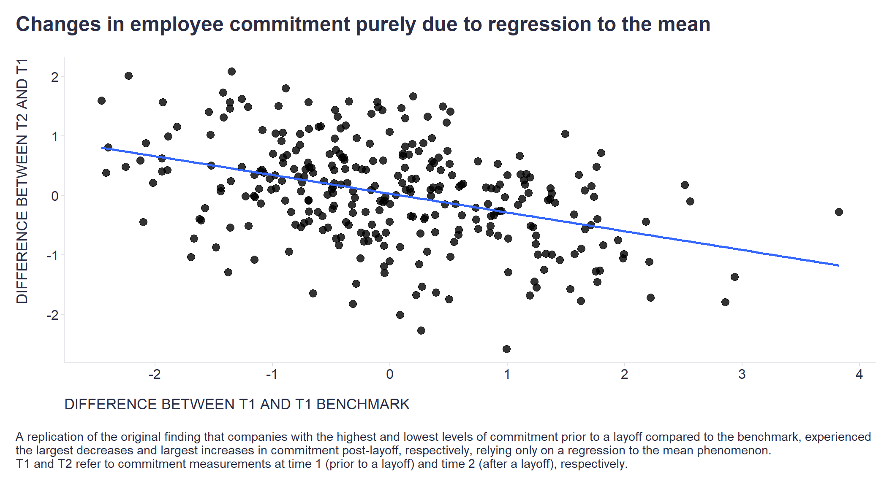

A vendor specializing in employee engagement measurements recently [presented their findings](https://www.cultureamp.com/blog/company-layoffs-myths) that companies with the highest and lowest levels of commitment prior to a layoff compared to the benchmark, experienced the largest decreases and largest increases in commitment post-layoff, respectively. They post-hoc-hypothesized that highly committed employees feel especially hurt and betrayed when layoffs occur.

However, when a similar pattern emerges, a warning light should always flash that regression to the mean (RTM) might actually be behind it. When a variable is imperfectly correlated with another variable, extreme values tend to gravitate towards the mean in subsequent measurements, which can make natural variations in repeated data appear like genuine change.

This doesn't mean that RTM was the sole factor in the aforementioned case. However, to know better, it's necessary to control for it. 

What follows is a simple simulation to illustrate how the reported finding could occur purely or partially due to RTM, and how one might control for it.

First, let's create correlated employee commitment observations per company from time 1 (T1) and time 2 (T2). 

```r
# uploading necessary libraries
library(tidyverse)

set.seed(1) # seed for reproducibility
n <- 2000 # number of observations
T1 <- rnorm(n) # generating observations at time 1
T2 <- 0.7*T1 + rnorm(n)*sqrt(1-0.7^2) # generating correlated observations at time 2

# cor(T1, T2) # checking the correlation

df <- data.frame(T1=T1, T2=T2) # putting created variables into dataframe

```

We also need a benchmark for T1 so that we can calculate the difference between T1 values and T1 benchmark. In addition, we also need to calculate the difference between T2 and T1.     

```r
# computing benchmark for pre-layoff period (T1)
benchmark <- df %>%
  dplyr::summarise(
    benchmark = mean(T1)
  ) %>%
  dplyr::pull(benchmark)

# computing differences between T2 and T1 and between T1 and T1 benchmark (average)
df <- df %>%
  dplyr::mutate(
    timeDiff = T2-T1,
    benchmarkDiff = T1-benchmark
  )

```

Then all we have to do is randomly assign individual observations to the group of companies that made layoffs and those that did not.

```r
# assigning each observation randomly one of two labels - Layoffs/NoLayoffs 
df1 <- df %>%
  dplyr::mutate(
    Layoffs = sample(c("Layoffs", "NoLayoffs"), size = n(), replace = TRUE, prob = c(0.15, 0.85))
  )

```

Now we can contrast the differences between T1 values and T1 benchmark on the one hand and the differences between T2 and T1 on the other. As we can see in the chart below, the pattern matches well with the originally reported finding 
- companies with the highest and lowest levels of commitment prior to a layoff compared to the benchmark, experienced the largest decreases and largest increases in commitment post-layoff, respectively, but now purely as a result of RTM.      

```r
# visualizing relationship between the 
df1 %>%
  dplyr::filter(Layoffs == "Layoffs") %>%
  ggplot2::ggplot(aes(x = benchmarkDiff, y = timeDiff)) +
  ggplot2::geom_point(size = 3, alpha = 0.8) +
  ggplot2::geom_smooth(method = "lm", se = F) +
  ggplot2::scale_x_continuous(breaks = seq(-2,4,1)) +
  labs(
    x = "DIFFERENCE BETWEEN T1 AND T1 BENCHMARK",
    y = "DIFFERENCE BETWEEN T2 AND T1",
    title = "Changes in employee commitment purely due to regression to the mean",
    caption = "\nA replication of the original finding that companies with the highest and lowest levels of commitment prior to a layoff compared to the benchmark, experienced\nthe largest decreases and largest increases in commitment post-layoff, respectively, relying only on a regression to the mean phenomenon.\nT1 and T2 refer to commitment measurements at time 1 (prior to a layoff) and time 2 (after a layoff), respectively."
  ) +
  ggplot2::theme(
    plot.title = element_text(color = '#2C2F46', face = "bold", size = 18, margin=margin(0,0,20,0)),
    plot.subtitle = element_text(color = '#2C2F46', face = "plain", size = 15, margin=margin(0,0,20,0)),
    plot.caption = element_text(color = '#2C2F46', face = "plain", size = 11, hjust = 0),
    axis.title.x.bottom = element_text(margin = margin(t = 15, r = 0, b = 0, l = 0), color = '#2C2F46', face = "plain", size = 13, lineheight = 16, hjust = 0),
    axis.title.y.left = element_text(margin = margin(t = 0, r = 15, b = 0, l = 0), color = '#2C2F46', face = "plain", size = 13, lineheight = 16, hjust = 1),
    axis.text = element_text(color = '#2C2F46', face = "plain", size = 12, lineheight = 16),
    axis.line = element_line(colour = "#E0E1E6"),
    axis.ticks = element_line(color = "#E0E1E6"),
    strip.text.x = element_text(size = 11, face = "plain"),
    legend.position= "bottom",
    legend.key = element_rect(fill = "white"),
    legend.key.width = unit(1.6, "line"),
    legend.margin = margin(0,0,0,0, unit="cm"),
    legend.text = element_text(color = '#2C2F46', face = "plain", size = 10, lineheight = 16),
    panel.background = element_blank(),
    panel.grid.major.y = element_blank(),
    panel.grid.major.x = element_blank(),
    panel.grid.minor = element_blank(),
    plot.margin=unit(c(5,5,5,5),"mm"), 
    plot.title.position = "plot",
    plot.caption.position =  "plot"
  ) +
  ggplot2::guides(color = guide_legend(nrow = 1))

```



In general, in order to make a valid estimate of the effect of layoffs on employee commitment when RTM is at play, we need to control for its effect. [One way to do this](https://academic.oup.com/ije/article/34/1/215/638499) is to include the difference between T1 values and T1 benchmark in the linear regression model as illustrated below.

```r
# modeling T2 while controlling for the effect of regression to the mean
model1 <- glm(T2 ~ benchmarkDiff + Layoffs, family = gaussian(link = "identity"), data = df1)
summary(model1)

```

It is clear from the estimated model that there is not much evidence in favor of the existence of a layoff effect, which should not be surprising since individual observations were purely randomly assigned to groups of companies with and without layoffs. However, when we adjusted the data to better reflect the hypothesized causal mechanism behind the observed pattern, the effect of layoffs was detected as statistically significant.

```r
# creating a new dataset that better reflects the hypothesized causal mechanism behind the observed pattern
df2 <- df %>%
  dplyr::rowwise() %>%
  dplyr::mutate(
    Layoffs = sample(c("Layoffs", "NoLayoffs"), size = 1, replace = TRUE, prob = c(0.15, 0.85)),
    T2 = ifelse(Layoffs == "Layoffs" & T1 >= 0.5, T2 - runif(min = 0.3, max = 1.5, n = 1), T2),
    T2 = ifelse(Layoffs == "Layoffs" & T1 <= -0.5 , T2 - runif(min = -0.75, max = 0.2, n = 1), T2)
  ) %>%
  dplyr::ungroup() %>%
  dplyr::mutate(timeDiff = T2-T1) # recomputing timeDiff

# modeling T2 while controlling for the effect of regression to the mean
model2 <- glm(T2 ~ benchmarkDiff + Layoffs, family = gaussian(link = "identity"), data = df2)
summary(model2)

```

Feel free to share your own experiences and encounters with the phenomena of regression to the mean in your people analytics practice.

<!-- RELATED:BEGIN -->
## Related notes
- [[tenure-vs-satisfaction|Simulating the "survivorship" effect in employee satisfaction data over time]]
- [[cross-lagged-panel-modeling|Getting (more) causal insights from employee survey data (without an RCT)]]
- [[causal-inference-in-people-analytics|Beyond prediction: Exploiting organizational events for causal inference in people analytics]]
- [[glassdoor|When flawed statistical & causal reasoning leads to a valid conclusion anyway]]
- [[multilevel-modeling|Multilevel modeling in people analytics]]
<!-- RELATED:END -->

---
> 📄 Read the [original post with full outputs](https://blog-about-people-analytics.netlify.app/posts/2023-05-10-regression-to-the-mean/) on my blog.
