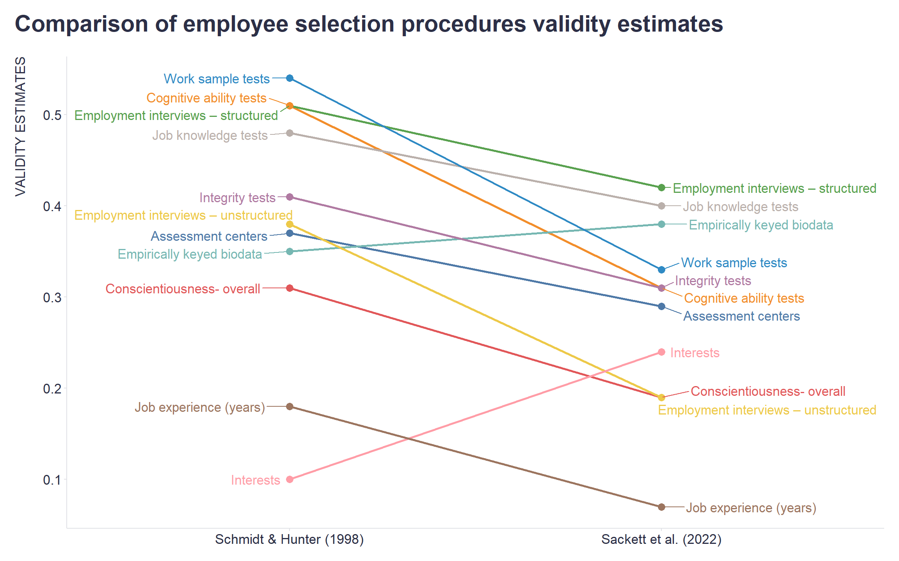

I suppose that many, if not the majority, of I/O psychology and people analytics folks have already heard about a new meta-analytic estimation of validity for selection procedures that is based on a more realistic range-restriction correction performed by [Sackett et al. (2022)](https://psycnet.apa.org/record/2022-17327-001).   

Numerous articles have explored the results of this meta-analysis and its presumed implications for the hiring process. However, what I found lacking was a clear visual representation of the changes in the validity estimates, including the original article.

Because I needed one for a training I was conducting on people analytics and EB-HRM, I created one. Given the nature of the change to be shown, I chose a slopegraph that nicely and intuitively illustrates a two-point change.

```r
# uploading the necessary libraries
library(tidyverse)
library(readxl)
library(ggrepel)

# uploading data
data <- readxl::read_xlsx("./data.xlsx")
#glimpse(data)

# transforming data
dataLong <- data %>%
  tidyr::drop_na() %>%
  tidyr::pivot_longer(Hunter:Sackett, names_to = "analysis", values_to = "validity") %>%
  dplyr::mutate(analysis = case_when(
    analysis == "Hunter" ~ "Schmidt & Hunter (1998)",
    analysis == "Sackett" ~ "Sackett et al. (2022)",
    TRUE ~ "unknown"
    ),
    analysis = factor(analysis, levels = c("Schmidt & Hunter (1998)", "Sackett et al. (2022)"))
  )

# creating custom color palette based on Tableau colors
my_palette <- c(
  "#4E79A7", "#F28E2C", "#E15759", "#76B7B2", "#59A14F",
  "#EDC949", "#B07AA2", "#FF9DA7", "#9C755F", "#BAB0AB",
  "#2F8AC4"  # an additional distinct color
)

# creating the slopegraph
dataLong %>%
  ggplot2::ggplot(aes(x = analysis, y = validity, group = SelectionProcedure)) +
  ggplot2::geom_line(aes(color = SelectionProcedure), linewidth = 1) +
  ggplot2::geom_point(aes(color = SelectionProcedure), size = 3) +
  ggrepel::geom_text_repel(data = dataLong %>% filter(analysis == "Schmidt & Hunter (1998)"), aes(label = SelectionProcedure, color = SelectionProcedure), size = 4.5, hjust = 1.2, vjust = 0.5, direction = "y", force = 1) +
  ggrepel::geom_text_repel(data = dataLong %>% filter(analysis == "Sackett et al. (2022)"), aes(label = SelectionProcedure, color = SelectionProcedure), size = 4.5, hjust = -0.2, vjust = 0.5, direction = "y", force = 1) +
  ggplot2::scale_color_manual(values = my_palette) +
  ggplot2::labs(
    title = "Comparison of employee selection procedures validity estimates",
    y = "VALIDITY ESTIMATES", 
    x = "") +
  ggplot2::theme(
    plot.title = element_text(color = '#2C2F46', face = "bold", size = 22, margin=margin(0,0,20,0)),
    plot.subtitle = element_text(color = '#2C2F46', face = "plain", size = 15, margin=margin(0,0,20,0)),
    plot.caption = element_text(color = '#2C2F46', face = "plain", size = 11, hjust = 0),
    axis.title.x.bottom = element_blank(),
    axis.title.y.left = element_text(margin = margin(t = 0, r = 15, b = 0, l = 0), color = '#2C2F46', face = "plain", size = 13, lineheight = 16, hjust = 1),
    axis.text = element_text(color = '#2C2F46', face = "plain", size = 13, lineheight = 16),
    axis.line = element_line(colour = "#E0E1E6"),
    axis.ticks = element_line(color = "#E0E1E6"),
    strip.text.x = element_text(size = 11, face = "plain"),
    legend.position= "none",
    legend.key = element_rect(fill = "white"),
    legend.key.width = unit(1.6, "line"),
    legend.margin = margin(0,0,0,0, unit="cm"),
    legend.text = element_text(color = '#2C2F46', face = "plain", size = 10, lineheight = 16),
    panel.background = element_blank(),
    panel.grid.major.y = element_blank(),
    panel.grid.major.x = element_blank(),
    panel.grid.minor = element_blank(),
    plot.margin=unit(c(5,5,5,5),"mm"), 
    plot.title.position = "plot",
    plot.caption.position =  "plot"
  )

```



Maybe the visualization will come in handy for you as well when trying to "rewire" your long-held beliefs and assumptions. It should make clearer in what direction and to what extent to do so 😉

<!-- RELATED:BEGIN -->
## Related notes
- [[career-hurdles|And what are your career hurdles?]]
- [[vocational-interests|Vocational interests don't seem so uninteresting after all]]
- [[regression-to-the-mean|Employee commitment over time & regression to the mean]]
- [[personality-and-non-linearities|Nonlinear relationships between personality traits and business outcomes seem to be the norm rather than the exception]]
- [[visual-inference-statistics|Visual statistical inference]]
<!-- RELATED:END -->

---
> 📄 Read the [original post with full outputs](https://blog-about-people-analytics.netlify.app/posts/2023-05-26-selection-procedures-validity-update/) on my blog.
