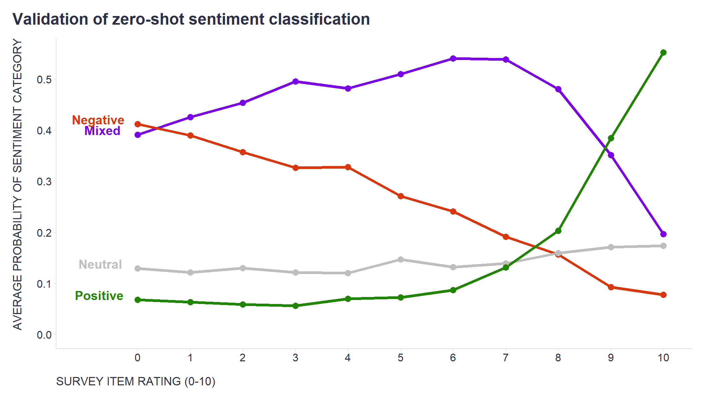

Recently, I experimented with [zero-shot classification](https://huggingface.co/tasks/zero-shot-classification) - a machine learning task where the model classifies data into categories it hasn't encountered during training - to determine the sentiment of comments from an employee survey (positive, negative, mixed, neutral).

I chose this approach as an alternative to the traditional [lexicon and rule-based NLTK sentiment analyzer](https://realpython.com/python-nltk-sentiment-analysis/). Using the transformer architecture of the model (bart-large-mnli from Facebook), I aimed to capture context from entire comments when gauging their sentiment. I admit that I had some doubts because the model wasn't specifically trained for sentiment analysis. Instead, it generalizes its understanding from the MNLI tasks to deduce sentiments.

Fortunately, each comment was tied to specific statements that also received ratings on a standard 0-10 scale. This allowed me to cross-reference the sentiment classification with the ratings people assigned to these statements.

So, how did the model do? As the attached chart shows, the average sentiment classification probability is pretty compellingly consistent with the ratings on the standard scale.

```r
library(tidyverse)
library(readr)

mydata <- readr::read_csv("./mydata.csv")

label_data <- mydata %>% 
  dplyr::group_by(sentiment_category) %>% 
  dplyr::slice(1)

mydata %>% 
  ggplot2::ggplot(aes(x = Score, y = avg_sentiment_score, color = sentiment_category)) +
  ggplot2::geom_line(linewidth = 1.5) +
  ggplot2::geom_point(size = 3) +
  ggplot2::scale_y_continuous(limits = c(0,NA), breaks = seq(0,1,0.1)) +
  ggplot2::scale_x_continuous(limits = c(-1,10), breaks = seq(0,10,1)) +
  ggplot2::scale_color_manual(values = c("Mixed"="#7b00e7", "Negative"="#db370e", "Neutral"="grey", "Positive"="#208600")) +
  ggplot2::geom_text(data=label_data, aes(label=sentiment_category), nudge_x=-0.5, hjust=0.75, vjust = 0, size = 5, fontface = "bold") +
  ggplot2::labs(
    x = "SURVEY ITEM RATING (0-10)",
    y = "AVERAGE PROBABILITY OF SENTIMENT CATEGORY",
    title = "Validation of zero-shot sentiment classification",
    color = ""
  ) +
  ggplot2::theme(
    plot.title = element_text(color = '#2C2F46', face = "bold", size = 18, margin=margin(0,0,12,0)),
    plot.subtitle = element_text(color = '#2C2F46', face = "plain", size = 15, margin=margin(0,0,20,0)),
    plot.caption = element_text(color = '#2C2F46', face = "plain", size = 11, hjust = 0),
    axis.title.x.bottom = element_text(margin = margin(t = 15, r = 0, b = 0, l = 0), color = '#2C2F46', face = "plain", size = 13, lineheight = 16, hjust = 0),
    axis.title.y.left = element_text(margin = margin(t = 0, r = 15, b = 0, l = 0), color = '#2C2F46', face = "plain", size = 13, lineheight = 16, hjust = 1),
    axis.text = element_text(color = '#2C2F46', face = "plain", size = 12, lineheight = 16),
    axis.line = element_line(colour = "#E0E1E6"),
    axis.ticks = element_line(color = "#E0E1E6"),
    strip.text.x = element_text(size = 11, face = "plain"),
    legend.position= "none",
    legend.key = element_rect(fill = "white"),
    legend.key.width = unit(1.6, "line"),
    legend.margin = margin(0,0,0,0, unit="cm"),
    legend.text = element_text(color = '#2C2F46', face = "plain", size = 10, lineheight = 16),
    panel.background = element_blank(),
    panel.grid.major.y = element_blank(),
    panel.grid.major.x = element_blank(),
    panel.grid.minor = element_blank(),
    plot.margin=unit(c(5,5,5,5),"mm"), 
    plot.title.position = "plot",
    plot.caption.position =  "plot"
  )

```



Seems like I can add another useful tool to my toolbox. If you are interested in trying it out, you can use a short code snippet below for it.


```python
import pandas as pd
from transformers import pipeline

# sentiment analysis with zero-shot classification using the facebook/bart-large-mnli model
sentiment_classifier = pipeline("zero-shot-classification", model="facebook/bart-large-mnli")
comments = df['comments'].to_list()
# defining the candidate labels 
candidate_labels = ["positive", "negative", "neutral", "mixed"]
# setting the hypothesis template
hypothesis_template = "The sentiment of this employee feedback is {}."
# estimating the sentiment labels
prediction = sentiment_classifier(comments, candidate_labels, hypothesis_template=hypothesis_template)
prediction = pd.DataFrame(prediction)
# creating columns with predicted sentiment (label with the highest probability) and sentiment scores for individual labels  
df['sentiment_label'] = prediction['labels'].apply(lambda x: x[0])
df['sentiment_score_positive'] = prediction.apply(lambda x: x['scores'][x['labels'].index('positive')], axis=1)
df['sentiment_score_negative'] = prediction.apply(lambda x: x['scores'][x['labels'].index('negative')], axis=1)
df['sentiment_score_neutral'] = prediction.apply(lambda x: x['scores'][x['labels'].index('neutral')], axis=1)
df['sentiment_score_mixed'] = prediction.apply(lambda x: x['scores'][x['labels'].index('mixed')], axis=1)

```

<!-- RELATED:BEGIN -->
## Related notes
- [[probability-of-comments-in-a-survey|What makes people more likely to comment on a question in an employee survey?]]
- [[employee-feedback-analysis-using-openai|Employee feedback analysis using tools from OpenAI]]
- [[latent-class-analysis|Latent Class Analysis of responses from employee surveys]]
- [[topic-analysis-with-genai|Creating new candidate topic labels on the fly during topic analysis with GenAI]]
- [[chatgpt-and-employee-feedback|Using ChatGPT to summarize and explore employee feedback?]]
<!-- RELATED:END -->

---
> 📄 Read the [original post with full outputs](https://blog-about-people-analytics.netlify.app/posts/2023-10-24-sentiment-analysis-validation/) on my blog.
