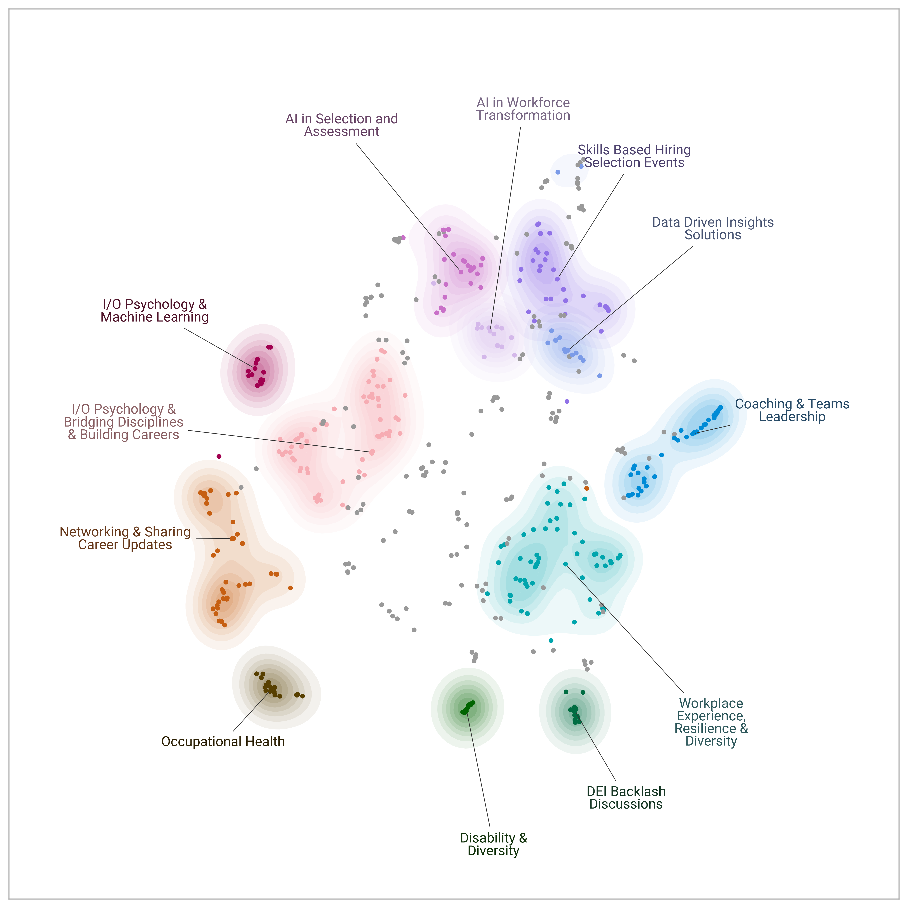

My LinkedIn bubble these days is full of posts from the [SIOP](https://www.siop.org/) 2025 conference. Unfortunately, it’s too far for me to attend in person. So, to participate at least symbolically, I quickly ran a [BERTopic](https://maartengr.github.io/BERTopic/index.html) pipeline on the SIOP event schedule to see what some of the major topics are and what I'll be missing. 😁

Apparently, a large part is devoted to AI & ML, workplace experience, I/O psychology career-building, and networking—some really nice ones!

Fortunately, things aren't as hopeless as they might sound. We have a secret (or maybe not-so-secret) agent there: Marissa Post, our US colleague and an awesome member of our Sanofi People Insights team. She’s attending in person, so we'll at least get the industry news and gossip secondhand. 😉

To everyone attending, enjoy the conference—and please share some summaries on LinkedIn later! 🙏

<!-- RELATED:BEGIN -->
## Related notes
- [[siop-2026-reflection|SIOP through the wisdom of crowds: What I may have missed]]
- [[siop-2026-recommender|SIOP 2026 Recommender]]
- [[siop-2026-causal-inference-workshop|No Experiment, No Problem? Causal Inference in Applied Quasi-Experimental Settings (Session ID 830)]]
- [[hr-tech-ai-shift|How AI is reshaping HR-tech]]
- [[linkedin-contacts-job-positions|Analyzing LinkedIn connections' jobs using LLMs and the BERTopic package]]
<!-- RELATED:END -->

---
> 📄 Read the [original post with full outputs](https://blog-about-people-analytics.netlify.app/posts/2025-04-04-siop-2025-conference-events/) on my blog.
