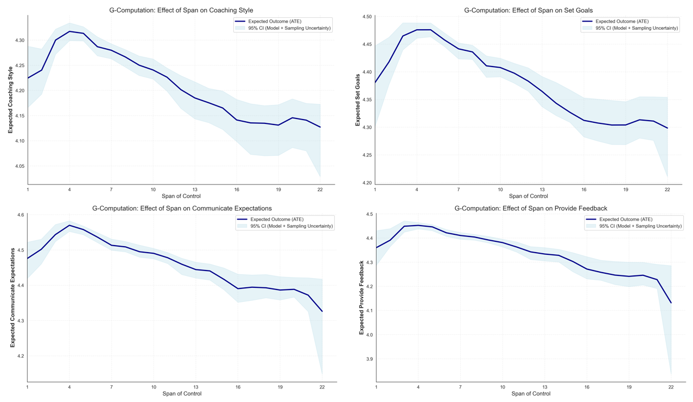

Many companies these days are pushing to flatten their org structures, hoping it will bring the well-known benefits of a leaner org profile - e.g., faster decision-making, reduced bureaucratic overhead, and greater employee autonomy.

With a flatter org structure, however, the resulting larger spans of control can negatively affect managers’ capacity to handle the people-related parts of their job - clarifying expectations, providing support and consideration, removing obstacles, securing resources, supporting development - you name it.

To illustrate this trade-off, see the four plots below showing [G-computation](https://medium.com/@akif.iips/a-short-introduction-to-g-computation-in-causal-inference-9a67bd9e2233) dose-response curves estimated using a Random Forest outcome model with bootstrapped uncertainty intervals that account for both sampling variability and model estimation error. The plots capture the causal effect of span of control (ranging from 1 to 22 direct reports) on four specific managerial behaviors (coaching, setting goals, communicating expectations, and providing feedback), as rated by direct reports, while controlling for common factors such as managers’ tenure, management level, department, performance rating, gender, age, region, job family, etc.

<div style="text-align:center">



</div>

As you can see, there is a negative - though non-linear and modest in absolute magnitude but very meaningful relative to the variability in the data - relationship between managers’ span of control and these managerial behaviors: the larger the former, the lower the latter.

The existence of this trade-off, imo, doesn’t mean we should avoid flatter org designs. Rather, it means we should account for it and adjust other parts of organizational functioning to compensate for managers’ reduced capacity for people management - for example, by decoupling people development from administrative reporting lines, implementing peer-based feedback and coaching loops to distribute the support load, or maybe using AI to offload managers’ analytical, coordination, and administrative work so they can reallocate time and attention to high-quality people management.

Curious whether anyone has dealt - successfully or unsuccessfully - with these negative consequences of organizational flattening. What worked, and what didn’t? Did you try AI as part of the solution?

P.S. You might notice the distinct “hook” at the start of the dose-response curves - expected management quality actually dips for very small spans (1–3) before peaking around 4–6. While the wider confidence intervals in this region (the light blue bands) reflect the natural variability of smaller sample sizes, the fact that this dip appears consistently across multiple distinct behaviors suggests a structural signal, not just noise. IMO, there are three plausible and likely converging mechanisms: role conflict, dyadic intensity, and selection bias. In smaller teams, managers are more often in “player–coach” roles, which entail significant resource-allocation conflicts: dominant individual-contributor duties crowd out the cognitive bandwidth required for high-quality people management. At the same time, the lack of distributed attention in a 1:1 dynamic can create a “surveillance effect,” where standard oversight is perceived by direct reports as hyper-scrutiny or micromanagement rather than developmental support. Finally, this cohort may reflect a maturity confound, even after accounting for the available control variables—effectively acting as “training wheels” for novice leaders or as containment roles for specific performance contexts—thereby skewing the behavioral signal downward. I’m curious what your hypothesis is, and how you’re thinking about what might be driving this.

**Notes**:

* If you’re interested in how the dose-response curves are computed using a Random Forest as the outcome model, check the code below.

```python
"""
G-COMPUTATION FOR DOSE-RESPONSE CURVES WITH RANDOM FOREST
===========================================================

This script demonstrates how to implement G-computation (also known as standardization 
or the g-formula) to estimate causal dose-response curves using Random Forest models 
with robust bootstrapping for uncertainty estimation.

G-computation is a causal inference method that estimates the effect of an
intervention by:
1. Fitting a model for the outcome given exposure and confounders
2. Predicting outcomes under counterfactual exposure scenarios for all individuals
3. Averaging these predictions to get population-level causal effects

This approach properly adjusts for confounding and can capture non-linear
relationships. Crucially, this version bootstraps the *estimator* (refitting the model)
to capture both sampling and model uncertainty.
"""

import pandas as pd
import numpy as np
from sklearn.ensemble import RandomForestRegressor
from joblib import Parallel, delayed
import matplotlib.pyplot as plt
import seaborn as sns

# Set plot style
sns.set_style("white")

def prepare_data(data, outcome_var, exposure_var, confounders):
    """
    Prepare data for G-computation analysis.
    """
    # Select relevant variables
    vars_of_interest = [outcome_var, exposure_var] + confounders
    modeling_data = data[vars_of_interest].dropna()
    
    # Prepare features: one-hot encode categorical variables
    X = pd.get_dummies(
        modeling_data.drop(columns=[outcome_var]), 
        drop_first=True
    )
    y = modeling_data[outcome_var]
    
    print(f"Dataset prepared: {len(modeling_data)} observations")
    print(f"Features: {X.shape[1]} (after encoding)")
    
    return X, y, modeling_data

def _bootstrap_iteration(X, y, exposure_var, exposure_range, n_estimators, random_state):
    """
    Helper function to run a single bootstrap iteration:
    1. Resample data
    2. Refit model
    3. Predict counterfactuals
    """
    # 1. Resample (Bootstrap)
    boot_idx = np.random.choice(len(X), size=len(X), replace=True)
    X_boot = X.iloc[boot_idx]
    y_boot = y.iloc[boot_idx]
    
    # 2. Fit Model on Bootstrap Sample
    # Note: n_jobs=1 here because we parallelize the outer loop
    model = RandomForestRegressor(
        n_estimators=n_estimators,
        random_state=random_state,
        n_jobs=1 
    )
    model.fit(X_boot, y_boot)
    
    # 3. Predict Counterfactuals
    means = []
    X_cf = X.copy() # Use original population structure for marginalization
    
    for level in exposure_range:
        X_cf[exposure_var] = level
        # Average prediction for this exposure level
        means.append(model.predict(X_cf).mean())
        
    return means

def gcomputation_dose_response(X, y, exposure_var, exposure_range, 
                               n_bootstrap=100, n_estimators=50, n_jobs=-1,
                               random_state=2026):
    """
    Perform G-computation with robust bootstrapping.
    
    Parameters:
    -----------
    X : pd.DataFrame
        Feature matrix
    y : pd.Series
        Outcome variable
    exposure_var : str
        Name of the exposure variable
    exposure_range : array-like
        Range of exposure values to evaluate
    n_bootstrap : int
        Number of bootstrap iterations (refitting the model)
    n_estimators : int
        Number of trees for the bootstrap models (usually fewer than main model)
    n_jobs : int
        Number of CPU cores to use (-1 for all)
        
    Returns:
    --------
    results_df : pd.DataFrame
    """
    print(f"\n{'='*70}")
    print("PERFORMING ROBUST G-COMPUTATION")
    print(f"{'='*70}")
    print(f"Exposure variable: {exposure_var}")
    print(f"Exposure range: {min(exposure_range)} to {max(exposure_range)}")
    print(f"Bootstrap iterations: {n_bootstrap} (Refitting model each time)")
    
    # Check if exposure variable exists in the data
    if exposure_var not in X.columns:
        raise ValueError(f"Exposure variable '{exposure_var}' not found in data")

    # 1. Calculate Point Estimate (Main Model)
    print("Fitting main model for point estimates...")
    main_model = RandomForestRegressor(n_estimators=200, random_state=random_state, n_jobs=n_jobs)
    main_model.fit(X, y)
    
    expected_outcomes = []
    X_cf = X.copy()
    for level in exposure_range:
        X_cf[exposure_var] = level
        expected_outcomes.append(main_model.predict(X_cf).mean())

    # 2. Bootstrap for Uncertainty (Parallelized)
    print("Running bootstrap iterations...")
    
    # Generate random seeds for each iteration to ensure diversity
    rng = np.random.RandomState(random_state)
    seeds = rng.randint(0, 100000, size=n_bootstrap)
    
    boot_results = Parallel(n_jobs=n_jobs, verbose=1)(
        delayed(_bootstrap_iteration)(
            X, y, exposure_var, exposure_range, n_estimators, seed
        ) for seed in seeds
    )
    
    # Convert list of lists to numpy array: (n_bootstrap, n_levels)
    boot_matrix = np.array(boot_results)
    
    # Calculate Confidence Intervals (Percentile Method)
    ci_lower = np.percentile(boot_matrix, 2.5, axis=0)
    ci_upper = np.percentile(boot_matrix, 97.5, axis=0)
    
    # Create results dataframe
    results_df = pd.DataFrame({
        'exposure_level': list(exposure_range),
        'expected_outcome': expected_outcomes,
        'ci_lower': ci_lower,
        'ci_upper': ci_upper
    })
    
    print(f"\nG-computation complete!")
    return results_df

def plot_dose_response(results_df, exposure_var, outcome_var, 
                        save_path=None, figsize=(10, 6)):
    """
    Plot the estimated causal dose-response curve.
    """
    fig, ax = plt.subplots(figsize=figsize)
    
    # Plot the dose-response curve
    ax.plot(
        results_df['exposure_level'], 
        results_df['expected_outcome'], 
        color='darkblue', 
        linewidth=2.5, 
        label='Expected Outcome (ATE)'
    )
    
    # Add confidence interval band
    ax.fill_between(
        results_df['exposure_level'],
        results_df['ci_lower'], 
        results_df['ci_upper'], 
        alpha=0.3, 
        color='lightblue', 
        label='95% CI (Model + Sampling Uncertainty)'
    )
    
    # Labels and formatting
    ax.set_xlabel(exposure_var, fontsize=12)
    ax.set_ylabel(f'Expected {outcome_var}', fontsize=12, weight='bold')
    ax.set_title(f'Causal Dose-Response Curve: {outcome_var} vs {exposure_var}', 
                 fontsize=14, weight='normal')
    
    ax.legend(loc='best', fontsize=10)
    ax.grid(True, alpha=0.3, linestyle='--')
    
    # Remove top and right spines for cleaner look
    sns.despine()
    
    plt.tight_layout()
    
    if save_path:
        plt.savefig(save_path, dpi=300, bbox_inches='tight')
        print(f"Plot saved to: {save_path}")
        
    plt.show()
    return fig, ax

def run_gcomputation_analysis(data, outcome_var, exposure_var, confounders, 
                                exposure_range, n_bootstrap=100, 
                               save_results_path=None, save_plot_path=None,
                               random_state=2026):
    """
    Complete pipeline for G-computation dose-response analysis.
    """
    print(f"\n{'='*70}")
    print("G-COMPUTATION DOSE-RESPONSE ANALYSIS")
    print(f"{'='*70}")
    
    # Step 1: Prepare data
    X, y, _ = prepare_data(data, outcome_var, exposure_var, confounders)
    
    # Step 2: G-computation (Fit & Bootstrap included)
    results_df = gcomputation_dose_response(
        X, y, exposure_var, exposure_range, 
        n_bootstrap=n_bootstrap, 
        random_state=random_state
    )
    
    # Step 3: Visualization
    plot_dose_response(
        results_df, exposure_var, outcome_var, 
        save_path=save_plot_path
    )
    
    # Step 4: Save results
    if save_results_path:
        results_df.to_csv(save_results_path, index=False)
    
    print("\nANALYSIS COMPLETE")
    print(f"{'='*70}\n")
    
    return results_df

# ============================================================================
# EXAMPLE USAGE
# ============================================================================
if __name__ == "__main__":
    print("To use this script, load your dataframe and call run_gcomputation_analysis()")

```
* You can also check [one of my previous posts](https://blog-about-people-analytics.netlify.app/posts/2023-02-08-span-of-control/) that examines this topic from the perspective of 1:1 meeting frequency, as measured via collaboration metadata.

<!-- RELATED:BEGIN -->
## Related notes
- [[multilevel-modeling|Multilevel modeling in people analytics]]
- [[people-analytics-popularity-after-covid|The impact of the COVID pandemic on the popularity of people analytics]]
- [[cross-lagged-panel-modeling|Getting (more) causal insights from employee survey data (without an RCT)]]
- [[mixed-level-ml|Beyond the “flat Earth”]]
- [[bayesian-shrinkage|Using Bayesian shrinkage in reporting employee turnover]]
<!-- RELATED:END -->

---
> 📄 Read the [original post with full outputs](https://blog-about-people-analytics.netlify.app/posts/2026-01-08-span-of-control-and-managerial-behavior/) on my blog.
