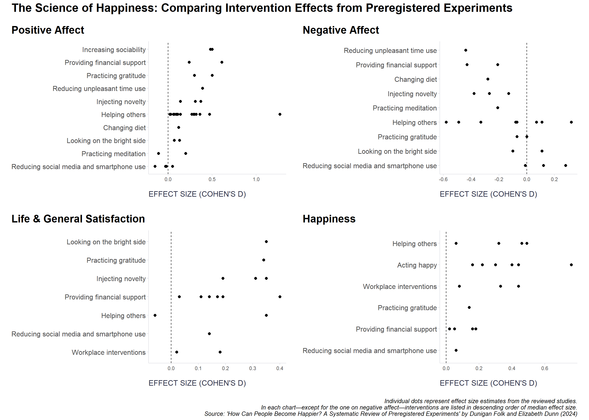

A recent systematic review by [Folk & Dunn (2024)](https://www.annualreviews.org/content/journals/10.1146/annurev-psych-022423-030818) explored what actually boosts our subjective well-being by focusing only on preregistered experiments—studies with pre-declared analysis plans that help prevent cherry-picking and the inflated effect sizes that plagued earlier happiness research.

**What seems to work:** *Being more sociable* - Even brief interactions with strangers boost mood • *Smiling naturally* - The facial feedback effect is real (when not forced) • *Injecting novelty* - Treating regular weekends like vacations improves satisfaction • *Financial support* - Cash transfers to disadvantaged populations create lasting happiness gains

**Mixed or limited evidence:** *Practicing gratitude* - Shows immediate benefits but lacks long-term effects • *Prosocial spending* - Using money to benefit others works, but effects are small • *Reducing social media* - Brief breaks don't help, but month-long breaks might • *Buying time-saving services* - Works for busy professionals but not for financially constrained populations

**What doesn't seem to work (despite popular belief):** *Random acts of kindnes*s - No clear evidence they boost happiness • *Meditation* - Limited evidence for mood benefits • *Volunteering* - Surprisingly, no evidence from rigorous studies • *Changing diet* - Fruit/vegetable consumption showed no significant benefits.

Key Takeaway: Many popular happiness strategies aren't backed by strong evidence. The most reliable path might be simpler: be more social, smile more genuinely, seek novel experiences, and if possible, help provide financial security to those in need. Having said that, we should not expect miracles as effect sizes for happiness interventions are typically small (d ≈ 0.20; see attached charts below with four major outcome variables for illustration).

```r
# libraries for data manipulationan and dataviz
library(tidyverse)
library(patchwork)

# uploading table with size effects based on results presented in the research paper (only for four major outcomes)
data <- readxl::read_excel("results.xlsx")

# plotting function
plot_effect <- function(df, var_name, desc = FALSE, title) {
  
  var_sym <- sym(var_name)
  
  chart <- df %>%
    select(intervention, !!var_sym) %>%
    drop_na(!!var_sym) %>%
    group_by(intervention) %>%
    mutate(med = median(!!var_sym)) %>%
    ungroup() %>%
    ggplot(aes(
      x = fct_reorder(intervention, med, .desc = desc),
      y = !!var_sym
    )) +
    geom_point(size=2) +
    coord_flip() +
    geom_hline(yintercept = 0, linetype='dashed') +
    labs(
      x = NULL,
      y = "EFFECT SIZE (COHEN'S D)",
      title = title  
    ) +
    ggplot2::theme(
      plot.title = element_text(face = "bold", size = 18, margin = margin(0, 0, 10, 0)),
      plot.subtitle = element_text(color = '#2C2F46', face = "plain", size = 16, margin = margin(0, 0, 20, 0)),
      plot.caption = element_text(color = '#2C2F46', face = "plain", size = 10, hjust = 0),
      axis.title.x.bottom = element_text(margin = margin(t = 15), color = '#2C2F46', face = "plain", size = 13, hjust = 0),
      axis.title.y.left = element_text(margin = margin(r = 15), color = '#2C2F46', face = "plain", size = 13),
      axis.text.y = element_text(size = 12, lineheight = 1.2),  
      axis.line = element_line(colour = "#E0E1E6"),
      legend.position = "top", 
      legend.box = "horizontal",
      legend.justification = "right",
      legend.key = element_blank(),
      legend.text = element_text(size = 12),
      panel.background = element_blank(),
      panel.grid.major.y = element_blank(),
      panel.grid.major.x = element_blank(),
      panel.grid.minor = element_blank(),
      axis.ticks = element_line(color = "#E0E1E6"),
      plot.margin = unit(c(5, 5, 5, 5), "mm"), 
      plot.title.position = "plot",
      plot.caption.position = "plot"
    )
  
  return(chart)
}

# creating plots for four major outcomes
g1 <- plot_effect(data, "positive_affect", desc = FALSE, title = "Positive Affect")
g2 <- plot_effect(data, "negative_affect", desc = TRUE, title = "Negative Affect")
g3 <- plot_effect(data, "life_general_satisfaction", desc = FALSE,title = "Life & General Satisfaction")
g4 <- plot_effect(data, "happiness", desc = FALSE, title = "Happiness")

# combining the plots into 2x2 matrix
g <- (g1 | g2) / (g3 | g4)

# adding whole plot annotations
g <- g + 
  plot_annotation(
    title    = "The Science of Happiness: Comparing Intervention Effects from Preregistered Experiments",
    caption  = "Individual dots represent effect size estimates from the reviewed studies.\nIn each chart—except for the one on negative affect—interventions are listed in descending order of median effect size.\nSource: 'How Can People Become Happier? A Systematic Review of Preregistered Experiments' by Dunigan Folk and Elizabeth Dunn (2024)",
    theme = theme(
      plot.title   = element_text(face = "bold", size = 20),
      plot.caption = element_text(size = 10, hjust = 1, face = 'italic')
    )
  )

print(g)

```



*Note: I put the charts together myself using data from the paper—so any slip-ups in the visuals are on me.*

⚠️ A few limitations are worth noting: the review included only 65 preregistered studies, many of which relied on WEIRD (Western, Educated, Industrialized, Rich, Democratic) populations and measured only short-term effects, limiting the ability to draw conclusions about long-term happiness. Additionally, some outcomes may have been influenced by participants’ expectations rather than the interventions themselves.

<!-- RELATED:BEGIN -->
## Related notes
- [[happiness-and-income|Happy today, richer tomorrow?]]
- [[engagement-interventions|Effectiveness of interventions for encreasing employee engagement]]
- [[nudge-effectiveness|Signal vs. Noise: Why we can’t yet identify effective nudges]]
- [[career-hurdles|And what are your career hurdles?]]
- [[collaboration-and-personality|Collaboration and personality]]
<!-- RELATED:END -->

---
> 📄 Read the [original post with full outputs](https://blog-about-people-analytics.netlify.app/posts/2025-05-06-systematic-review-of-happiness-interventions/) on my blog.
