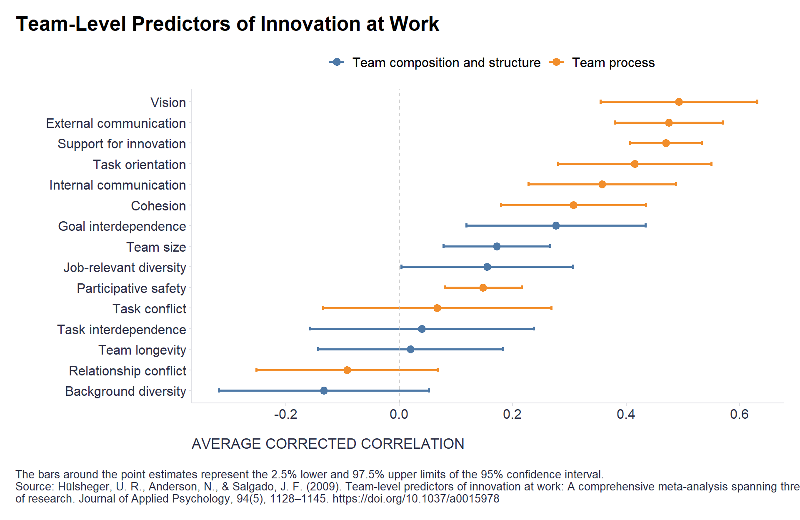

At least this is suggested by an interesting [meta-analysis of team-level predictors of innovation at work](https://www.researchgate.net/publication/26762638_Team-Level_Predictors_of_Innovation_at_Work_A_Comprehensive_Meta-Analysis_Spanning_Three_Decades_of_Research) by Hülsheger, Anderson, & Salgado (2009). 

```r
# uploading library
library(tidyverse)

# uploading data with the results of the meta-analysis 
data <- readxl::read_xlsx("./metaAnalysisResults.xlsx")
#dplyr::glimpse(data)

data %>%
  ggplot2::ggplot(aes(x = forcats::fct_reorder(variable, rho), y = rho, group = area, color = area)) +
  ggplot2::geom_point(size = 3) +
  ggplot2::geom_errorbar(aes(ymin=l95, ymax=h95), width=.2, position=position_dodge(0.05), linewidth = 1) +
  ggplot2::geom_hline(yintercept = 0, linetype = "dashed", color = "grey") +
  ggplot2::coord_flip() +
  ggplot2::scale_color_manual(values = c("Team composition and structure"="#4e79a7", "Team process" = "#f28e2b")) +
  ggplot2::labs(
    x = "",
    y = "AVERAGE CORRECTED CORRELATION",
    title = "Team-Level Predictors of Innovation at Work",
    caption = "\nThe bars around the point estimates represent the 2.5% lower and 97.5% upper limits of the 95% confidence interval.\nSource: Hülsheger, U. R., Anderson, N., & Salgado, J. F. (2009). Team-level predictors of innovation at work: A comprehensive meta-analysis spanning three decades\nof research. Journal of Applied Psychology, 94(5), 1128–1145. https://doi.org/10.1037/a0015978",
    color = ""
  ) +
  ggplot2::theme(
    plot.title = ggtext::element_markdown(face = "bold", size = 18, margin=margin(0,0,10,0)),
    plot.subtitle = element_text(color = '#2C2F46', face = "plain", size = 16, margin=margin(0,0,20,0)),
    plot.caption = element_text(color = '#2C2F46', face = "plain", size = 10, hjust = 0),
    axis.title.x.bottom = element_text(margin = margin(t = 15, r = 0, b = 0, l = 0), color = '#2C2F46', face = "plain", size = 13, lineheight = 16, hjust = 0),
    axis.title.y.left = element_text(margin = margin(t = 0, r = 15, b = 0, l = 0), color = '#2C2F46', face = "plain", size = 13, lineheight = 16, hjust = 1),
    axis.text = element_text(color = '#2C2F46', face = "plain", size = 12, lineheight = 16),
    strip.text.x = element_text(size = 13, face = "bold"),
    axis.line = element_line(colour = "#E0E1E6"),
    legend.position="top",
    legend.key = element_rect(fill = "white"),
    legend.text = element_text(size = 12),
    panel.background = element_blank(),
    panel.grid.major.y = element_blank(),
    panel.grid.major.x = element_blank(),
    panel.grid.minor = element_blank(),
    axis.ticks = element_line(color = "#E0E1E6"),
    plot.margin=unit(c(5,5,5,5),"mm"), 
    plot.title.position = "plot",
    plot.caption.position =  "plot"
  )

```



If that's true, not sure whether it's good news or bad news for companies' innovation initiatives. Is it easier to change processes or team composition? I expect there will be a lot of "it depends" 😉 What do you think?

<!-- RELATED:BEGIN -->
## Related notes
- [[team-design-creativity-innovation|How should teams be designed to be creative and innovative?]]
- [[tas-c-suit-teams|Insights from the Team Assessment Survey results of C-suite teams]]
- [[corporate-culture-trade-offs|The hidden trade-offs in corporate culture?]]
- [[self-leadership|Self-Leadership: A New Superpower?]]
- [[career-hurdles|And what are your career hurdles?]]
<!-- RELATED:END -->

---
> 📄 Read the [original post with full outputs](https://blog-about-people-analytics.netlify.app/posts/2023-06-22-team-level-predictors-of-innovation/) on my blog.
