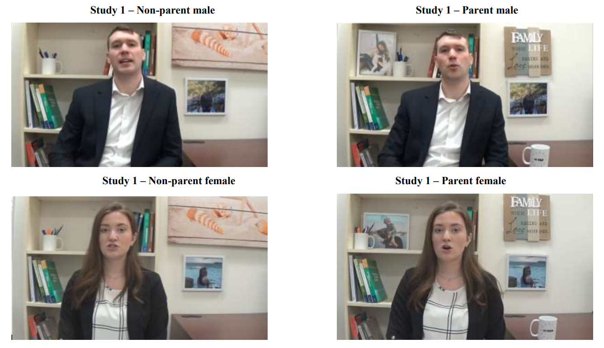

A recent set of experimental studies conducted by [Roulin et al. (2022)](https://onlinelibrary.wiley.com/doi/full/10.1002/job.2680) sought to determine whether and how the backgrounds in video interviews (VIs) could influence evaluators' judgments by revealing potentially stigmatizing features that are typically hidden in traditional selection contexts, but can become visible during VIs. The research specifically explored the impact of parental status, sexual orientation, and political affiliation on evaluators' perceptions. 

The results?

* Applicants identified as parents were perceived as warmer and received higher ratings for interview performance, yet they were not judged more negatively in terms of competence or potential work performance.
* Applicants who supported the same political party as the evaluator were seen as warmer and received higher assessments of both interview performance and potential work performance.
* Sexual orientation had no impact on any of the outcome variables. 

These results suggest that standardizing video backgrounds during virtual interviews (VIs) should be considered a best practice, which is in line with the logic behind structured interviews that try to limit the variability in interview performance to the applicants' [KSAOs](https://dictionary.apa.org/knowledge-skills-abilities-and-other-characteristics) relevant for job performance.

<!-- RELATED:BEGIN -->
## Related notes
- [[gender-gap-in-hiring-decisions|Evidence on the presence of gender bias in selection settings]]
- [[analytical-choices-and-variability|How variations in analytic choices affect results?]]
- [[psw-and-selection-bias-in-employee-surveys|How to analyze employee survey results with less (selection) bias?]]
- [[selection-procedures-validity-update|Visualizing shifts in validity estimates for selection procedures]]
- [[vocational-interests|Vocational interests don't seem so uninteresting after all]]
<!-- RELATED:END -->

---
> 📄 Read the [original post with full outputs](https://blog-about-people-analytics.netlify.app/posts/2024-02-15-video-interviews-and-biases/) on my blog.
